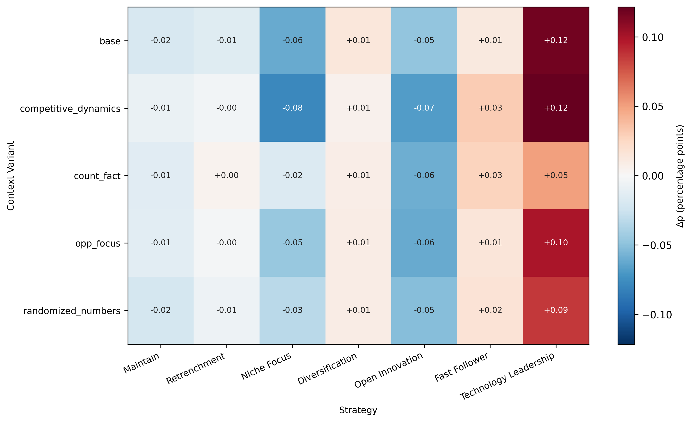
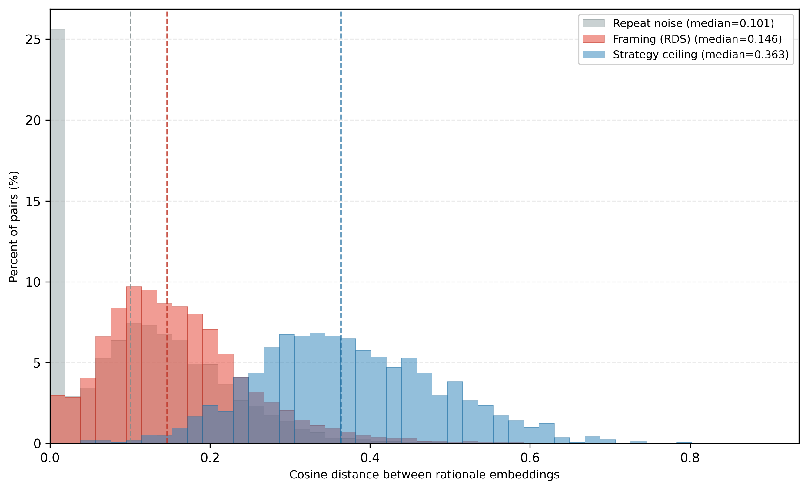
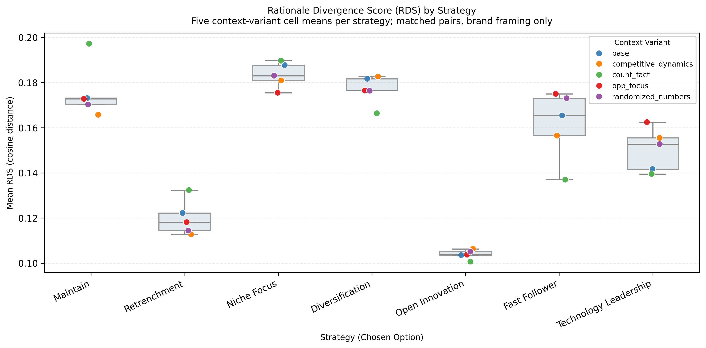
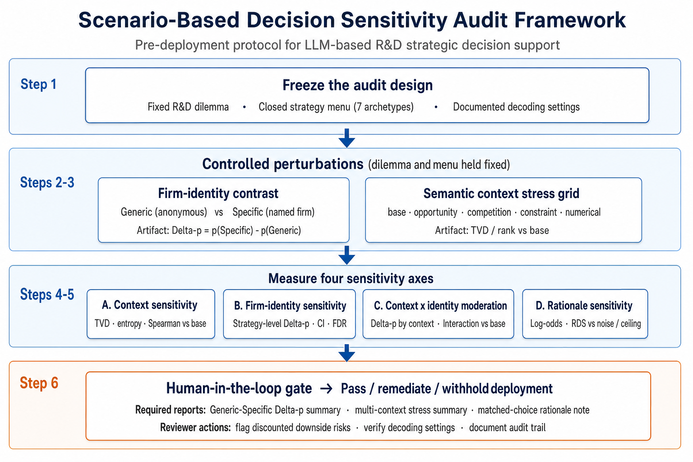

**Auditing LLMs as Algorithmic Agents for R&D Strategy: A Scenario-Based Framework for Context and Framing Sensitivity**

**Abstract**  
Large Language Models (LLMs) are increasingly deployed as algorithmic agents in R&D and innovation management, yet their behavior as strategic decision-makers remains poorly understood. This study introduces a scenario-based benchmark for auditing how LLMs' strategic judgments respond to controlled variations in context and framing. Using historically grounded R&D scenarios, we systematically manipulate semantic context (opportunity, constraint, competition signals, 여기에 숫자 변동 추가), brand framing (anonymous vs. a high-profile innovator), and numerical inputs[숫자 이야기는 제거, 레벨 안맞음] across multiple LLMs and decoding temperatures[온도 중요한지 판단 필요].

Three main findings emerge. First, LLMs exhibit strong context sensitivity: opportunity framing shifts choices toward Technology Leadership, while unfavorable constraints trigger defensive positioning. Second, brand framing asymmetrically amplifies this pattern—identifying the firm as a high-profile innovator boosts proactive strategies while suppressing collaborative and niche approaches.[context*framing 상호관계 추가] Third, these framing effects persist in model-generated rationales and vary systematically across models and temperature settings, revealing that LLMs operate as conditional strategic agents rather than stable default reasoners. We conclude by outlining an audit protocol for evaluating robustness before deploying LLMs in strategic R&D contexts, contributing to AI governance and human-in-the-loop oversight.

**1\. Introduction**  
Large Language Models (LLMs) are increasingly used as algorithmic agents in R&D and innovation management—supporting technology assessment, competitive intelligence, and strategic planning under uncertainty. Organizations now consult LLMs not merely as information retrievers but as active contributors to strategic decision-making. Yet, despite this rapid adoption, empirical understanding of how these models behave as strategic agents remains critically limited.

When an LLM produces a strategic recommendation, it does not simply retrieve facts. It actively interprets the problem, weighs competing considerations, and generates a course of action—behaviors that qualify it as an algorithmic agent. However, unlike human agents whose reasoning can be probed and audited, LLMs offer no built-in transparency about what drives their judgments. Do they rely on stable strategic logic, or are their recommendations systematically shaped by how the problem is framed, which brand name appears in the prompt, or even the randomness setting of the decoder?

Current evaluative frameworks offer little answers to these questions. They primarily focus on accuracy, coherence, or task-level performance in isolated contexts (Chang et al., 2024). While informative, such metrics provide no insight into the stability of strategic judgments—how decisions shift when the same underlying dilemma is presented with different contextual emphasis, brand identity, or numerical inputs(없애는게 적절-레벨 안맞음). These are precisely the factors that matter most in R&D strategy, where outcomes are highly sensitive to market signals, competitive framing, and narrative persuasion.

To address this gap, this study shifts the focus from "correctness" to "decision sensitivity". We introduce a scenario-based audit framework that systematically varies contextual and framing conditions to probe how LLMs adjust their strategic stances. Our central question is: How stable are LLMs' strategic judgments across different conditions and model configurations? By answering this question, we aim to characterize LLMs as conditional strategic agents and to provide practical guidance for auditing their behavior before deployment in high-stakes R&D environments.

**2\. Background and related work**

**2.1 LLMs as decision support systems**  
Recent research has increasingly embedded LLMs into real-world decision pipelines, particularly in operations and engineering management. Wang et al. (2025a) propose a multi-agent scheduling chain that leverages LLM-based agents to handle flexible job shop scheduling and real-time rescheduling, demonstrating substantial gains in scheduling efficiency under disruptions. Du et al. (2025) introduce LLM-MANUF, an integrated framework in which multiple fine-tuned LLMs generate alternative decision plans that are subsequently ranked and fused, highlighting that manufacturing decision quality depends as much on comparing and aggregating candidate strategies as on generating a single “best” answer. Beyond manufacturing, Wang et al. (2025b), Xiong et al. (2025), and Gindullina et al. (2026) combine spatiotemporal knowledge graphs, digital twins, and physics-informed neural networks with LLM agents to support berth allocation, aviation design, and epidemic forecasting, respectively. These studies illustrate how LLMs can act as planning and coordination engines for complex operational systems, yet they typically assess success in terms of task performance and system-level efficiency. They rarely examine how, within a fixed set of strategic options, LLMs distribute their choices or how sensitive those choices are to subtle changes in contextual description or framing.

**2.2 Reliability, hallucination, and safety in high-stakes decisions**  
Another line of work focuses on making LLM-supported decisions more reliable in high-stakes environments. Kong et al. (2026) present HaluGNN, which models question–answer pairs as token graphs and uses graph neural networks to detect hallucinated content, thereby improving decision security in domains where factual errors are costly. Heo et al. (2025) develop HaluCheck, a visualization and automation framework that decomposes model responses into sentence-level claims, retrieves external evidence, and highlights likely hallucinations through an interactive interface for expert systems. Przystalski et al. (2026) use stylometric features to distinguish human- from LLM-generated texts, informing governance around authorship, attribution, and authenticity. In the context of smart-city management, Antuley et al. (2026) propose SORA-ATMAS, an adaptive trust and governance framework that aligns multiple LLM agents with cross-domain policies and regulatory constraints. Collectively, these studies treat reliability and safety primarily at the level of factual correctness, anomaly detection, and policy compliance. What remains underexplored is whether LLMs are reliable as strategic decision agents—specifically, how their strategic choices and rationales shift under contextual and framing manipulations when the underlying problem remains fixed.

**2.3 Knowledge-grounded decision infrastructures**  
A third strand of literature builds knowledge-grounded infrastructures that connect LLMs to structured data and domain ontologies. Ojuri et al. (2025) propose a text-to-SQL framework in which LLMs and intelligent agents translate natural language queries into executable SQL, lowering the access barrier for non-technical users and reducing dependence on data specialists in organizational decision-making. Xiong et al. (2025) introduce DR-RAG, a domain-rule-based retrieval-augmented generation framework that ties aviation digital models to knowledge graphs, rule bases, and digital twins, turning complex product design into a loop of retrieval, generation, and simulation feedback. In financial decision-making, Sinha et al. (2026) present FinBloom, a knowledge-grounded financial agent that combines a domain-specialized LLM with real-time news and regulatory filings to answer dynamic financial queries. Alarcón Serrano et al. (2026) evaluate how well general-purpose LLMs can recognize taxonomic relationships in SNOMED CT, clarifying their role in biomedical knowledge-graph workflows that support clinical reasoning. These works substantially improve what LLMs know and how they access relevant information. Yet, even with stronger grounding, they do not systematically analyze how a model’s strategic choices over a fixed option set change when only the narrative emphasis, identity cues, or quantitative inputs are perturbed.

**2.4 Evaluation and Behavioral Profiling of LLMs**  
Evaluation- and reasoning-centric research has sought to understand how LLMs plan, reason, and exhibit preferences across tasks. Liu et al. (2026) propose CART, a traceable planning framework that decomposes goals into subtasks, tracks planning trajectories, and triggers replanning when conditions change, thereby improving the robustness of LLM-based agents in incomplete-information environments. Gjorgjevikj et al. (2025) introduce xLLMBench, a decision-centric benchmarking framework that uses multi-criteria decision-making to rank models along accuracy, scale, energy consumption, and other non-performance factors. Memduhoğlu et al. (2026) treat LLMs as “virtual experts” for multi-criteria spatial planning, comparing their analytic hierarchy process (AHP) weightings with those of human panels and documenting systematic biases in how models prioritize criteria for solar power plant site selection. Torres-Moreno and Hermosillo-Valadez (2026) propose a semantic knowledge abstraction framework that restructures premise–hypothesis relations in natural language inference to improve consistency and reveal latent semantic gaps in LLMs’ reasoning. These contributions collectively move beyond simple accuracy metrics toward richer assessments of reasoning, robustness, and multi-dimensional trade-offs. However, these evaluation frameworks typically focus on task-level performance or general reasoning consistency, leaving open how LLMs' strategic preferences shift under controlled perturbations of brand identity, contextual emphasis, or numerical signals.

**2.5 Cognitive Biases, Framing Effects, and Strategic Heuristics**

Human strategic judgments are susceptible to cognitive shortcuts that bypass deliberative reasoning (Kahneman, 2011). The *halo effect* occurs when a salient positive attribute—such as a firm's reputation—biases overall evaluation (Thorndike, 1920). *Anchoring* describes the tendency for an initial cue to shape subsequent judgments, even when that cue carries no objective decision-relevant information (Tversky & Kahneman, 1974). More broadly, Kahneman (2011) distinguishes fast, intuitive System 1 thinking from slow, analytical System 2 reasoning, with framing effects arising when System 1 dominates.

In LLM-based strategic decision-making, analogous patterns remain underexplored. The presence of a high-status brand identity or the selective emphasis of opportunity versus constraint information could trigger heuristic-like responses—leading models to prioritize narrative consistency over neutral evaluation of quantitative or factual signals. Nonetheless, existing benchmarks have not systematically characterized how such framing effects manifest in LLMs' categorical strategy choices, nor whether they persist in model-generated rationales.

**2.6 Strategic Archetypes in R&D and Innovation Management**  
To rigorously characterize the strategic behavior of LLMs, it is necessary to map their decision outputs onto established theoretical frameworks. This study adopts seven strategic archetypes rooted in the classical literature of competitive strategy and technological innovation. These options—Technology Leadership, Fast Follower, Open Innovation, Niche Focus, Diversification, Retrenchment, and Maintain—represent the fundamental trajectories firms pursue to navigate market transitions and resource constraints.

Specifically, the distinction between 'Technology Leadership' and 'Fast Follower' is grounded in the pioneering work on timing of entry and R&D intensity (Schilling, 2019). The concepts of 'Niche Focus' and 'Diversification' align with Porter’s generic strategies and the resource-based view of the firm (Porter, 1980; Barney, 1991). Furthermore, 'Open Innovation' reflects the modern shift toward collaborative R&D ecosystems (Chesbrough, 2003), while 'Retrenchment' and 'Maintain' represent critical defensive maneuvers under high environmental volatility (Miles et al., 1978). By constraining the LLM’s choice set to these validated archetypes, we transition from observing simple linguistic patterns to analyzing structural strategic reasoning. This methodological grounding ensures that the observed shifts in choice distributions are interpretable within the context of established management science.

**2.7 Research gap**  
Synthesizing these strands, prior work shows that LLMs can (i) drive automated planning in operational systems, (ii) support reliability through hallucination detection, (iii) operate within knowledge-grounded infrastructures, and (iv) be evaluated along general reasoning dimensions. Yet, taken together, this literature provides little systematic evidence on how LLMs behave as categorical strategic decision-makers when subjected to controlled perturbations of the same business dilemma. We therefore formulate four research questions: [리서치 갭에서 리서치 질문과 연결이 강화되어야 함. 지금 썡뚱맞음-옆에 내용은 참조만: "numerical change"에 대한 언급 (RQ1 대비), "magnitude vs direction"의 구분에 대한 암시 (RQ3 대비), "rationale" 분석의 필요성에 대한 언급 (RQ4 대비)]

**RQ1 (Context effect on choice).** How do variations in semantic context—specifically, signals of opportunity, constraint, competition, and numerical change—affect LLMs' strategy choices when the underlying decision problem is held constant?

**RQ2 (Framing effect on choice).** How does brand framing (Generic vs. Specific firm identification) reshape strategy selection when model, temperature, scenario, context variant, and context load are otherwise identical?

**RQ3 (Context–framing interaction on choice).** Is the impact of brand framing on strategy choice moderated by semantic context? Specifically, do both the magnitude and the direction of framing-induced strategy reallocation vary systematically across context variants?

**RQ4 (Framing effect on rationale).** How does brand framing alter the semantic content of model-generated rationales when the chosen strategy is held constant?

To address these questions, this study reconceptualizes LLMs as conditional strategic agents whose decision-making logic is intrinsically linked to environmental framing. Rather than treating model outputs as static responses, we seek to characterize the dynamic boundaries of LLM-based reasoning by evaluating the stability and sensitivity of strategic choices and rationales under controlled perturbations. By bridging the gap between cognitive psychology and strategic management, this research provides a foundational framework for understanding how architectural biases in LLMs can be identified and managed in high-stakes corporate environments.

**3\. Methodology**  
This study adopts a scenario-based benchmarking framework to analyze LLMs make strategic decisions under varying contextual and framing conditions. As illustrated in Fig. 1, the methodology consists of five sequential stages. First, we define six historically grounded base strategic scenarios, each representing a fixed strategic dilemma. Across all scenarios, problem framing is systematically controlled through two conditions: a Generic framing (anonymous firm) and a Specific framing (explicitly identified as Tesla), which are applied consistently throughout the experiment. Second, each base scenario is expanded using four contextual variants that selectively modify competitive, factual, opportunity-related, or numerical information. Third, contextual information related to technology, market competition, policy, and financial conditions is automatically injected or removed while preserving the same core problem structure. Fourth, LLMs are required to select a single strategy from a predefined set of strategic options and to articulate a brief rationale for their choice. Finally, each scenario configuration is evaluated through repeated inference under different decoding settings, and the resulting outputs are aggregated and analyzed to assess decision sensitivity across conditions.

Fig 1\. Scenario-based benchmarking framework for LLM strategic decision-making  
**3.1 Base Strategic Scenarios and Problem Framing**  
To anchor the analysis in realistic and theoretically grounded decision contexts, we construct six base strategic scenarios based on key phases in Tesla’s historical development. These phases—Founder phase, Roadster launch, Model S, Model X, Model 3, and Energy Infrastructure—are derived from widely used case narratives and strategic patterns in the strategic management of technological innovation literature (Schilling, 2019). Each scenario represents a distinct but well-defined strategic dilemma commonly faced by technology-driven firms as they transition across stages of innovation, market expansion, and organizational scaling.

Importantly, each base scenario is designed to capture a fixed strategic dilemma. While contextual information may vary across experimental conditions, the core problem statement—namely, the fundamental strategic challenge faced by the firm at that stage—remains unchanged. This design ensures that observed differences in model behavior can be attributed to contextual and framing variations rather than to changes in the underlying decision problem itself.

Across all base scenarios and their contextual variants, problem framing is systematically controlled through two conditions. In the Generic framing, the firm is described as an anonymous company, allowing assessment of strategy selection without explicit brand cues. In the Specific framing, the firm is explicitly identified as Tesla, introducing firm identity and brand-related associations into the decision context. This framing distinction is applied consistently across all scenarios and variants, serving as a cross-cutting experimental dimension rather than a scenario-specific feature.

By grounding base scenarios in established innovation strategy frameworks while maintaining consistent problem structures and framing controls, this stage establishes a stable foundation for isolating how LLMs respond to contextual variation and firm identity cues in subsequent experimental steps.

**3.2 Contextual Scenario Variants**  
To examine how LLMs’ strategic judgments change under different informational emphases, we introduce controlled contextual variants to each base scenario. These variants do not alter the underlying strategic dilemma; instead, they selectively modify how the same problem is contextualized.

Four contextual variants are used. The competitive\_dynamics variant adds explicit signals of intensified competition to assess responses to competitive pressure. The count\_fact variant emphasizes unfavorable factual constraints, such as financial or operational limitations, to test defensive strategic adjustment. The opp\_focus variant highlights positive opportunity signals, probing whether opportunity framing amplifies proactive or leadership-oriented strategies. Finally, the randomized\_numbers variant applies numerical perturbations (±20%) to quantitative inputs without changing their semantic meaning, serving as a control to distinguish semantic sensitivity from numerical variation.

All variants are applied consistently across base scenarios and framing conditions, enabling direct comparison of how different types of contextual cues influence strategic decision sensitivity.

**3.3 Contextual Information Injection**  
To probe decision sensitivity, contextual information is injected into each scenario in a controlled and modular manner. Across all scenario instances, including the base case and its contextual variants, context blocks are defined to represent market conditions, technological constraints, financial status, policy support, competitive landscape, and customer response.

Each experimental run receives a subset of these context blocks, which are selectively added to or removed from the prompt while keeping the core problem statement unchanged. This design enables systematic combinations of contextual presence and absence, allowing us to observe how LLMs adjust strategic judgments when specific signals are emphasized, suppressed, or jointly presented.

Importantly, contextual injection operates independently of problem framing. Both Generic (anonymous firm) and Specific (Tesla-identified) problem formulations are paired with identical contextual information, ensuring that observed differences can be attributed to contextual cues and framing effects rather than changes in the underlying strategic dilemma.

This approach enables fine-grained analysis of how individual and combined contextual signals influence strategy selection, decision stability, and sensitivity to semantic framing.

**3.4 Strategy Selection Task Design**  
The seven strategic archetypes introduced in Section 2.6 are operationalized as a closed-choice decision task. For each scenario, LLMs are instructed to select exactly one strategy from the options defined in Table 1 and provide a brief rationale. No ranking or weighting is allowed, forcing the model to commit to a single strategic direction.

| Strategy Option | Definition |
| :--- | :--- |
| **Technology Leadership** | Pursue technological superiority at the cost of higher risk or delayed scalability. |
| **Fast Follower** | Rapidly scale by adopting proven technologies, emphasizing speed and cost efficiency. |
| **Open Innovation** | Collaborate with external partners to share risks, resources, and capabilities. |
| **Niche Focus** | Target a narrowly defined customer segment, emphasizing specialization. |
| **Diversification** | Expand into adjacent businesses to spread risk and create synergies. |
| **Retrenchment** | Reduce scope or delay expansion to preserve financial stability. |
| **Maintain** | Stabilize existing operations before pursuing further strategic moves. |

Table 1. Seven strategic archetypes and their definitions.

**3.5 Repeated Inference and Aggregation**  
To examine the stability and variability of LLM-based strategic judgments, this study adopts a repeated inference approach rather than relying on single-shot model outputs. Strategic decision-making is inherently non-deterministic, and a single response may not adequately represent a model’s underlying preference structure.

Repeated inference enables observation of how consistently a model favors particular strategies under identical conditions and how its choices disperse when multiple plausible interpretations exist. By incorporating both deterministic and stochastic decoding regimes, the framework captures a spectrum of decision behaviors ranging from most-probable judgments to probabilistic exploration.

Instead of treating each output as an isolated recommendation, individual inferences are aggregated into empirical strategy distributions. These distributions reflect relative selection tendencies across the predefined strategic options, allowing analysis of dominant patterns as well as decision uncertainty.

This distributional perspective is essential for assessing context and framing sensitivity. It supports comparative analysis across scenarios, structural examination of strategic environments, and sensitivity measurement relative to baseline conditions, thereby providing a more robust characterization of LLMs as strategic decision agents than single-point evaluations.

4\. Experimental Setup

**4.1 Model Selection**

We evaluate five open-weight, instruction-tuned language models that span distinct developer ecosystems and pretraining traditions: Meta Llama 3.1 8B Instruct, Mistral 7B Instruct v0.3, Qwen 2.5 14B Instruct, DeepSeek LLM 7B Chat, and Yi 1.5 9B Chat. This selection is motivated by three considerations. First, architectural and institutional diversity reduces the risk that findings reflect idiosyncrasies of a single model family or geographic training corpus; the panel mixes U.S., European, and Asia-based open models whose alignment and data mixes differ in ways that may plausibly affect strategic framing and narrative priors. Second, all models are openly available instruct variants that can be hosted on local inference stacks, which supports reproducible, high-volume repeated sampling under fixed prompts and decoding regimes—conditions that are difficult to guarantee with proprietary API-only frontiers whose internals may change without notice. Third, parameter counts are confined to a compact scale band (roughly 7B–14B parameters), which keeps compute and latency within a range typical of on-premise or dedicated-GPU deployments in corporate R\&D settings while still allowing meaningful variation in model capacity (e.g., 7B-class versus 14B-class) within a single experimental design. The goal is comparable results across models and evidence that speaks to open weights firms can run on their own hardware.

**4.2 Prompt Design and Bias Control**

Prompts followed a fixed template with five components: (1) a strategic dilemma statement, (2) optional context blocks, (3) candidate execution options, (4) mapping from options to strategic archetypes, and (5) a JSON output schema. Models were required to select exactly one strategy and provide a brief rationale, preventing free-form outputs.

Firm-identity framing was isolated by keeping all content identical except the problem statement: Generic framing described an anonymous firm; Specific framing explicitly named Tesla. Contextual information, injected modularly as described in §3.3, was held identical across framing conditions to ensure that any difference in strategy distributions arises solely from the brand cue.

To mitigate option-order bias, alphabetic labels (A–G) were rotated across scenarios so that no archetype (e.g., Technology Leadership) was consistently tied to the same label. Responses were parsed into a structured JSON object; unparseable responses or selections outside the seven archetypes were excluded from normalized distributions (compliance reported in Appendix A).

**4.3 Inference Settings and Repetition Protocol**

Each experimental condition was repeated 30 times per model at two decoding temperatures. Temperature 0.0 produces deterministic responses, establishing a baseline of each model's stable strategic preferences under identical inputs. Temperature 0.7 introduces controlled randomness to assess whether the observed patterns remain stable when responses are allowed to vary, and to compare models' sensitivity to decoding temperature. Maximum output length was fixed at 256 tokens.

**5\. Key Findings**  
This section synthesizes the central empirical patterns observed across repeated runs. We first characterize how strategy selections shift across contextual variants and whether those shifts form distinct structural regimes (distributional profiles and PCA separation). We then quantify decision uncertainty and rank stability using entropy, Jensen–Shannon divergence, and Spearman correlation, and separately examine the pure effect of brand framing on strategy reallocation. Finally, we test whether brand exposure alters the rationale framing even when the selected strategy is held constant, and we extend the analysis to model-level behavioral profiling and temperature robustness. (Instruction-following compliance and categorical validity checks are reported in Appendix A.)

**5.1 Strategy Distribution Across Contextual Variants**  
Fig. 2 shows that the distribution of selected strategies varies across repeated runs, indicating that LLMs do not rely on a single dominant default strategy but respond systematically to contextual framing. In the base scenario, conservative positioning such as Niche Focus is most frequent, while Technology Leadership remains secondary. When opportunity signals are emphasized (opp\_focus), leadership-oriented strategies surge and become dominant. In contrast, unfavorable factual constraints (count\_fact) lead to defensive repositioning toward niche or follower strategies. Notably, numerical perturbations alone (randomized\_numbers) produce minimal change, indicating that semantic context rather than numeric variation drives strategic reorientation. This pattern carries important implications for strategic decision-making. In many real-world R\&D and innovation contexts, proportional numerical changes—such as shifts in cost, market size, or resource availability—often serve as triggers for strategic adjustment. However, the observed stability under numerical perturbations suggests that LLMs may treat moderate quantitative variation as secondary when the overall semantic structure of the scenario remains unchanged. This does not imply an inability to process numbers, but it suggests that, within narrative-based prompts, quantitative signals may exert less influence on categorical strategic choice than semantic framing. For practitioners, this indicates that LLM-generated recommendations in magnitude-sensitive environments should be interpreted with attention to how numerical thresholds are presented and whether they meaningfully alter the underlying decision narrative.

  
Fig. 2\. Strategy distribution across contextual scenario variants.

**5.2 Structural Separation and Statistical Dynamics of Strategic Contexts**  
Fig 3\. examines whether these distributional shifts reflect meaningful structural differences. Principal component analysis reveals clear separation between opportunity-focused and unfavorable scenarios, while the base and randomized-number variants cluster closely together. This suggests that LLMs internally distinguish qualitatively different strategic environments rather than responding to random noise or minor input changes.  
  
Fig. 3\. PCA-based structural separation of strategy distributions across scenarios.

To further quantify these shifts and the underlying decision uncertainty, we calculated Shannon entropy, Jensen-Shannon Divergence (JSD), and Spearman rank correlation for each scenario relative to the base (Table 2). Bootstrap 95% confidence intervals for JSD from base (10,000 resamples; row-level nonparametric bootstrap) are reported alongside the point estimates.

| Scenario | entropy | jsd\_from\_base | 95% CI | spearman\_vs\_base |
| :---: | :---: | :---: | :---: | :---: |
| base | 1.8422 | 0 | — | 1 |
| competitive\_dynamics | 1.8211 | 0.0107 | [0.0101, 0.0115] | 0.8214 |
| count\_fact | 1.7818 | 0.0081 | [0.0075, 0.0088] | 0.6429 |
| opp\_focus | 1.7030 | 0.0471 | [0.0457, 0.0486] | 0.6786 |
| randomized\_numbers | 1.8328 | 0.0002 | [0.0002, 0.0004] | 1 |

Table 2\. Quantitative metrics for strategic decision consistency and shift.

The quantitative analysis provides several key insights into the models' decision-making logic:

* Context-Driven Certainty (Entropy): The opp\_focus scenario exhibited the lowest entropy (1.7030), compared to the base scenario (1.8422). This suggests that while LLMs are generally cautious (high entropy) in ambiguous settings, they become significantly more "confident" and decisive when presented with growth-oriented opportunities.

* Sensitivity to Narrative vs. Magnitude (JSD & Spearman): The jsd\_from\_base for opp\_focus (0.0471) was nearly six times higher than that of count\_fact (0.0081), indicating that LLMs are disproportionately sensitive to optimistic framing. Conversely, the randomized\_numbers scenario showed a perfect Spearman correlation (1.0000) and near-zero JSD (0.0002) relative to the base. This statistically confirms "numerical insensitivity," where the models' strategic ranking remains frozen despite quantitative fluctuations.

These metrics validate the PCA results: the structural separation observed in Fig. 3 is not merely visual but is rooted in distinct changes in decision certainty and rank stability across different semantic contexts.

**5.3 Strategic Reallocation Under Brand Framing**  
To isolate the pure effect of brand framing, we compare strategy selections under Specific (Tesla-identified) versus Generic (anonymous) framing while holding all other experimental conditions strictly identical—same model, temperature, scenario, context variant, and number of context blocks. For each condition, we compute Δp = p(Specific) − p(Generic) per strategy and macro-average across conditions. Bootstrap 95% confidence intervals (10,000 condition-level resamples) and Benjamini–Hochberg FDR correction across the seven strategies test whether each shift is reliably distinguishable from zero (Fig. 4).

Fig. 4 shows that Specific firm identification reallocates strategy probability mass across the choice set rather than nudging a single option. Six of seven strategies exhibit FDR-significant Δp; only Retrenchment does not (Δp = −0.4 pp; 95% CI [−1.2, +0.3]; FDR *q* = .267), indicating that defensive retrenchment is effectively framing-invariant. The largest shifts are concentrated and asymmetric: Technology Leadership increases by +9.5 pp (95% CI [8.2, 10.7]; FDR *q* < .001), while Open Innovation (−5.7 pp) and Niche Focus (−4.7 pp) decline by comparable margins (both FDR *q* < .001). Smaller but still significant reallocations emerge for Fast Follower (+2.0 pp), Diversification (+0.9 pp), and Maintain (−1.5 pp) (FDR *q* < .05). Thus, brand framing operates as a distributional shift—systematically downweighting collaborative and niche archetypes while elevating leadership-oriented (and, secondarily, follower and diversification) options—rather than as a diffuse or uniform preference nudge.

  
Fig. 4\. Strategic reallocation under brand framing (bootstrap 95% CI from condition-level resampling; stars denote FDR-corrected significance at *q* < .05, .01, and .001).

**5.4 Context–Framing Interaction: Moderation of Brand Effects**

To examine whether brand framing operates independently of context or is moderated by it, we disaggregate the Δp = p(Specific) − p(Generic) computed in Section 5.3 by context variant. Fig. 5 presents the resulting framing-effect matrix as a context variant × strategy heatmap. To test moderation formally, we compute a difference-in-differences interaction relative to base: $\Delta p_{\mathrm{interaction}} = \Delta p(\mathrm{variant}) - \Delta p(\mathrm{base})$ for each strategy. Bootstrap 95% confidence intervals (10,000 condition-level resamples per variant) and Benjamini–Hochberg FDR correction across the 28 interaction terms (four non-base variants × seven strategies) assess whether context reliably shifts framing effects beyond base (Table 5).

  
Fig. 5\. Brand framing effect (Δp = p(Specific) − p(Generic)) by context variant and strategy (macro-averaged over conditions within each variant; diverging scale centered at zero).

| Context variant | Maintain | Retrenchment | Niche Focus | Diversification | Open Innovation | Fast Follower | Technology Leadership |
| :---- | :----: | :----: | :----: | :----: | :----: | :----: | :----: |
| competitive\_dynamics | +0.011 | +0.011 | −0.018 | −0.008 | −0.020 | +0.019 | +0.005 |
| count\_fact | +0.006 | +0.019 | +0.045** | −0.006 | −0.012 | +0.015 | −0.067** |
| opp\_focus | +0.007 | +0.012 | +0.015 | −0.005 | −0.014 | +0.003 | −0.018 |
| randomized\_numbers | −0.002 | +0.008 | +0.028 | −0.004 | −0.004 | +0.004 | −0.031 |

Table 5. Context–framing interaction ($\Delta p_{\mathrm{interaction}} = \Delta p(\mathrm{variant}) - \Delta p(\mathrm{base})$) by context variant and strategy. Stars denote FDR-corrected significance at *q* < .01 (**). Bootstrap 95% CIs for significant terms: Technology Leadership under count\_fact [−0.104, −0.029]; Niche Focus under count\_fact [0.018, 0.072].

Three findings emerge. First, the directional signature of brand framing is fully consistent across all five context variants in Fig. 5: Technology Leadership gains and Open Innovation and Niche Focus lose in every row without exception. Pairwise Spearman rank correlations between variant-level Δp profiles range from 0.93 to 1.00, confirming that context does not reverse which strategies are favored or penalized under Specific framing.

Second, descriptive magnitudes in Fig. 5 vary by context—row-wise mean |Δp| is highest under competitive\_dynamics (0.045) and lowest under count\_fact (0.025)—and Technology Leadership Δp ranges from +12.2 pp to +5.0 pp across variants. Table 5 shows, however, that most of these context differences are not statistically distinguishable from zero after FDR correction: only two of 28 interaction terms are significant. Under count\_fact, Technology Leadership interaction is −0.067 (95% CI [−0.104, −0.029]; FDR *q* < .01), indicating that unfavorable factual constraints attenuate Tesla's leadership amplification relative to base by 6.7 pp—a formal difference-in-differences confirmation that constraint context weakens brand-driven Technology Leadership gains. The same context significantly moderates Niche Focus (+0.045; 95% CI [0.018, 0.072]; FDR *q* < .01), meaning the brand penalty on Niche Focus is 4.5 pp smaller under count\_fact than under base (consistent with defensive repositioning already salient in the narrative). Opportunity-focused (opp\_focus) and competitive contexts show attenuation of Technology Leadership interaction in the expected direction (−0.018 and +0.005, respectively), but neither departs reliably from zero at FDR *q* < .05. Open Innovation suppression remains interaction-invariant across variants (all FDR *q* > .05).

Third, these results characterize context and brand framing as moderation of intensity rather than qualitative reversal. Context adjusts how strongly Specific framing reallocates choices—most clearly and statistically for Technology Leadership under constraint—but does not change the sign of the dominant framing pattern. Auditing brand framing under a single context condition can therefore over- or underestimate framing risk depending on which narrative is active, reinforcing multi-context audit protocols; the count\_fact interaction results provide the strongest statistical evidence that constraint narratives specifically dampen leadership-oriented brand amplification.

**5.5 Rationale Framing Shift Under Brand Exposure**

This section examines whether explanatory rationales shift under brand exposure even when the strategic choice remains identical. We constructed matched pairs holding all experimental conditions constant—model, temperature, scenario, context variant, number of context blocks, and chosen strategy—while varying only firm identification (Specific vs. Generic). Firm-referential tokens (e.g., Tesla, company) and numeric terms were masked to minimize superficial lexical artifacts. Lexical divergence was quantified using log-odds ratios, with statistical significance assessed via paired permutation tests(146,429 samples; 59,819 terms) and Benjamini–Hochberg false discovery rate correction. Both global separation (mean absolute log-odds difference) and keyword-level effects were evaluated.

The analysis confirms significant lexical divergence between conditions. The observed global separation (mean |Δlog-odds| = 0.323) exceeded the permutation baseline (0.223, p = 0.003), indicating systematic differences beyond random variation.

Table 3 summarizes the semantic structure of this divergence. Specific (Tesla) rationales were characterized by high-agency, vision-oriented language—mission lead, leader capturing, world transition—emphasizing proactive market positioning. Generic rationales were characterized by constraint-oriented, operational language—rushed quality, delaying significant, make feasible—emphasizing execution risks and resource management.

| Analysis Dimension | Specific (Visionary & Strategic Expansion) | Generic (Operational & Constraint Management) |
| :---: | ----- | ----- |
| **Leadership & Identity** | mission lead, identity leader (Focus on mission-driven leadership and brand identity) | trust balanced, goals standards (Focus on maintaining trust and adhering to industry standards) |
| **Technological Positioning** | goal technological, position platform (Emphasis on technological objectives and platform dominance) | enables integration, optimization scale (Emphasis on systems integration and operational efficiency) |
| **Market Dynamics** | world transition, leader capturing (Highlighting global transformation and proactive market capture) | rushed quality, delaying significant (Highlighting quality risks and significant project delays) |
| **Execution & Feasibility** | prestige demonstrate, mission showcase (Demonstrating institutional prestige and showcasing core missions) | funding invest, make feasible (Addressing capital investment and practical feasibility) |

Table 3. Semantic framing differences in rationale keywords

These findings indicate that LLM-generated strategic rationales are not neutral analytical outputs but reflect framing-consistent narrative patterns. Notably, the effect persists after masking brand-referential terms, suggesting that firm identity cues trigger distinct explanatory styles rather than mere lexical priming.

To quantify the degree of narrative divergence beyond keyword inspection, we introduce the Rationale Divergence Score (RDS)—the cosine distance between SentenceTransformer embeddings of matched Generic and Specific rationale pairs. RDS ∈ [0, 1], where 0 indicates semantically identical justifications and 1 indicates maximal divergence. Because pairs are matched on all experimental conditions (model, temperature, scenario, context variant, context load, and chosen strategy), any RDS above zero reflects the effect of framing alone on the explanatory narrative.

Across 141,209 matched pairs, the overall mean RDS is 0.157 (median = 0.146, SD = 0.090); macro-averaged over 2,343 condition×strategy cells, mean RDS = 0.156 (95% CI [0.154, 0.159]), confirming that the rationale shift documented in Table 3 is not confined to a narrow set of keywords but constitutes a pervasive, semantically measurable divergence. To interpret this magnitude, we compare RDS against two reference distributions using the same embedding pipeline and preprocessing (brand-term masking only). All pair types are defined within run-level cells—model, temperature, context load, scenario, and context variant held fixed—with one random pair per eligible cell for each baseline (seed = 42).

The repeat-noise lower bound (n = 5,790; median = 0.101) additionally fixes chosen strategy and firm framing and contrasts two independent repeats, isolating decoding variability absent intentional manipulation. The strategy-ceiling upper bound (n = 1,702; median = 0.364) fixes firm framing but compares rationales from two different chosen strategies, approximating embedding distance when the strategic commitment itself changes. RDS holds repeat and strategy fixed and varies Generic vs. Specific framing alone.

Fig. 6 overlays the three distributions. RDS (median = 0.146) lies clearly above repeat noise and well below the cross-strategy ceiling, indicating that brand framing induces semantically measurable narrative shift beyond stochastic repetition, yet does not reframe justifications to the same extent as changing the chosen strategy itself. Cell-level bootstrap 95% confidence intervals (10,000 resamples) and Benjamini–Hochberg FDR correction confirm that macro-averaged mean RDS is reliably distinguishable from zero for all seven strategies (all FDR *q* < .001; strategy-level means and CIs are reported below). Fig. 7 visualizes how these strategy-level means distribute across context variants.

Fig. 6. Rationale embedding distance: framing (RDS) vs. repeat noise vs. cross-strategy ceiling (matched preprocessing; noise and ceiling baselines: one random pair per eligible cell).

Fig. 7. Mean Rationale Divergence Score (RDS) by strategy. Boxes span the five context-variant cell means; colored points indicate base, competitive\_dynamics, count\_fact, opp\_focus, and randomized\_numbers (matched pairs; same strategy chosen, only brand framing varies). Macro mean RDS and bootstrap 95% CIs are reported in the text.

Three structural patterns emerge from Fig. 7. First, RDS differs substantially across strategies: all seven exhibit FDR-significant macro mean RDS (all FDR *q* < .001). Maintain (0.183; 95% CI [0.176, 0.190]) and Diversification (0.175; 95% CI [0.168, 0.182]) show the highest narrative divergence, while Open Innovation (0.121; 95% CI [0.115, 0.127]) and Retrenchment (0.130; 95% CI [0.123, 0.138]) show the lowest—a roughly 1.5-fold spread across the strategy axis. This indicates that the degree of framing-induced narrative shift is conditioned on strategic content.

Second, context variants do shift RDS within a strategy, but the size of that shift is strategy-dependent rather than uniform. For Open Innovation the five context means are nearly coincident (span ≈ 0.01), whereas for Fast Follower they range from 0.136 to 0.175 (span ≈ 0.039), with Technology Leadership and Retrenchment intermediate (span ≈ 0.024). Context is therefore a second-order factor layered on the strategy-driven baseline, with the room it has to move the rationale set by the chosen strategy.

Third, the count\_fact variant produces the most pronounced outliers, but not in a uniform direction: under unfavorable factual constraints, rationale divergence becomes more tightly coupled to the chosen strategy rather than globally inflated or deflated. In Fig. 7, count_fact simultaneously marks the highest cell mean (Maintain = 0.197) and one of the lowest within-strategy means (Fast Follower = 0.136; Open Innovation = 0.100). This pattern indicates that constraint framing does not “spread” narrative divergence evenly across decisions; instead, it amplifies strategy-specific narrative anchoring, pushing some strategies toward sharper framing divergence while compressing others.

These figures capture the size of rationale divergence, not its substance. The Maintain × count\_fact point (mean RDS = 0.197, the highest in Fig. 7) illustrates the phenomenon concretely. The following pair, drawn from this cell and representing its most divergent instance (individual RDS = 0.689), captures the pattern at its sharpest: when both Generic and Specific prompts lead to the same "Maintain" choice, Generic rationales frame the decision around operational risk and cash-flow stabilization ("delaying the full-scale launch allows the company to stabilize operations and cash position"), while Specific rationales invoke brand-stewardship imperatives ("ensuring high-quality product delivery is crucial for maintaining brand trust and reputation"). The strategic conclusion is identical; the explanatory frame is not.

**5.6 Model-Level Behavioral Profiling and Temperature Robustness**  
This section extends the scenario-level findings by profiling model-specific behavioral signatures under the same strategic benchmark. Rather than relying on pooled trends, we compare models as distinct strategic reasoners and evaluate whether their behavioral profiles remain stable across decoding temperatures.

To support this comparative analysis, we formalize the quantitative framework into three specific profiling axes. These axes transition from general descriptive metrics to formal behavioral indicators, allowing for a multidimensional assessment of how each model navigates the trade-offs between contextual responsiveness, framing stability, and decision stability.

5.6.1 Profiling Axes  
To quantify model behavior, we define a strategy distribution $P(m, \tau, s, n, v, \phi)$ for a given model $m$, temperature $\tau$, scenario $s$, context load $n$ (Num Context), context variant $v$, and framing type $\phi \in \{\text{Generic, Specific}\}$. we employ the Jensen–Shannon Divergence ($JSD$) to measure the statistical distance between distributions.

1\. Framing Robustness (FR)  
FR measures the model's ability to maintain a consistent strategy regardless of arbitrary branding changes (Generic vs. Specific) under identical underlying conditions.

$$FR(m, \tau) = 1 - \mathbb{E}_{s,n,v} \left[ JSD\left( P(m, \tau, s, n, v, \text{Generic}), P(m, \tau, s, n, v, \text{Specific}) \right) \right]$$

* Interpretation: A higher FR indicates that the model's strategic choice is invariant to framing manipulations, focusing on the core problem rather than brand-level biases.

2\. Context Responsiveness (CR)  
CR evaluates how effectively a model updates its strategic distribution when provided with high-value semantic context (e.g., competitive dynamics, factual constraints, or opportunity focus) compared to a baseline scenario.

$$CR(m,\tau)=E_{s,n,\phi,\,v\in V_{sem}}\Big[JSD\big(P(m,\tau,s,n,\mathrm{Base},\phi),P(m,\tau,s,n,v,\phi)\big)\Big]$$
where $V_{sem}$ is the semantic-variant set `{competitive_dynamics, count_fact, opp_focus}`.

* Interpretation: A higher CR reflects the model's "strategic intelligence"—its capacity to parse and integrate task-relevant nuances into its decision-making process.

3\. Decision Stability (DS)  
DS measures how predictable a model’s strategic choices are across repeated runs under fixed conditions. In the current implementation, DS is defined using the concentration of the empirical choice distribution across repeats (normalized entropy).  
Let $\mathcal{A}$ be the set of strategies and let a fixed condition be $c=(s,n,v,\phi)$, where $s$ is the scenario, $n$ is context load, $v$ is the context variant, and $\phi\in\{\text{Generic},\text{Specific}\}$ is framing. For model $m$ at temperature $\tau$, define the empirical distribution over repeats:

$$p_{c}^{m,\tau}(a)=\frac{1}{R}\sum_{r=1}^{R}\mathbf{1}\big[\text{strategy}_{r}=a\big],\quad a\in\mathcal{A}.$$

Then

$$DS(m,\tau)=\mathbb{E}_{c}\left[1-\frac{H\left(p_{c}^{m,\tau}\right)}{\log_{2}|\mathcal{A}|}\right], \qquad H(p)=-\sum_{a\in\mathcal{A}}p(a)\log_{2}p(a).$$

* Interpretation: A higher DS indicates that repeated runs under the same condition concentrate on fewer strategies (higher predictability). DS approaches 1 when the model consistently selects the same strategy, and approaches 0 when choices are spread uniformly across strategies.

5.6.2 Cross-Model and Cross-Temperature Comparison  
We evaluate each model’s "strategic fingerprint" by calculating the three-axis scores at both $T=0.0$ and $T=0.7$. This comparison reveals whether a model’s behavior is rooted in its structural reasoning logic or merely a byproduct of stochastic decoding.

Table 5 lists the three-axis scores for each model $m$ and temperature $\tau$. By construction, FR, CR,and DS lie in $[0,1]$

| Model | $T$ | FR | CR | DS |
| :---- | :--: | :----: | :----: | :----: |
| Yi-1.5-9B-Chat | 0.0 | 0.8137 | 0.0796 | 0.8552 |
| Yi-1.5-9B-Chat | 0.7 | 0.8298 | 0.0691 | 0.6943 |
| Qwen2.5-14B-Instruct | 0.0 | 0.6749 | 0.1485 | 0.8932 |
| Qwen2.5-14B-Instruct | 0.7 | 0.7066 | 0.1340 | 0.8600 |
| DeepSeek-LLM-7B-Chat | 0.0 | 0.9405 | 0.1138 | 0.9015 |
| DeepSeek-LLM-7B-Chat | 0.7 | 0.9560 | 0.0582 | 0.6423 |
| Llama-3.1-8B-Instruct | 0.0 | 0.8515 | 0.1750 | 0.8759 |
| Llama-3.1-8B-Instruct | 0.7 | 0.9334 | 0.1206 | 0.7273 |
| Mistral-7B-Instruct-v0.3 | 0.0 | 0.7594 | 0.1325 | 0.9178 |
| Mistral-7B-Instruct-v0.3 | 0.7 | 0.8195 | 0.1078 | 0.8336 |

Table 5\. model-level profiling scores (three axes)

Three patterns stand out.

First, temperature consistently improves FR but degrades DS. Every model shows higher FR at T=0.7 (e.g., Llama: 0.8515 → 0.9334; DeepSeek: 0.9405 → 0.9560), while DS declines across all models—most sharply for DeepSeek (0.9015 → 0.6423) and Yi (0.8552 → 0.6943). This confirms a systematic trade-off: stochasticity reduces brand sensitivity at the cost of repeatability.

Second, CR is the most variable and model-dependent axis. Llama achieves the highest CR at T=0.0 (0.1750), nearly double that of Yi (0.0796). At T=0.7, DeepSeek's CR collapses by nearly half (0.1138 → 0.0582), while Llama and Qwen maintain moderate responsiveness (0.1206 and 0.1340, respectively). This suggests that context integration is not a stable model property but varies substantially across architectures and temperatures.

Third, models exhibit distinct prioritization patterns. DeepSeek maximizes FR (0.9405 at T=0.0; 0.9560 at T=0.7)—the most "brand-blind" model—making it suitable for impartial audits. Qwen leads on DS (0.8932 at T=0.0; 0.8600 at T=0.7)—the most repeatable—ideal for compliance workflows. Llama maximizes CR (0.1750 at T=0.0; 0.1206 at T=0.7)—the most context-responsive—best for exploratory analysis. No single model dominates all axes; selection depends on organizational priorities.

5.6.3 Scenario-Resolved Behavior: Localizing FR, CR, and DS Across the Experimental Grid

Section 5.5.2 compared models using aggregate profiling scores. While useful for benchmarking, aggregate averages do not reveal where framing sensitivity, context adaptation, or instability emerge within the experimental grid. To address this limitation, we examine scenario-level behavior for three metrics.

Fig. 8 and Fig. 9 summarize scenario × model heatmaps at $T=0.0$ and $T=0.7$. Each panel is independently min–max scaled to $[0,1]$.

  
Fig. 8. Scenario × model heatmaps for $FR_{\mathrm{scenario}}$, $CR_{\mathrm{scenario}}$, and $DS_{\mathrm{scenario}}$ at $T=0.0$.

  
Fig. 9. Scenario × model heatmaps for $FR_{\mathrm{scenario}}$, $CR_{\mathrm{scenario}}$, and $DS_{\mathrm{scenario}}$ at $T=0.7$.

**(1) Heterogeneous local behavior.**  
FR and DS remain relatively high across most cells, while CR is sparse—only a few scenario–model pairs (e.g., 4_model_x_launch) show strong context-driven redistribution. CR's concentration in specific cells (not uniform across all cells) reveals that context responsiveness is situation-dependent. This conditional dependence supports treating models as conditional decision agents: the three axes do not co-move; aggregate profiling scores therefore pool qualitatively different local behaviors. Consequently, a model that appears "moderately context-sensitive" on aggregate may in fact be highly responsive in a few critical scenarios and entirely unresponsive in others—a distinction that only scenario-resolved analysis can reveal.

**(2) Temperature effects.**  
The relative spatial structure of FR and CR is broadly preserved across temperatures (e.g., Qwen2.5-14B's FR dip on 5_model_3_mass_market persists, and its CR hotspot on 4_model_x_launch remains equally prominent), whereas DS weakens at T=0.7. This indicates that stochastic decoding primarily erodes run-to-run repeatability without fundamentally altering which scenarios trigger framing sensitivity or context-driven redistribution.

**Priority cells for case analysis.**

The patterns above motivate a closer look at specific scenario–model pairs where each metric's characteristic behavior is most pronounced. For FR and DS, we select the cells with the lowest scaled scores—where framing robustness or decision stability fails most visibly. For CR, we select the cell with the highest scaled score—where semantic context most strongly reallocates strategy choices. Table 6 lists the resulting three priority cells, averaging across T=0.0 and T=0.7 to reflect both decoding regimes.

| Metric | Model | Scenario | Mean scaled value (Figs. 8–9, avg.) |
| :---- | :---- | :---- | :---- |
| $FR_{\mathrm{scenario}}$ (min) | Qwen2.5-14B-Instruct | 5_model_3_mass_market | 0.000 |
| $CR_{\mathrm{scenario}}$ (max) | Qwen2.5-14B-Instruct | 4_model_x_launch | 0.935 |
| $DS_{\mathrm{scenario}}$ (min) | deepseek-llm-7b-chat | 2_roadster_launch | 0.184 |

Table 6. Priority scenario–model cells.

---

**(A) FR Case: Brand Identity Changes Strategic Preference (5_model_3_mass_market)**

**(1) Problem (scenario text)**: Facing an explosive increase in pre-orders, a company must rapidly scale production while maintaining product quality, financial stability, and public trust. The core challenge is to overcome production bottlenecks and reduce costs without sacrificing the brand’s reputation in the mass market.

**(2) Strategy menu (options).**

| Mapped strategy | Execution option |
| :---- | :---- |
| Technology Leadership | Prioritize production speed to meet demand as quickly as possible |
| Fast Follower | Adopt proven mass-manufacturing practices from incumbents to catch up quickly |
| Open Innovation | Utilize manufacturing partners (OEM) to scale production |
| Niche Focus | Restrict deliveries to priority regions/customers first (e.g., North America only) |
| Diversification | Expand into related mass-market products (e.g., Model Y crossover) simultaneously |
| Retrenchment | Scale down Model 3 volume targets to protect financial stability |
| Maintain | Expand production gradually while prioritizing quality and profitability |

Table 7. Strategy menu for 5_model_3_mass_market.

**(3) Observed behavior**

To isolate firm-identity framing effects from semantic context variation, Fig. 10 reports pooled strategy choices under the neutral base context variant only.

  
Fig. 10. FR deep-dive for 5_model_3_mass_market.

A paired permutation test on brand-masked token statistics (480 paired runs per cell) confirms that the lexical gap between Generic and Specific rationales is systematic, not a decoding artifact (global separation statistic with p ≈ 0.005 at both T=0.0 and T=0.7).

| Framing | Contexts | Rationale | Strategy choice |
| :---- | :---- | :---- | :---- |
| **Generic** | High demand, production pressure | Keywords (2-grams): manufacturing partners, scale production, quickly scale, utilizing manufacturing, production rapidly. | **Open Innovation** — Utilize manufacturing partners (OEM) to scale production. External partnerships as the main scaling lever.|
| **Specific** | High demand, production pressure | Keywords (2-grams): quality profitability, maintaining reputation, long term, crucial maintaining.  | **Maintain** — Expand production gradually while prioritizing quality and profitability. Internal cadence and safeguards over fastest-possible scale-out. |

Table 8. FR case summary

As shown in Fig. 10, Generic framing leads the model to favor Open Innovation (external partnerships for scaling). Under Specific (Tesla) framing, it shifts to Maintain (gradual expansion with quality focus). This divergence from the aggregate trend in Section 5.3 (where brand framing boosted Technology Leadership) illustrates that local effects can deviate substantially from averages—highlighting the need for scenario-level auditing.

---

**(B) CR Case: Semantic Cues Reallocate Strategy Mix (4_model_x_launch)**

**(1) Problem (scenario text)**: A company aims to enter the growing SUV market. However, a complex product design creates high production difficulty and quality risks, which could severely damage the brand's reputation despite a lack of direct competition.

**(2) Strategy menu (options).**

| Mapped strategy | Execution option |
| :---- | :---- |
| Technology Leadership | Launch a luxury SUV with innovative, complex features |
| Fast Follower | Introduce a simpler SUV quickly to capture demand before competitors |
| Open Innovation | Partner with suppliers/OEMs to co-develop SUV platform and reduce complexity |
| Niche Focus | Develop a standard, mid-priced SUV for a specific customer segment |
| Diversification | Expand into related vehicle categories (e.g., crossover, minivan) alongside SUV |
| Retrenchment | Reduce scope of SUV project, scale down features to cut risk |
| Maintain | Postpone the SUV launch, focus on stabilizing Model S production first |

Table 9. Strategy menu for 4_model_x_launch.

**(3) Observed behavior.**

semantic manipulation is implemented only through the context_variant axis—base, competitive_dynamics, count_fact, and opp_focus—on top of Generic vs. Specific firm-identity framing.

  
Fig. 11. CR deep-dive for 4_model_x_launch.

The following plot reports the corresponding mean JSD from base for each semantic variant (CR cue strength), shown separately for $T=0.0$ and $T=0.7$.
  
Fig. 12. CR cue strength: mean JSD from base per semantic variant (T=0.0 vs T=0.7).

 Fig. 11 shows that Generic framing maintains Open Innovation as the dominant choice across all context variants. Under Specific framing, opp_focus uniquely activates Technology Leadership, while competitive_dynamics lifts Fast Follower. The JSD hierarchy in the accompanying plot (opp_focus > competitive_dynamics > count_fact) confirms asymmetric cue sensitivity: positive opportunities drive larger reallocations than unfavorable constraints.

---

**(C) DS Case: Context Load Shapes Stability (2_roadster_launch)**

**(1) Problem (scenario text)**: A company must manage conflicting goals of product quality and timely delivery during its initial product launch. With significant pre-orders already placed, the company faces severe cash flow issues and supply chain delays, jeopardizing brand trust and future investment if not handled correctly.

**(2) Strategy menu (options).**

| Mapped strategy | Execution option |
| :---- | :---- |
| Technology Leadership | Prioritize product quality and performance, accepting launch delays |
| Fast Follower | Accelerate launch to meet demand, accepting potential quality compromises |
| Open Innovation | Expand manufacturing partnerships to share risk |
| Niche Focus | Limit deliveries to early adopters first, delaying mass rollout |
| Diversification | Introduce parallel revenue streams (e.g., licensing tech, consulting) to ease cash flow |
| Retrenchment | Scale back launch volume until supply chain stabilizes |
| Maintain | Delay full-scale launch, focus on stabilizing operations and cash position |

Table 10. Strategy menu for 2_roadster_launch.

**(3) Observed behavior.**

  
Fig. 13. Strategy mix across Num Context tiers.

  
Fig. 14. Repeat-level entropy across Num Context tiers.

As shown in Figs. 13–14, strategy mass shifts systematically as context blocks accumulate: near-vacuous prompts favor Open Innovation; partial context pivots toward Retrenchment/Niche Focus; full context yields a Fast Follower vs. Retrenchment split. This demonstrates that decision stability depends not only on temperature but also on the amount of contextual information provided. This variation across context loads explains why DS is low in this cell: even small changes in information quantity produce different strategic responses, making repeatability under identical conditions difficult to achieve.

**6. Discussion**

**6.1 From Findings to the Audit Problem**

Sections 5.1–5.5 show that, with the underlying R&D dilemma and closed strategy menu held fixed, LLM recommendations and matched-choice rationales still shift under semantic context and firm-identity cues. These results do not primarily ask whether any single recommendation is “correct.” They ask whether an LLM-assisted strategy decision support system (DSS) is stable under legitimate deployment variation in how the same problem is narrated and identified. In organizational settings, context blocks, firm names, and prompt templates are routinely edited by analysts. If those edits move strategy mass and explanatory frames, accuracy-oriented evaluation alone is insufficient. Pre-deployment *decision sensitivity audit*—measuring how recommendations and rationales shift under controlled context and firm-identity perturbations—is therefore a first-order requirement for trustworthy use in R&D strategy workflows.

**6.2 What the Framework Measures**

The contribution of this study is accordingly operational as well as empirical. The scenario-based audit framework converts the observations above into four measurable sensitivity axes that organizations can recompute on their own model–prompt stacks.

*Context sensitivity* quantifies how strategy distributions change when opportunity, constraint, competition, or numerical-perturbation narratives are substituted for a shared base dilemma. Practical audit artifacts include the full strategy-mix profile (Fig. 2), structural separation of regimes (Fig. 3), and shift metrics relative to base—entropy, JSD, and rank correlation with interval estimates (Table 2). The decisive diagnostic is whether semantic variants move the menu materially while purely numerical variants do not.

*Firm-identity sensitivity* isolates brand/name exposure under otherwise identical conditions by computing Δp = p(Specific) − p(Generic) for each archetype, with condition-level bootstrap intervals and FDR control (Fig. 4). The audit question is not whether firm names are present in production prompts, but whether anonymizing them reallocates strategy mass across the menu rather than producing a negligible nudge.

*Context–identity moderation* asks whether firm-identity effects are themselves context-dependent. The framework reports variant-level Δp heatmaps (Fig. 5) and difference-in-differences interactions versus base (Table 5). Directional consistency across rows signals a stable framing signature; significant interactions (here concentrated under count_fact for Technology Leadership and Niche Focus) flag intensity modulation that single-context audits would miss.

*Rationale sensitivity under matched choice* extends the audit beyond selected labels. When model, scenario, context, and chosen strategy are fixed, Generic–Specific log-odds separation and the Rationale Divergence Score (RDS)—calibrated against repeat-noise and cross-strategy ceilings (Figs. 6–7)—test whether justifications remain frame-invariant. A system may recommend the same archetype yet still change the managerial narrative under firm-identity cues.

Together, these axes treat LLMs as conditional strategic decision-support components whose behavior must be profiled under controlled perturbations, not assumed constant once a prompt template is frozen.

**6.3 Interpreting the Sensitivity Patterns**

Across the four audit axes, four interpretive regularities emerge.

First, context sensitivity is asymmetric and semantic rather than numerical. Opportunity framing produces the largest shift from base (JSD ≈ 0.047; lowest entropy = 1.703) and elevates Technology Leadership; competition is intermediate (JSD ≈ 0.011); unfavorable constraint induces more defensive niche/follower repositioning but a smaller distributional shift (JSD ≈ 0.008). Randomized numerical perturbations leave near-zero JSD (≈ 0.0002) and Spearman rank identity with base (Spearman = 1.00). The hierarchy opportunity > competition > constraint, together with numerical near-invariance, implies that in narrative prompts semantic emphasis dominates neutral magnitudes unless quantities are cast as explicit decision thresholds. Reviews conducted only under optimistic framings are likely to overstate leadership-oriented commitment and understate downside repositioning.

Second, firm-identity sensitivity reallocates the menu rather than nudging a single option. Relative to Generic framing, Specific identification raises Technology Leadership by +9.5 pp while lowering Open Innovation (−5.7 pp) and Niche Focus (−4.7 pp); Fast Follower (+2.0 pp), Diversification (+0.9 pp), and Maintain (−1.5 pp) show smaller but FDR-significant shifts, whereas Retrenchment alone is framing-invariant. This pattern is consistent with halo-style retrieval of high-status innovator associations and associative anchoring of subsequent reasoning on the named firm (Thorndike, 1920; Tversky & Kahneman, 1974). A single Generic-only or Specific-only production run therefore cannot reveal whether identity cues—not the dilemma—are driving the recommendation.

Third, context–identity moderation changes intensity without reversing direction. Technology Leadership gains and Open Innovation / Niche Focus losses appear under Specific framing in every context variant (pairwise Spearman of variant-level Δp profiles ≥ 0.93). Formal difference-in-differences interactions versus base are sparse after FDR correction: under count_fact, Technology Leadership amplification is attenuated by −6.7 pp and the Niche Focus brand penalty is softened by +4.5 pp relative to base. Context therefore moderates intensity without reversing direction. Auditing identity exposure under a single narrative can over- or understate framing risk depending on which story is active—most clearly when constraint narratives dampen leadership-oriented brand amplification.

Fourth, rationale sensitivity shows that identical strategy labels need not imply identical managerial narratives. After brand-term masking, Specific rationales favor high-agency collocates such as *mission lead*, *identity leader*, *world transition*, and *leader capturing*, whereas Generic rationales favor constraint-oriented collocates such as *rushed quality*, *delaying significant*, *make feasible*, and *funding invest* (mean |Δlog-odds| = 0.323 vs. permutation baseline 0.223, *p* = 0.003). The Rationale Divergence Score (RDS) places this shift above repeat noise (median RDS = 0.146 vs. noise median = 0.101) and below the cross-strategy ceiling (0.364); macro mean RDS = 0.156, with all seven strategies FDR-significant and larger divergence for Maintain (0.183) and Diversification (0.175) than for Open Innovation (0.121) and Retrenchment (0.130). Identical strategy labels therefore do not guarantee frame-invariant managerial narratives. Sensitivity is predictable enough to audit, but too axis- and strategy-dependent to summarize with a single bias coefficient.

**6.4 A Decision Sensitivity Audit Protocol for R&D Deployment**

For organizations preparing to use LLMs as R&D strategy DSS components, the framework implies a reusable pre-deployment protocol rather than ad hoc prompt debugging. Fig. 15 summarizes the workflow: freeze the dilemma and strategy menu, apply matched firm-identity and multi-context perturbations, measure the four sensitivity axes from Section 6.2, and gate deployment with human review. Three principles govern how the protocol should be applied.

First, the protocol measures *sensitivity*, not correctness. Its purpose is to profile how recommendations shift under legitimate prompt variations, not to declare any single output right or wrong. Second, empirical anchors are context-dependent. The illustrative thresholds in Table 11 partition our Tesla-anchored benchmark (*N* = 408,000 inferences) into tertiary PASS/REVIEW/REMEDIATE bands; organizations should treat them as calibration starting points and re-estimate the partitions on their own scenario sets before production use. Third, thresholds should be risk-adjusted: a smaller shift may be acceptable for exploratory ideation but unacceptable for capital-allocation decisions.

  
Fig. 15\. Scenario-based decision sensitivity audit framework for LLM-based R&D strategic decision support. Steps 1–3 freeze the design and apply controlled firm-identity and context perturbations; Steps 4–5 measure context sensitivity, firm-identity sensitivity, context–identity moderation, and rationale sensitivity; Step 6 applies a human-in-the-loop gate (pass / remediate / withhold) before deployment.

*Step 1: Freeze the dilemma and strategy menu.* Hold the core problem statement and the closed seven-archetype menu fixed, with alphabetically rotated option labels per scenario to mitigate order bias and a fixed JSON output schema (one strategy + brief rationale). If decision contexts differ materially from automotive/EV history, validate the menu with domain experts.

*Step 2: Run matched Generic vs. Specific prompts (RQ2).* Under identical model, temperature, scenario, and context load, compute Δ*p* = *p*(Specific) − *p*(Generic) for each archetype with 95% bootstrap CIs and FDR correction (Benjamini–Hochberg, α = 0.05). Apply the Δ*p* row in Table 11. Positive Δ*p* on identity-congruent archetypes signals brand amplification; negative Δ*p* signals avoidance—both are audit findings, not errors.

*Step 3: Stress-test semantic context variants (RQ1).* At minimum, evaluate base, opportunity (*opp\_focus*), competition (*competitive\_dynamics*), and constraint (*count\_fact*) narratives, plus *randomized\_numbers* (±20% perturbation) when quantitative inputs matter operationally. For each variant, report JSD from base and apply the JSD row in Table 11. Also report Spearman rank correlation with base as a supplementary diagnostic—not a separate gate metric—and flag context-dependent rank reordering when Spearman < 0.70 (e.g., *count\_fact* = 0.64 in our benchmark). If opportunity JSD exceeds twice constraint JSD, flag optimism bias; if numerical perturbation JSD remains near zero, semantic framing—not moderate magnitudes—drives reorientation.

*Step 4: Test moderation, not only main effects (RQ3).* Recompute Δ*p* within each context variant and test difference-in-differences interactions versus base, Δ*p*interaction = Δ*p*(variant) − Δ*p*(base), with bootstrap CIs and FDR correction. Apply the interaction row in Table 11. Directional consistency of Δ*p* across variants matters more than magnitude; any sign reversal is a qualitative escalation requiring context-specific controls or human review.

*Step 5: Audit rationales under matched choices (RQ4).* For cells where Generic and Specific runs select the same archetype, compute RDS (cosine distance between SentenceTransformer embeddings of matched rationale pairs, with brand-referential tokens masked) and inspect keyword polarity (vision/leadership vs. operational/constraint terms). Calibrate RDS against repeat-noise (median 0.101) and cross-strategy ceiling (0.364) benchmarks from Section 5.5; apply the RDS row in Table 11.

*Step 6: Gate with human review and documentation.* Compile a Decision Sensitivity Audit Report with four components—one per research question and sensitivity axis: (i) multi-context JSD summary (RQ1; include Spearman as supplementary rank-stability diagnostic), (ii) Generic–Specific Δ*p* table (RQ2), (iii) moderation interaction table (RQ3), and (iv) RDS-by-archetype note (RQ4). Classify each component using the corresponding row in Table 11. Human reviewers should explicitly flag downside blindness (constraint contexts that barely move recommendations), optimism over-reaction (opportunity JSD ≫ constraint JSD), brand sign reversal, archetype-specific rationale divergence, and context-dependent rank reordering (Spearman < 0.70). Document temperature and sampling settings as audited run conditions.

*Calibration of illustrative thresholds.* The PASS/REVIEW/REMEDIATE cutoffs in Table 11 are not universal constants; they partition the observed metric ranges in our benchmark into tertiary bands for deployment triage—one primary gate metric per sensitivity axis (RQ1–RQ4). For context effects (RQ1), JSD cutoffs of 0.01 and 0.03 fall between the observed variant levels—*count\_fact* (0.008), *competitive\_dynamics* (0.011), and *opp\_focus* (0.047)—so that moderate narrative reframing triggers REVIEW while the largest semantic shift triggers REMEDIATE. For firm-identity effects (RQ2), the 2 pp and 5 pp boundaries separate the seven archetype-level \|Δ*p*\| values into small reallocations (≤1.5 pp: Retrenchment, Diversification, Maintain), intermediate shifts (2.0–4.7 pp: Fast Follower, Niche Focus), and large reallocations (≥5.7 pp: Open Innovation, Technology Leadership). For interactions (RQ3), the count thresholds reflect our empirical pattern—two FDR-significant moderation terms without sign reversal—while reserving REMEDIATE for widespread interaction or qualitative reversal. For rationale divergence (RQ4), 0.12 and 0.18 bracket the repeat-noise median (0.101) and the highest archetype mean (Maintain, 0.183), placing the macro framing effect (mean RDS = 0.156) in the REVIEW band. Spearman rank correlation is reported alongside JSD as a supplementary rank-stability diagnostic but does not carry separate gate thresholds. Organizations deploying in other industries should re-estimate these partitions during an initial calibration phase (Section 7.1).

| Metric (sensitivity axis / RQ) | PASS (proceed) | REVIEW (flag; pilot with human-in-the-loop) | REMEDIATE (revise prompt/architecture before deployment) | Benchmark example |
| :---- | :---- | :---- | :---- | :---- |
| JSD — context sensitivity (RQ1) | All < 0.01 | Any 0.01–0.03 | Any ≥ 0.03 | *opp\_focus* 0.047 → REMEDIATE |
| Δ*p* — firm-identity sensitivity (RQ2) | All \|Δ*p*\| < 2 pp | Any 2 ≤ \|Δ*p*\| < 5 pp | Any \|Δ*p*\| ≥ 5 pp | Technology Leadership +9.5 pp → REMEDIATE |
| Interactions — context–identity moderation (RQ3) | 0 FDR-significant | 1–2 (stable Δ*p* direction) | ≥ 3, or any sign reversal | *count\_fact* × Technology Leadership −0.067 → REVIEW |
| RDS — rationale sensitivity (RQ4) | ≤ 0.12 | 0.12–0.18 | > 0.18 | Maintain 0.183 → REMEDIATE |

Table 11. Illustrative audit thresholds as tertiary bands calibrated to observed ranges in our benchmark—one primary gate metric per sensitivity axis (RQ1–RQ4). Values are starting points for organizational calibration, not universal standards; see Section 7.1 for scope limits.

*Final gate.* PASS if all four metric rows in Table 11 meet PASS criteria—deploy with scheduled re-audit (e.g., quarterly) and after model or prompt updates. REMEDIATE if any row is in REVIEW or one to two rows are in REMEDIATE—revise and re-audit, then pilot with mandatory human review. WITHHOLD if unresolved REMEDIATE signals persist or qualitative sign reversal is detected—do not deploy until governance review. Under our benchmark configuration, opportunity JSD, firm-identity Δ*p*, and Maintain RDS already exceed REMEDIATE thresholds, and constraint narratives show supplementary rank instability (Spearman = 0.64); a conservative audit therefore favors ensemble prompting, anonymized production templates, or human-authored rationales rather than single-framing deployment.

The goal of this protocol is not to eliminate sensitivity—exploratory scenario work may productively exploit it—but to make context and firm-identity effects measurable, reportable, and governable before LLM outputs enter R&D decision processes. Better audits, not just better models, are required.

**7. Limitations and Future Research**

**7.1 Limitations**

Four limitations temper the generalizability of our findings.

*Scenario scope.* Our six scenarios are anchored in Tesla's automotive/EV history. While this ensures internal consistency and provides a concrete, recognizable context, findings may not fully extend to other R&D contexts—pharmaceuticals with regulatory approval cycles, semiconductors with fixed fabrication timelines and high capital intensity, or platform ecosystems with network effect dynamics. The strategic archetypes themselves are general, but the specific instantiation of "opportunity" and "constraint" signals may vary across industries.

*Model scale and family.* We tested five open-weight models in the 7B–14B parameter range. This scale band reflects what organizations can run on local infrastructure, but larger models (70B+, e.g., Llama-3-70B, DeepSeek-V3) or proprietary APIs (GPT-4, Claude-3.5) may exhibit different sensitivity patterns. Preliminary evidence suggests that larger models may be more robust to certain framing manipulations but more susceptible to others due to richer pre-trained associations.

*Numerical perturbation range.* Numerical inputs were perturbed by ±20% while preserving semantic meaning, testing moderate quantitative variation. Extreme magnitude shifts (e.g., order-of-magnitude cost increases crossing feasibility thresholds) might trigger different responses. Our finding of "numerical insensitivity" should thus be interpreted as applying to moderate, non-threshold-crossing perturbations.

*Brand framing specificity.* We used only one high-profile innovator brand (Tesla) for Specific framing. Other brand types—incumbents (e.g., GM, Ford), failed innovators, B2B vs. B2C brands, or culturally specific brands—may yield different associative anchoring effects. Our results establish that brand framing *can* significantly alter strategic recommendations; future work must map the boundary conditions of this effect.

**7.2 Future Research Directions**

These limitations suggest four immediate research directions.

*Cross-industry scenario expansion.* Future work should extend the scenario portfolio beyond automotive/EV to diverse R&D contexts: pharmaceutical clinical trial decisions (regulatory milestone framing), semiconductor process technology choices (capital intensity vs. yield trade-offs), green energy project portfolios (policy uncertainty vs. technological learning), and platform ecosystem governance (complementor incentives vs. platform control). Cross-industry comparisons would reveal whether the observed sensitivity patterns are universal or context-dependent.

*Human-manager baseline comparisons.* A critical open question is how LLM sensitivity compares to human expert sensitivity under matched prompts. Do human R&D managers exhibit similar asymmetric responsiveness to optimistic framing (opportunity > competition > constraint)? Are they more or less susceptible to brand halo effects? Human panel studies (e.g., 50–100 R&D professionals responding to the same scenarios) would provide a benchmark for calibrating appropriate trust in LLM-generated recommendations. If LLMs and humans exhibit qualitatively similar bias patterns, the governance challenge becomes managing known heuristics; if they diverge, distinct protocols may be required.

*Debiasing intervention studies.* Can the observed framing sensitivities be reduced through prompt engineering or model configuration? Promising interventions include: (i) chain-of-thought prompting requiring explicit numerical reasoning, (ii) explicit counter-framing instructions ("Please ignore brand associations and focus on the following facts..."), (iii) ensemble methods aggregating predictions across multiple context variants, and (iv) fine-tuning on balanced examples of optimistic and constraint framing. Intervention studies testing these approaches would provide practical tools for immediate deployment.

*Scaling across model families.* Systematic scaling studies across parameter counts (1B, 7B, 13B, 34B, 70B, frontier) and model families (open vs. proprietary, instruction-tuned vs. base, different alignment methods) would reveal how sensitivity patterns evolve with model capacity. Do larger models become more robust to framing, or do they develop richer pre-trained associations that make them *more* sensitive? Longitudinal tracking across model versions (e.g., Llama-3.1 → Llama-4) would support reproducible AI governance in organizational settings.

**8. Conclusion**

This study proposed a scenario-based audit framework for evaluating context and firm-identity sensitivity in LLM-based R&D strategic decision support. Holding the underlying dilemma and closed strategy menu fixed, the framework measures four axes—context sensitivity, firm-identity sensitivity, context–identity moderation, and rationale sensitivity under matched choice—so that organizations can profile how recommendations and justifications move under controlled prompt perturbations rather than relying on a single correctness score.

Empirically, semantic context redistributes strategy mass asymmetrically (opportunity > competition > constraint), while moderate numerical perturbations leave rankings essentially unchanged. Firm-identity exposure reallocates the menu toward Technology Leadership and away from Open Innovation and Niche Focus; context moderates the intensity of these effects without reversing their direction. Even when the chosen strategy is held constant, Generic and Specific rationales diverge in vocabulary and in Rationale Divergence Score (RDS), so identical labels need not imply identical managerial narratives.

The practical implication is straightforward: for LLM-assisted strategy DSS, pre-deployment *decision sensitivity audit* is a first-order requirement. Section 6.4 operationalizes this as a six-step protocol with illustrative PASS/REVIEW/REMEDIATE thresholds (Table 11)—one primary gate metric per sensitivity axis (RQ1–RQ4), whose cutoffs partition observed benchmark ranges into tertiary calibration bands—and a human-in-the-loop gate before deployment. Under our benchmark configuration, opportunity JSD, firm-identity Δ*p*, and Maintain RDS already exceed REMEDIATE thresholds; a conservative audit therefore favors ensemble prompting, anonymized templates, or human-authored rationales rather than single-framing production use. The goal is not to eliminate sensitivity—which can be useful for exploratory scenario work—but to make context and firm-identity effects measurable, reportable, and governable before model outputs enter R&D decision processes. Better audits, not just better models, are required.

**References**

Alarcón Serrano, J.D., Cano-Marin, E. and Sicilia, M.-A. (2026). Assessing open LLMs' ability to identify biomedical taxonomic relationships: a SNOMED CT-based experimental evaluation. Knowledge-Based Systems, 115882.

Antuley, U., Siddiqui, S., Hameed, S., Arif, W. and Shah, S.A. (2026). SORA-ATMAS: adaptive trust management and multi-LLM aligned governance for future smart cities. Knowledge-Based Systems, 337, 115403.

Barney, J. (1991). Firm resources and sustained competitive advantage. Journal of Management, 17(1), pp. 99–120.

Chang, Y., Wang, X., Wang, J., Wu, Y., Yang, L., Zhu, K., Chen, H., Yi, X., Wang, C. and Wang, Y. et al. (2024). A survey on evaluation of large language models. ACM Transactions on Intelligent Systems and Technology, 15(3), Article 39, pp. 1–45.

Chesbrough, H.W. (2003). Open Innovation: The New Imperative for Creating and Profiting from Technology. Boston, MA: Harvard Business School Press.

Du, K., Yang, B., Xie, K., Dong, N., Zhang, Z., Wang, S. and Mo, F. (2025). LLM-MANUF: an integrated framework of fine-tuning large language models for intelligent decision-making in manufacturing. Advanced Engineering Informatics, 65, 103263.

Gindullina, D., Lazutov, M., Stolyarov, K., Danilenko, D. and Leonenko, V. (2026). Expert-guided forecasting of epidemic ARI incidence based on physics-informed neural networks and large language models. Expert Systems with Applications, 315, 131730.

Gjorgjevikj, A., Nikolikj, A., Koroušić Seljak, B. and Eftimov, T. (2025). User-defined trade-offs in LLM benchmarking: balancing accuracy, scale, and sustainability. Knowledge-Based Systems, 330, 114405.

Heo, S., Son, S. and Park, H. (2025). HaluCheck: explainable and verifiable automation for detecting hallucinations in LLM responses. Expert Systems with Applications, 272, 126712.

Kahneman, D. (2011). Thinking, Fast and Slow. New York: Farrar, Straus and Giroux.

Kong, L., Zhang, Y., Zhong, X., Fu, H., Wang, Y. and Liu, H. (2026). HaluGNN: hallucination detection in large language models using graph neural network. Expert Systems with Applications, 306, 130857.

Liu, J., Hao, W., Cheng, K., Chen, G. and Xie, X. (2026). CART: a traceable zero-shot planning framework for large language models with adaptive replanning. Knowledge-Based Systems, 336, 115189.

Memduhoğlu, A., Fulman, N., Polat, N. and Ataş, T. (2026). Large language models as virtual experts? Evaluating AHP-based criteria weighting performance for solar power plant site selection. Expert Systems with Applications, 299, 130171.

Miles, R.E., Snow, C.C., Meyer, A.D. and Coleman, H.J. (1978). Organizational strategy, structure, and process. Academy of Management Review, 3(3), pp. 546–562.

Ojuri, S., Han, T.A., Chiong, R. and Di Stefano, A. (2025). Optimizing text-to-SQL conversion techniques through the integration of intelligent agents and large language models. Information Processing & Management, 62(5), 104136.

Porter, M.E. (1980). Competitive Strategy: Techniques for Analyzing Industries and Competitors. New York: Free Press.

Przystalski, K., Argasiński, J.K., Grabska-Gradzińska, I. and Ochab, J.K. (2026). Stylometry recognizes human and LLM-generated texts in short samples. Expert Systems with Applications, 296, 129001.

Schilling, M.A. (2019). Strategic Management of Technological Innovation (6th ed.). New York: McGraw-Hill Education.

Sinha, A., Agarwal, C. and Malo, P. (2026). FinBloom: knowledge-grounding large language model with real-time financial data. Knowledge-Based Systems, 339, 115559.

Thorndike, E.L. (1920). A constant error in psychological ratings. Journal of Applied Psychology, 4(1), pp. 25–29.

Torres-Moreno, D. and Hermosillo-Valadez, J. (2026). Semantic knowledge abstraction: consistent reasoning in large language models for natural language inference. Knowledge-Based Systems, 332, 114825.

Tversky, A. and Kahneman, D. (1974). Judgment under uncertainty: heuristics and biases. Science, 185(4157), pp. 1124–1131.

Wang, Z., Wan, C., Liu, J., Zhang, X., Wang, H., Hu, Y. and Hu, Z. (2025a). MASC: large language model-based multi-agent scheduling chain for flexible job shop scheduling problem. Advanced Engineering Informatics, 67, 103527.

Wang, P., Hu, Q., Mei, Q., Wang, S., Yang, Y., Guo, D., Liu, X., Hu, W. and Chen, J. (2025b). Intelligent port logistics: a spatiotemporal knowledge graph and AI-agent framework for berth allocation. Advanced Engineering Informatics, 68, 103633.

Xiong, X., Cai, H., Yu, H., Shen, B. and Hu, P. (2025). DR-RAG: domain-rule-based retrieval-augmented generation for aviation digital model design. Advanced Engineering Informatics, 68, 103688.

**Appendix A. Data Validation and Categorical Compliance**  
This appendix reports instruction-following validity checks for the categorical strategy-selection task. The models demonstrated stable instruction-following performance, with an overall compliance rate of approximately 97.3% (396,961 valid responses out of 408,000 total inferences). Table A1 summarizes the compliance and non-compliance (error) rates across the five context variants.

| Scenario | Compliance Rate (Valid) | Non-compliance Rate (Error) |
| :---- | :---- | :---- |
| Opportunity | 97.57% | 2.43% (Lowest) |
| Randomized | 97.49% | 2.51% |
| Competitive | 97.30% | 2.70% |
| Base | 97.16% | 2.84% |
| Count Fact | 96.96% | 3.04% (Highest) |

Table A1. Categorical compliance and error rates by context variant.

As indicated in Table A1, the non-compliance rate remained within a narrow band, with a maximum deviation of only 0.61 percentage points between the lowest-error (Opportunity, 2.43%) and highest-error (Count Fact, 3.04%) variants. This uniformity indicates that categorical compliance was largely insensitive to contextual framing. The overall consistency across all variants confirms that the models are capable of operating within a constrained decision-making framework. To ensure a rigorous comparison of strategic patterns, subsequent analyses in Section 5 are conducted using the normalized distribution of valid strategic choices, excluding the out-of-set responses.