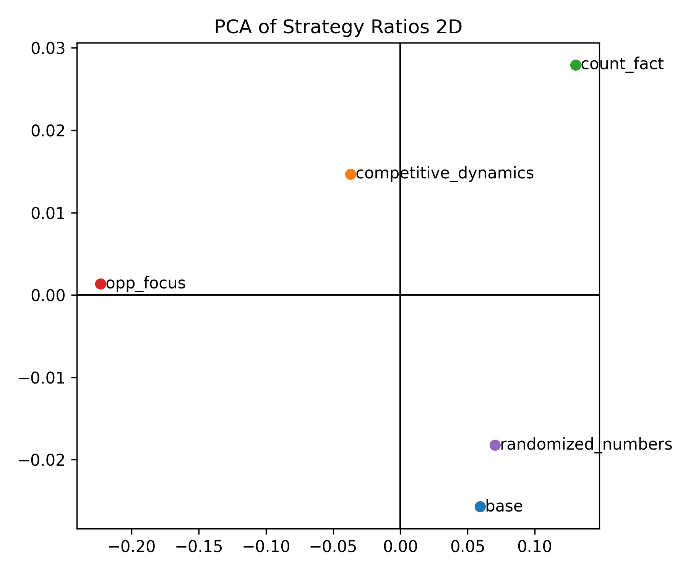
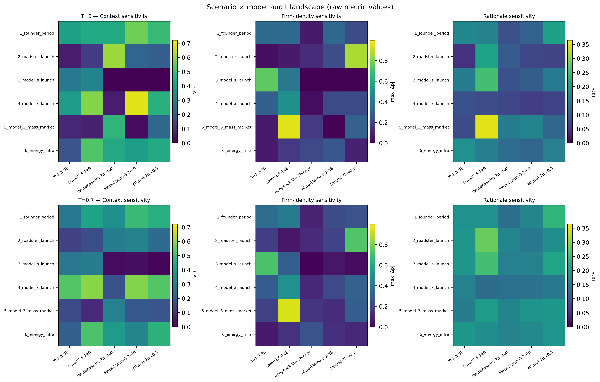
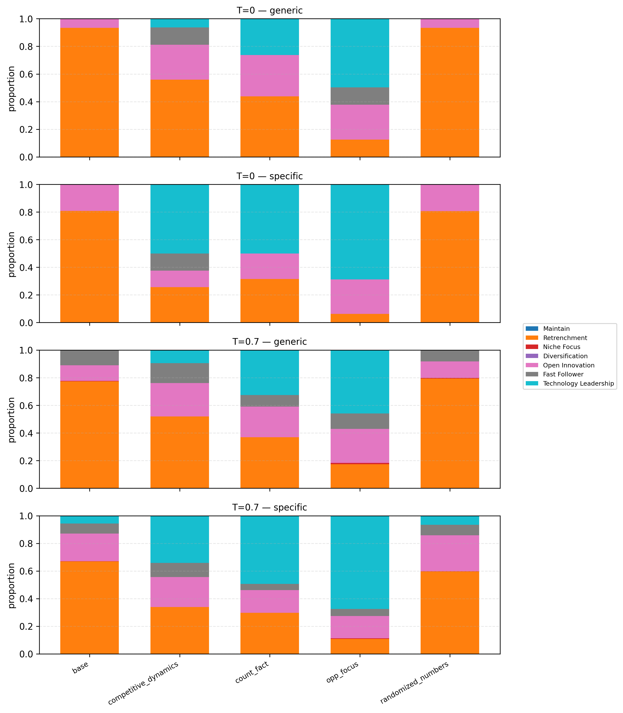
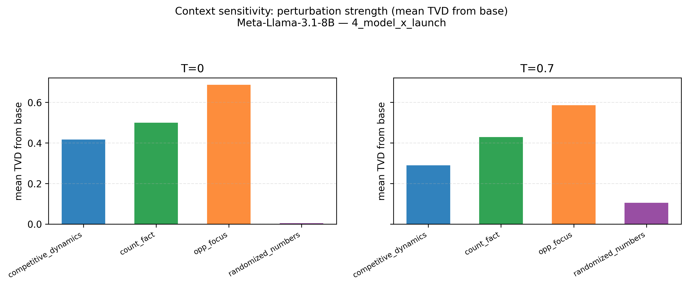
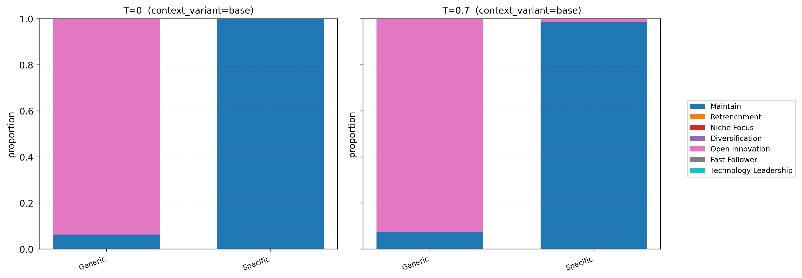
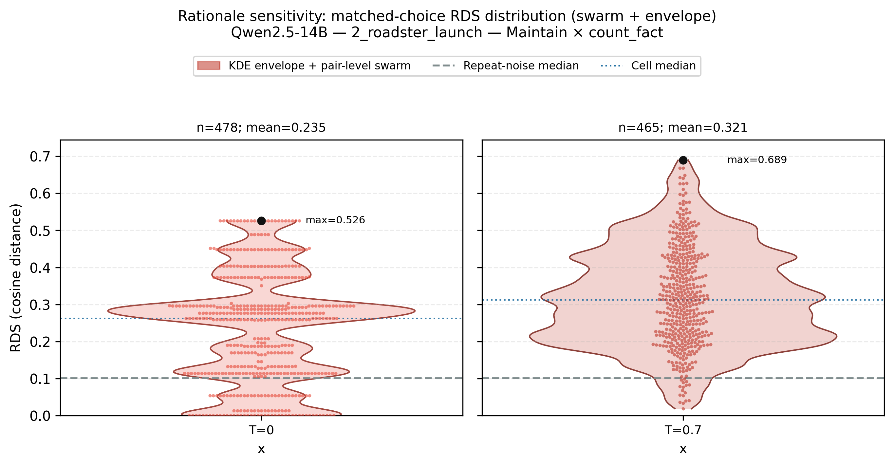

**A Scenario-Based Audit Framework for Evaluating Context and Firm-Identity Sensitivity in LLM-Based Strategic Decision Support**

**Abstract**  
Large Language Models (LLMs) are increasingly used as decision-support agents in R&D and innovation management, where analysts consult them for strategic recommendations under uncertainty. Existing evaluations, however, judge such systems mainly by task accuracy and overlook a property that matters more for deployment: whether a model's strategic recommendation stays stable when the same underlying problem is narrated, identified, or decoded slightly differently. We find that it does not. When the strategic dilemma and the option menu are held fixed, LLMs systematically reallocate their strategy recommendations in response to semantic context, firm-identity framing, and decoding settings; this instability further persists in the rationales they generate, and it concentrates in specific model–scenario–configuration combinations rather than averaging out. Because these are exactly the prompt variations that arise routinely in practice, correctness-oriented benchmarks alone cannot certify an LLM-based strategy decision-support system for use.

We therefore reframe the evaluation problem from correctness to decision sensitivity and propose a scenario-based audit framework for measuring it before deployment. Built on historically grounded R&D dilemmas, a closed menu of strategic archetypes, and controlled perturbations applied across multiple open-weight LLMs, the framework defines four complementary sensitivity axes—context sensitivity, firm-identity sensitivity, context–identity moderation, and rationale sensitivity—each paired with an interpretable metric that reports how much strategy mass or narrative content shifts relative to a fixed baseline. These axes are assembled into a deployable six-step audit protocol with tiered decision gates and human-in-the-loop review, positioning LLMs as conditional strategic agents whose behavior must be profiled, reported, and governed rather than assumed constant once a prompt template is frozen. The contribution is thus an operational auditing methodology—metrics, baselines, and gating criteria—for trustworthy use of LLMs in strategic R&D decision support.


**1\. Introduction**  
Large Language Models (LLMs) are increasingly used as algorithmic agents in R&D and innovation management—supporting technology opportunity discovery (Yoo et al., 2026) and strategic decision-making under uncertainty (Allen and McDonald, 2026). Organizations now consult LLMs not merely as information retrievers but as active participants in shaping strategic choices. Yet, despite this rapid adoption, empirical understanding of how these models behave as strategic agents remains critically limited.

When an LLM produces a strategic recommendation, it does not simply retrieve facts. It actively interprets the problem, weighs competing considerations, and generates a course of action. Unlike human agents whose reasoning can be probed and audited, however, LLMs offer no built-in transparency about what drives their judgments. Do they rely on stable strategic logic, or are their recommendations systematically shaped by how the problem is framed, which brand name appears in the prompt, or even the randomness setting of the decoder?

Current evaluative frameworks offer little answer to these questions. They primarily focus on accuracy, coherence, or task-level performance in isolated contexts (Chang et al., 2024). While informative, such metrics provide no insight into the stability of strategic judgments—how recommendations shift when the same underlying dilemma is presented with different contextual emphasis or brand identity, or decoded under different sampling settings. These are precisely the factors that matter most in R&D strategy, where outcomes are highly sensitive to market signals, competitive framing, and narrative persuasion.

To address this gap, this study shifts the focus from "correctness" to "decision sensitivity". We introduce a scenario-based audit framework that holds the underlying dilemma and a closed strategy menu fixed while systematically varying contextual and firm-identity conditions, so as to measure how much—and where—LLMs reallocate their strategic recommendations. Our central question is: how stable are LLMs' strategic judgments across contextual framing, firm identity, and model configurations, and can that stability be measured before deployment? By answering it, we characterize LLMs as conditional strategic agents: systems whose strategic behavior must be profiled, reported, and governed under realistic perturbations rather than assumed constant once a prompt template is frozen. To operationalize this view, we provide an audit protocol—sensitivity metrics, baselines, and gating criteria—for evaluating LLM behavior before use in high-stakes R&D decision support.

**2\. Background and related work**

**2.1 LLMs as decision support systems**  
Recent research has increasingly embedded LLMs into real-world decision pipelines, particularly in operations and engineering management. Wang et al. (2025a) propose a multi-agent scheduling chain that leverages LLM-based agents to handle flexible job shop scheduling and real-time rescheduling, demonstrating substantial gains in scheduling efficiency under disruptions. Du et al. (2025) introduce LLM-MANUF, an integrated framework in which multiple fine-tuned LLMs generate alternative decision plans that are subsequently ranked and fused, highlighting that manufacturing decision quality depends as much on comparing and aggregating candidate strategies as on generating a single “best” answer. Beyond manufacturing, Wang et al. (2025b), Xiong et al. (2025), and Gindullina et al. (2026) combine spatiotemporal knowledge graphs, digital twins, and physics-informed neural networks with LLM agents to support berth allocation, aviation design, and epidemic forecasting, respectively. These studies illustrate how LLMs can act as planning and coordination engines for complex operational systems, yet they typically assess success in terms of task performance and system-level efficiency. They rarely examine how, within a fixed set of strategic options, LLMs distribute their choices or how sensitive those choices are to subtle changes in contextual description or framing.

**2.2 Reliability, hallucination, and safety in high-stakes decisions**  
Another line of work focuses on making LLM-supported decisions more reliable in high-stakes environments. Kong et al. (2026) present HaluGNN, which models question–answer pairs as token graphs and uses graph neural networks to detect hallucinated content, thereby improving decision security in domains where factual errors are costly. Heo et al. (2025) develop HaluCheck, a visualization and automation framework that decomposes model responses into sentence-level claims, retrieves external evidence, and highlights likely hallucinations through an interactive interface for expert systems. Przystalski et al. (2026) use stylometric features to distinguish human- from LLM-generated texts, informing governance around authorship, attribution, and authenticity. In the context of smart-city management, Antuley et al. (2026) propose SORA-ATMAS, an adaptive trust and governance framework that aligns multiple LLM agents with cross-domain policies and regulatory constraints. In a separate high-stakes judgment setting, Choi and Park (2026) audit LLM-based patent comparison across three evaluative dimensions using diagnostic metrics that quantify prompt-induced shifts in consistency, alignment, and bias, positioning structured comparative judgment as an auditable paradigm for LLM deployment. Collectively, these studies treat reliability and safety primarily at the level of factual correctness, anomaly detection, policy compliance, or the internal consistency of a single fixed evaluative task. What remains underexplored is whether LLMs are reliable as strategic decision agents—specifically, how their strategic choices and rationales shift under contextual and framing manipulations when the underlying problem remains fixed.

**2.3 Knowledge-grounded decision infrastructures**  
A third strand of literature builds knowledge-grounded infrastructures that connect LLMs to structured data and domain ontologies. Ojuri et al. (2025) propose a text-to-SQL framework in which LLMs and intelligent agents translate natural language queries into executable SQL, lowering the access barrier for non-technical users and reducing dependence on data specialists in organizational decision-making. Xiong et al. (2025) introduce DR-RAG, a domain-rule-based retrieval-augmented generation framework that ties aviation digital models to knowledge graphs, rule bases, and digital twins, turning complex product design into a loop of retrieval, generation, and simulation feedback. In financial decision-making, Sinha et al. (2026) present FinBloom, a knowledge-grounded financial agent that combines a domain-specialized LLM with real-time news and regulatory filings to answer dynamic financial queries. Alarcón Serrano et al. (2026) evaluate how well general-purpose LLMs can recognize taxonomic relationships in SNOMED CT, clarifying their role in biomedical knowledge-graph workflows that support clinical reasoning. These works substantially improve what LLMs know and how they access relevant information. Yet, even with stronger grounding, they do not systematically analyze how a model’s strategic choices over a fixed option set change when only the narrative emphasis, identity cues, or quantitative inputs are perturbed.

**2.4 Evaluation and Behavioral Profiling of LLMs**  
Evaluation- and reasoning-centric research has sought to understand how LLMs plan, reason, and exhibit preferences across tasks. Liu et al. (2026) propose CART, a traceable planning framework that decomposes goals into subtasks, tracks planning trajectories, and triggers replanning when conditions change, thereby improving the robustness of LLM-based agents in incomplete-information environments. Gjorgjevikj et al. (2025) introduce xLLMBench, a decision-centric benchmarking framework that uses multi-criteria decision-making to rank models along accuracy, scale, energy consumption, and other non-performance factors. Memduhoğlu et al. (2026) treat LLMs as “virtual experts” for multi-criteria spatial planning, comparing their analytic hierarchy process (AHP) weightings with those of human panels and documenting systematic biases in how models prioritize criteria for solar power plant site selection. Torres-Moreno and Hermosillo-Valadez (2026) propose a semantic knowledge abstraction framework that restructures premise–hypothesis relations in natural language inference to improve consistency and reveal latent semantic gaps in LLMs’ reasoning. Most directly related to the present study, Allen and McDonald (2026) benchmark 21 proprietary and 13 open-source LLMs on the Back Bay Battery strategy simulation, showing that composite strategic performance has generally improved across model generations, yet even frontier models exhibit a systematic bias toward exploiting the existing business at the expense of long-term growth investment. This benchmark evaluates the quality of a single strategic trajectory produced under one fixed prompt configuration; it does not ask whether the same model, facing an unchanged strategic problem, would reach a different decision if that problem were merely narrated, identified, or decoded differently. These contributions collectively move beyond simple accuracy metrics toward richer assessments of reasoning, robustness, and multi-dimensional trade-offs. However, these evaluation frameworks—whether general-purpose or strategy-specific—typically focus on task-level performance or the quality of a single decision, leaving open how LLMs' strategic preferences shift under controlled perturbations of brand identity, contextual emphasis, or numerical signals.

**2.5 Cognitive Biases, Framing Effects, and Strategic Heuristics**

Human strategic judgments are susceptible to cognitive shortcuts that bypass deliberative reasoning (Kahneman, 2011). The halo effect occurs when a salient positive attribute—such as a firm's reputation—biases overall evaluation (Thorndike, 1920). Anchoring describes the tendency for an initial cue to shape subsequent judgments, even when that cue carries no objective decision-relevant information (Tversky & Kahneman, 1974). More broadly, Kahneman (2011) distinguishes fast, intuitive System 1 thinking from slow, analytical System 2 reasoning, with framing effects arising when System 1 dominates.

In LLM-based strategic decision-making, analogous patterns remain underexplored. The presence of a high-status brand identity or the selective emphasis of opportunity versus constraint information could trigger heuristic-like responses—leading models to prioritize narrative consistency over neutral evaluation of quantitative or factual signals. Nonetheless, existing benchmarks have not systematically characterized how such framing effects manifest in LLMs' categorical strategy choices, nor whether they persist in model-generated rationales.

**2.6 Strategic Archetypes in R&D and Innovation Management**  
To rigorously characterize the strategic behavior of LLMs, it is necessary to map their decision outputs onto established theoretical frameworks. This study adopts seven strategic archetypes rooted in the classical literature of competitive strategy and technological innovation. These options—Technology Leadership, Fast Follower, Open Innovation, Niche Focus, Diversification, Retrenchment, and Maintain—represent the fundamental trajectories firms pursue to navigate market transitions and resource constraints.

Specifically, the distinction between 'Technology Leadership' and 'Fast Follower' is grounded in the pioneering work on timing of entry and R&D intensity (Schilling, 2019). The concepts of 'Niche Focus' and 'Diversification' align with Porter’s generic strategies and the resource-based view of the firm (Porter, 1980; Barney, 1991). Furthermore, 'Open Innovation' reflects the modern shift toward collaborative R&D ecosystems (Chesbrough, 2003), while 'Retrenchment' and 'Maintain' represent critical defensive maneuvers under high environmental volatility (Miles et al., 1978). By constraining the LLM’s choice set to these validated archetypes, we transition from observing simple linguistic patterns to analyzing structural strategic reasoning. This methodological grounding ensures that the observed shifts in choice distributions are interpretable within the context of established management science.

**2.7 Research gap**  
Synthesizing these strands, prior work has advanced LLM-based decision support on four fronts: automated planning in operational systems, reliability through hallucination detection and structured-judgment auditing, knowledge-grounded access to structured domain information, and evaluation along general reasoning, multi-criteria, and strategy-simulation performance dimensions. In every case, success is defined by accuracy, reliability, or task performance—whether the model reaches a correct or well-grounded answer, or a strategically sound one under a single fixed prompt—rather than by the stability of the strategic stance the model takes when the same problem is narrated or identified differently. Cognitive science, meanwhile, shows that human strategic judgment is systematically reshaped by framing, anchoring, and halo effects, and strategic management supplies a validated set of archetypes against which categorical choices can be interpreted. These two observations have not been joined: it remains unknown whether an LLM, treated as a categorical strategic decision-maker over a fixed archetype menu, exhibits comparable framing-driven instability when the underlying dilemma is held constant—and whether that instability is large enough, and structured enough, to matter for deployment.

Closing this gap requires moving systematically from choice to rationale. We must first ask whether variation in semantic context—opportunity, constraint, competition, and numerical signals alike—reshapes the chosen strategy when the underlying dilemma is fixed. We must then isolate whether firm-identity framing reallocates strategy choice on its own; whether context and firm identity interact in a way that alters not only the magnitude but potentially the direction of framing effects; and whether, even when the selected strategy is unchanged, firm-identity framing still alters the rationale that justifies it. We therefore formulate four research questions:

**RQ1 (Context effect on choice).** How do variations in semantic context—specifically, signals of opportunity, constraint, competition, and numerical change—affect LLMs' strategy choices when the underlying decision problem is held constant?

**RQ2 (Framing effect on choice).** How does brand framing (Generic vs. Specific firm identification) reshape strategy selection when model, temperature, scenario, context variant, and context load are otherwise identical?

**RQ3 (Context–framing interaction on choice).** Is the impact of brand framing on strategy choice moderated by semantic context? Specifically, do both the magnitude and the direction of framing-induced strategy reallocation vary systematically across context variants?

**RQ4 (Framing effect on rationale).** How does brand framing alter the semantic content of model-generated rationales when the chosen strategy is held constant?

To address these questions, this study reconceptualizes LLMs as conditional strategic agents whose decision-making logic is intrinsically linked to environmental framing. Rather than treating model outputs as static responses, we seek to characterize the dynamic boundaries of LLM-based reasoning by evaluating the stability and sensitivity of strategic choices and rationales under controlled perturbations. By bridging the gap between cognitive psychology and strategic management, this research provides a foundational framework for understanding how architectural biases in LLMs can be identified and managed in high-stakes corporate environments.

**3\. Methodology**  
This study adopts a scenario-based benchmarking framework to analyze LLMs make strategic decisions under varying contextual and framing conditions. As illustrated in Fig. 1, the methodology consists of five sequential stages. First, we define six historically grounded base strategic scenarios, each representing a fixed strategic dilemma. Across all scenarios, problem framing is systematically controlled through two conditions: a Generic framing (anonymous firm) and a Specific framing (explicitly identified as Tesla), which are applied consistently throughout the experiment. Second, each base scenario is expanded using four contextual variants that selectively modify competitive, factual, opportunity-related, or numerical information. Third, contextual information related to technology, market competition, policy, and financial conditions is automatically injected or removed while preserving the same core problem structure. Fourth, LLMs are required to select a single strategy from a predefined set of strategic options and to articulate a brief rationale for their choice. Finally, each scenario configuration is evaluated through repeated inference under different decoding settings, and the resulting outputs are aggregated and analyzed to assess decision sensitivity across conditions.


Fig 1\. Scenario-based benchmarking framework for LLM strategic decision-making  
**3.1 Base Strategic Scenarios and Problem Framing**  
To anchor the analysis in realistic and theoretically grounded decision contexts, we construct six base strategic scenarios based on key phases in Tesla’s historical development. These phases—Founder phase, Roadster launch, Model S, Model X, Model 3, and Energy Infrastructure—are derived from widely used case narratives and strategic patterns in the strategic management of technological innovation literature (Schilling, 2019). Each scenario represents a distinct but well-defined strategic dilemma commonly faced by technology-driven firms as they transition across stages of innovation, market expansion, and organizational scaling.

Importantly, each base scenario is designed to capture a fixed strategic dilemma. While contextual information may vary across experimental conditions, the core problem statement—namely, the fundamental strategic challenge faced by the firm at that stage—remains unchanged. This design ensures that observed differences in model behavior can be attributed to contextual and framing variations rather than to changes in the underlying decision problem itself.

Across all base scenarios and their contextual variants, problem framing is systematically controlled through two conditions. In the Generic framing, the firm is described as an anonymous company, allowing assessment of strategy selection without explicit brand cues. In the Specific framing, the firm is explicitly identified as Tesla, introducing firm identity and brand-related associations into the decision context. This framing distinction is applied consistently across all scenarios and variants, serving as a cross-cutting experimental dimension rather than a scenario-specific feature.

By grounding base scenarios in established innovation strategy frameworks while maintaining consistent problem structures and framing controls, this stage establishes a stable foundation for isolating how LLMs respond to contextual variation and firm identity cues in subsequent experimental steps.

**3.2 Contextual Scenario Variants**  
To examine how LLMs’ strategic judgments change under different informational emphases, we introduce controlled contextual variants to each base scenario. These variants do not alter the underlying strategic dilemma; instead, they selectively modify how the same problem is contextualized.

Four contextual variants are used. The competitive\_dynamics variant adds explicit signals of intensified competition to assess responses to competitive pressure. The count\_fact variant emphasizes unfavorable factual constraints, such as financial or operational limitations, to test defensive strategic adjustment. The opp\_focus variant highlights positive opportunity signals, probing whether opportunity framing amplifies proactive or leadership-oriented strategies. Finally, the randomized\_numbers variant applies numerical perturbations (±20%) to quantitative inputs without changing their semantic meaning, serving as a control to distinguish semantic sensitivity from numerical variation.

All variants are applied consistently across base scenarios and framing conditions, enabling direct comparison of how different types of contextual cues influence strategic decision sensitivity.

**3.3 Contextual Information Injection**  
To probe decision sensitivity, contextual information is injected into each scenario in a controlled and modular manner. Across all scenario instances, including the base case and its contextual variants, context blocks are defined to represent market conditions, technological constraints, financial status, policy support, competitive landscape, and customer response.

Each experimental run receives a subset of these context blocks, which are selectively added to or removed from the prompt while keeping the core problem statement unchanged. This design enables systematic combinations of contextual presence and absence, allowing us to observe how LLMs adjust strategic judgments when specific signals are emphasized, suppressed, or jointly presented.

Importantly, contextual injection operates independently of problem framing. Both Generic (anonymous firm) and Specific (Tesla-identified) problem formulations are paired with identical contextual information, ensuring that observed differences can be attributed to contextual cues and framing effects rather than changes in the underlying strategic dilemma.

This approach enables fine-grained analysis of how individual and combined contextual signals influence strategy selection, decision stability, and sensitivity to semantic framing.

**3.4 Strategy Selection Task Design**  
The seven strategic archetypes introduced in Section 2.6 are operationalized as a closed-choice decision task. For each scenario, LLMs are instructed to select exactly one strategy from the options defined in Table 1 and provide a brief rationale. No ranking or weighting is allowed, forcing the model to commit to a single strategic direction.

| Strategy Option | Definition |
| :--- | :--- |
| **Technology Leadership** | Pursue technological superiority at the cost of higher risk or delayed scalability. |
| **Fast Follower** | Rapidly scale by adopting proven technologies, emphasizing speed and cost efficiency. |
| **Open Innovation** | Collaborate with external partners to share risks, resources, and capabilities. |
| **Niche Focus** | Target a narrowly defined customer segment, emphasizing specialization. |
| **Diversification** | Expand into adjacent businesses to spread risk and create synergies. |
| **Retrenchment** | Reduce scope or delay expansion to preserve financial stability. |
| **Maintain** | Stabilize existing operations before pursuing further strategic moves. |

Table 1. Seven strategic archetypes and their definitions.


**3.5 Repeated Inference and Aggregation**  
To examine the stability and variability of LLM-based strategic judgments, this study adopts a repeated inference approach rather than relying on single-shot model outputs. Strategic decision-making is inherently non-deterministic, and a single response may not adequately represent a model’s underlying preference structure.

Repeated inference enables observation of how consistently a model favors particular strategies under identical conditions and how its choices disperse when multiple plausible interpretations exist. By incorporating both deterministic and stochastic decoding regimes, the framework captures a spectrum of decision behaviors ranging from most-probable judgments to probabilistic exploration.

Instead of treating each output as an isolated recommendation, individual inferences are aggregated into empirical strategy distributions. These distributions reflect relative selection tendencies across the predefined strategic options, allowing analysis of dominant patterns as well as decision uncertainty.

This distributional perspective is essential for assessing context and framing sensitivity. It supports comparative analysis across scenarios, structural examination of strategic environments, and sensitivity measurement relative to baseline conditions, thereby providing a more robust characterization of LLMs as strategic decision agents than single-point evaluations.

4\. Experimental Setup

**4.1 Model Selection**

We evaluate five open-weight, instruction-tuned language models that span distinct developer ecosystems and pretraining traditions: Meta Llama 3.1 8B Instruct (Grattafiori et al., 2024), Mistral 7B Instruct v0.3 (Jiang et al., 2023), Qwen 2.5 14B Instruct (Yang et al., 2024), DeepSeek LLM 7B Chat (Bi et al., 2024), and Yi 1.5 9B Chat (Young et al., 2024). This selection is motivated by three considerations. First, architectural and institutional diversity reduces the risk that findings reflect idiosyncrasies of a single model family or geographic training corpus; the panel mixes U.S., European, and Asia-based open models whose alignment and data mixes differ in ways that may plausibly affect strategic framing and narrative priors. Second, all models are openly available instruct variants that can be hosted on local inference stacks, which supports reproducible, high-volume repeated sampling under fixed prompts and decoding regimes—conditions that are difficult to guarantee with proprietary API-only frontiers whose internals may change without notice. Third, parameter counts are confined to a compact scale band (roughly 7B–14B parameters), which keeps compute and latency within a range typical of on-premise or dedicated-GPU deployments in corporate R\&D settings while still allowing meaningful variation in model capacity (e.g., 7B-class versus 14B-class) within a single experimental design. The goal is comparable results across models and evidence that speaks to open weights firms can run on their own hardware.

**4.2 Prompt Design and Bias Control**

Prompts followed a fixed template with five components: (1) a strategic dilemma statement, (2) optional context blocks, (3) candidate execution options, (4) mapping from options to strategic archetypes, and (5) a JSON output schema. Models were required to select exactly one strategy and provide a brief rationale, preventing free-form outputs.

Firm-identity framing was isolated by keeping all content identical except the problem statement: Generic framing described an anonymous firm; Specific framing explicitly named Tesla. Contextual information, injected modularly as described in §3.3, was held identical across framing conditions to ensure that any difference in strategy distributions arises solely from the brand cue.

To mitigate option-order bias (Guan et al., 2025), alphabetic labels (A–G) were rotated across scenarios so that no archetype (e.g., Technology Leadership) was consistently tied to the same label. Responses were parsed into a structured JSON object; unparseable responses or selections outside the seven archetypes were excluded from normalized distributions (compliance reported in Appendix A).

**4.3 Inference Settings and Repetition Protocol**

Each experimental condition was repeated 30 times per model at two decoding temperatures. Temperature 0.0 produces deterministic responses, establishing a baseline of each model's stable strategic preferences under identical inputs. Temperature 0.7 introduces controlled randomness to assess whether the observed patterns remain stable when responses are allowed to vary, and to compare models' sensitivity to decoding temperature. Maximum output length was fixed at 256 tokens.

**5\. Key Findings**  
This section synthesizes the central empirical patterns observed across repeated runs. We first characterize how strategy selections shift across contextual variants and whether those shifts form distinct structural regimes. We then examine the pure effect of brand framing on strategy reallocation, test whether context and firm identity interact, and assess whether brand exposure alters the rationale framing even when the selected strategy is held constant. Finally, we localize population-level sensitivity patterns to specific model–scenario–temperature cells that motivate the audit framework in Section 6.

**5.1 Strategy Distribution Across Contextual Variants**  
Fig. 2 shows that the distribution of selected strategies varies across repeated runs, indicating that LLMs do not rely on a single dominant default strategy but respond systematically to contextual framing. In the base scenario, Niche Focus is most frequent, followed by Open Innovation, with Technology Leadership and Maintain close behind. When opportunity signals are emphasized (opp\_focus), leadership-oriented strategies surge and become dominant. In contrast, unfavorable factual constraints (count\_fact) lead to defensive repositioning toward niche or follower strategies. Notably, numerical perturbations alone (randomized\_numbers) produce minimal change, indicating that semantic context rather than numeric variation drives strategic reorientation. This pattern carries important implications for strategic decision-making. In many real-world R\&D and innovation contexts, proportional numerical changes—such as shifts in cost, market size, or resource availability—often serve as triggers for strategic adjustment. However, the observed stability under numerical perturbations suggests that LLMs may treat moderate quantitative variation as secondary when the overall semantic structure of the scenario remains unchanged.

  
Fig. 2\. Strategy distribution across contextual scenario variants.

**5.2 Structural Separation and Statistical Dynamics of Strategic Contexts**  
Fig 3\. examines whether these distributional shifts reflect meaningful structural differences. Principal component analysis reveals clear separation between opportunity-focused and unfavorable scenarios, while the base and randomized-number variants cluster closely together. This suggests that LLMs internally distinguish qualitatively different strategic environments rather than responding to random noise or minor input changes.  
  
Fig. 3\. PCA-based structural separation of strategy distributions across scenarios.


To further quantify these shifts and the underlying decision uncertainty, we calculated Shannon entropy, Total Variation Distance (TVD) from base, and Spearman rank correlation for each scenario relative to the base (Table 2). For each context variant *v* (*competitive\_dynamics*, *count\_fact*, *opp\_focus*, or *randomized\_numbers*), TVD = 0.5 Σ<sub>i</sub> |*p<sup>v</sup><sub>i</sub>* − *p<sup>base</sup><sub>i</sub>*|, where *p<sup>v</sup><sub>i</sub>* and *p<sup>base</sup><sub>i</sub>* are the selection shares of strategy *i* under the variant and base scenarios, respectively. TVD directly measures the share of strategy mass that shifted from the base distribution when that contextual cue was changed—e.g., a TVD of 0.25 means roughly 25% of choices moved to a different strategy. Bootstrap 95% confidence intervals for TVD from base (10,000 resamples; row-level nonparametric bootstrap) are reported alongside the point estimates.

| Scenario | entropy | TVD\_from\_base | 95% CI (TVD) | spearman\_vs\_base |
| :---: | :---: | :---: | :---: | :---: |
| base | 1.8422 | 0 | — | 1 |
| competitive\_dynamics | 1.8211 | 0.1121 | [0.1077, 0.1172] | 0.8214 |
| count\_fact | 1.7818 | 0.1002 | [0.0958, 0.1047] | 0.6429 |
| opp\_focus | 1.7030 | 0.2550 | [0.2505, 0.2595] | 0.6786 |
| randomized\_numbers | 1.8328 | 0.0206 | [0.0164, 0.0258] | 1 |

Table 2\. Quantitative metrics for strategic decision consistency and shift.

The quantitative analysis provides several key insights into the models' decision-making logic:

* Context-Driven Certainty (Entropy): The opp\_focus scenario exhibited the lowest entropy (1.7030), compared to the base scenario (1.8422). This suggests that while LLMs are generally cautious (high entropy) in ambiguous settings, they become significantly more "confident" and decisive when presented with growth-oriented opportunities.

* Sensitivity to Narrative vs. Magnitude (TVD & Spearman): The TVD\_from\_base for opp\_focus (0.2550) was roughly 2.5× that of count\_fact (0.1002), indicating that LLMs are disproportionately sensitive to optimistic framing. Conversely, the randomized\_numbers scenario showed a perfect Spearman correlation (1.0000) and a comparatively small TVD (0.0206)—roughly one-fifth of count\_fact—relative to the base. This statistically confirms "numerical insensitivity," where the models' strategic ranking remains frozen despite quantitative fluctuations.

These metrics validate the PCA results: the structural separation observed in Fig. 3 is not merely visual but is rooted in distinct changes in decision certainty and rank stability across different semantic contexts.

**5.3 Strategic Reallocation Under Brand Framing**  
To isolate the pure effect of brand framing, we compare strategy selections under Specific (Tesla-identified) versus Generic (anonymous) framing while holding all other experimental conditions strictly identical—same model, temperature, scenario, context variant, and number of context blocks. For each condition, we compute Δp = p(Specific) − p(Generic) per strategy and macro-average across conditions. Bootstrap 95% confidence intervals (10,000 condition-level resamples) and Benjamini–Hochberg false discovery rate (FDR) correction across the seven strategies test whether each shift is reliably distinguishable from zero (Fig. 4).

Fig. 4 shows that Specific firm identification reallocates strategy probability mass across the choice set rather than nudging a single option. Six of seven strategies exhibit FDR-significant Δp; only Retrenchment does not (Δp = −0.4 pp; 95% CI [−1.2, +0.3]; FDR *q* = .267). The largest shifts are concentrated and asymmetric: Technology Leadership increases by +9.5 pp (95% CI [8.2, 10.7]; FDR *q* < .001), while Open Innovation (−5.7 pp) and Niche Focus (−4.7 pp) decline by comparable margins (both FDR *q* < .001). Smaller but still significant reallocations emerge for Fast Follower (+2.0 pp), Diversification (+0.9 pp), and Maintain (−1.5 pp) (FDR *q* < .05). Thus, brand framing operates as a distributional shift—systematically downweighting collaborative and niche archetypes while elevating leadership-oriented (and, secondarily, follower and diversification) options—rather than as a diffuse or uniform preference nudge.

  
Fig. 4\. Strategic reallocation under brand framing (bootstrap 95% CI from condition-level resampling; stars denote FDR-corrected significance at *q* < .05, .01, and .001).

**5.4 Context–Framing Interaction: Moderation of Brand Effects**

To examine whether brand framing operates independently of context or is moderated by it, we disaggregate the Δp = p(Specific) − p(Generic) computed in Section 5.3 by context variant. Fig. 5 presents the resulting framing-effect matrix as a context variant × strategy heatmap. To test moderation formally, we compute a difference-in-differences interaction relative to base: $\Delta p_{\mathrm{interaction}} = \Delta p(\mathrm{variant}) - \Delta p(\mathrm{base})$ for each strategy. Bootstrap 95% confidence intervals (10,000 condition-level resamples per variant) and FDR correction across the 28 interaction terms (four non-base variants × seven strategies) assess whether context reliably shifts framing effects beyond base (Table 5).

  
Fig. 5\. Brand framing effect (Δp = p(Specific) − p(Generic)) by context variant and strategy (macro-averaged over conditions within each variant; diverging scale centered at zero).

| Context variant | Maintain | Retrenchment | Niche Focus | Diversification | Open Innovation | Fast Follower | Technology Leadership |
| :---- | :----: | :----: | :----: | :----: | :----: | :----: | :----: |
| competitive\_dynamics | +0.011 | +0.011 | −0.018 | −0.008 | −0.020 | +0.019 | +0.005 |
| count\_fact | +0.006 | +0.019 | +0.045** | −0.006 | −0.012 | +0.015 | −0.067** |
| opp\_focus | +0.007 | +0.012 | +0.015 | −0.005 | −0.014 | +0.003 | −0.018 |
| randomized\_numbers | −0.002 | +0.008 | +0.028 | −0.004 | −0.004 | +0.004 | −0.031 |

Table 5. Context–framing interaction ($\Delta p_{\mathrm{interaction}} = \Delta p(\mathrm{variant}) - \Delta p(\mathrm{base})$) by context variant and strategy. Stars denote FDR-corrected significance at *q* < .01 (**). Bootstrap 95% CIs for significant terms: Technology Leadership under count\_fact [−0.104, −0.029]; Niche Focus under count\_fact [0.018, 0.072].

Two findings emerge. First, the directional signature of brand framing is fully consistent across all five context variants in Fig. 5: Technology Leadership gains and Open Innovation and Niche Focus lose in every row without exception. Pairwise Spearman rank correlations between variant-level Δp profiles range from 0.93 to 1.00, confirming that context does not reverse which strategies are favored or penalized under Specific framing.

Second, Fig. 5 suggests modest variation in framing magnitudes across contexts—for example, Technology Leadership Δp ranges from +12.2 pp to +5.0 pp across variants. Formal interaction tests (Table 5), however, show that most of these descriptive differences are not statistically distinguishable after FDR correction: only two of 28 interaction terms remain significant, both under count\_fact. Relative to base, unfavorable factual constraints reduce Tesla’s Technology Leadership gain by 6.7 pp and shrink the brand penalty on Niche Focus by 4.5 pp. No other variant yields an FDR-significant interaction, including for Open Innovation suppression.

Taken together, brand framing is directionally stable across contexts, and statistically reliable moderation of its intensity is limited to count\_fact. Even so, that boundary condition shows why a single contextual narrative is an incomplete basis for judging firm-identity sensitivity: constraint framing can dampen leadership-oriented brand amplification in ways that would not be apparent from the base context alone.

**5.5 Rationale Framing Shift Under Brand Exposure**

This section examines whether explanatory rationales shift under brand exposure even when the strategic choice remains identical. We constructed matched pairs holding all experimental conditions constant—model, temperature, scenario, context variant, number of context blocks, and chosen strategy—while varying only firm identification (Specific vs. Generic). Firm-referential tokens (e.g., Tesla, company) and numeric terms were masked to minimize superficial lexical artifacts. Lexical divergence was quantified using log-odds ratios, with statistical significance assessed via paired permutation tests (146,429 samples; 59,819 terms) and FDR correction. Both global separation (mean absolute log-odds difference) and keyword-level effects were evaluated.

The analysis confirms significant lexical divergence between conditions. The observed global separation (mean |Δlog-odds| = 0.323) exceeded the permutation baseline (0.223, p = 0.003), indicating systematic differences beyond random variation.

Table 3 summarizes the semantic structure of this divergence. Specific (Tesla) rationales were characterized by high-agency, vision-oriented language—mission lead, leader capturing, world transition—emphasizing proactive market positioning. Generic rationales were characterized by constraint-oriented, operational language—rushed quality, delaying significant, make feasible—emphasizing execution risks and resource management.

| Analysis Dimension | Specific (Visionary & Strategic Expansion) | Generic (Operational & Constraint Management) |
| :---: | ----- | ----- |
| **Leadership & Identity** | mission lead, identity leader (Focus on mission-driven leadership and brand identity) | trust balanced, goals standards (Focus on maintaining trust and adhering to industry standards) |
| **Technological Positioning** | goal technological, position platform (Emphasis on technological objectives and platform dominance) | enables integration, optimization scale (Emphasis on systems integration and operational efficiency) |
| **Market Dynamics** | world transition, leader capturing (Highlighting global transformation and proactive market capture) | rushed quality, delaying significant (Highlighting quality risks and significant project delays) |
| **Execution & Feasibility** | prestige demonstrate, mission showcase (Demonstrating institutional prestige and showcasing core missions) | funding invest, make feasible (Addressing capital investment and practical feasibility) |

Table 3. Semantic framing differences in rationale keywords

These findings indicate that LLM-generated strategic rationales are not neutral analytical outputs but reflect framing-consistent narrative patterns. Notably, the effect persists after masking brand-referential terms, suggesting that firm identity cues trigger distinct explanatory styles rather than mere lexical priming.

To quantify the degree of narrative divergence beyond keyword inspection, we introduce the Rationale Divergence Score (RDS)—the cosine distance between Sentence-BERT embeddings (*paraphrase-MiniLM-L6-v2*; Reimers and Gurevych, 2019) of matched Generic and Specific rationale pairs. RDS ∈ [0, 1], where 0 indicates semantically identical justifications and 1 indicates maximal divergence. Any RDS above zero therefore reflects the effect of firm framing alone on the explanatory narrative.

Across 146,565 matched pairs spanning 2,545 condition×strategy cells, mean RDS is 0.158 (median = 0.146, SD = 0.090; bootstrap 95% CI on cell-level macro means [0.156, 0.161]), confirming that the rationale shift documented in Table 3 is not confined to a narrow set of keywords but constitutes a pervasive, semantically measurable divergence. To interpret this magnitude, we compare RDS against two reference distributions using the same embedding pipeline and preprocessing (brand-term masking only). Noise and ceiling baselines each draw one random pair per eligible cell (seed = 42).

The repeat-noise lower bound (n = 5,790; median = 0.101) fixes Standard Mapping and firm framing and contrasts two independent repeats, isolating decoding variability absent intentional manipulation. The strategy-ceiling upper bound (n = 1,702; median = 0.364) fixes firm framing but compares rationales from two different chosen strategies, approximating embedding distance when the strategic commitment itself changes.

Fig. 6 overlays the three distributions. RDS (median = 0.146) lies clearly above repeat noise and well below the cross-strategy ceiling, indicating that brand framing induces semantically measurable narrative shift beyond stochastic repetition, yet does not reframe justifications to the same extent as changing the chosen strategy itself. Cell-level bootstrap 95% confidence intervals (10,000 resamples) and FDR correction confirm that macro-averaged mean RDS is reliably distinguishable from zero for all seven strategies (all FDR *q* < .001; strategy-level means and CIs are reported below). Fig. 7 visualizes how these strategy-level means distribute across context variants.


Fig. 6. Rationale embedding distance: framing (RDS) vs. repeat noise vs. cross-strategy ceiling (matched preprocessing; noise and ceiling baselines: one random pair per eligible cell).


Fig. 7. Mean Rationale Divergence Score (RDS) by strategy. Boxes span the five context-variant cell means; colored points indicate base, competitive\_dynamics, count\_fact, opp\_focus, and randomized\_numbers (matched pairs on Standard Mapping; only brand framing varies). Macro mean RDS and bootstrap 95% CIs are reported in the text.

Three structural patterns emerge from Fig. 7. First, RDS differs substantially across strategies: all seven exhibit FDR-significant macro mean RDS (all FDR *q* < .001). Maintain (0.184; 95% CI [0.177, 0.191]) and Diversification (0.179; 95% CI [0.171, 0.187]) show the highest narrative divergence, while Open Innovation (0.124; 95% CI [0.119, 0.129]) and Retrenchment (0.136; 95% CI [0.129, 0.144]) show the lowest—a roughly 1.5-fold spread across the strategy axis. This indicates that the degree of framing-induced narrative shift is conditioned on strategic content.

Second, context variants do shift RDS within a strategy, but the size of that shift is strategy-dependent rather than uniform. For Open Innovation the five context means are nearly coincident (span ≈ 0.006), whereas for Fast Follower they range from 0.137 to 0.175 (span ≈ 0.038), with Technology Leadership and Retrenchment intermediate (span ≈ 0.021). Context is therefore a second-order factor layered on the strategy-driven baseline, with the room it has to move the rationale set by the chosen strategy.

Third, the count\_fact variant produces the most pronounced outliers, but not in a uniform direction: under unfavorable factual constraints, rationale divergence becomes more tightly coupled to the chosen strategy rather than globally inflated or deflated. In Fig. 7, count_fact simultaneously marks the highest cell mean (Maintain = 0.197) and one of the lowest within-strategy means (Fast Follower = 0.137; Open Innovation = 0.101). This pattern indicates that constraint framing does not “spread” narrative divergence evenly across decisions; instead, it amplifies strategy-specific narrative anchoring, pushing some strategies toward sharper framing divergence while compressing others.

**5.6 Localized Sensitivity Profiles and Deployment Risk Cases**

Sections 5.1–5.5 establish that LLM strategy recommendations and matched-choice rationales shift under semantic context and firm-identity cues when the underlying dilemma and closed strategy menu are held fixed. Those results are population-level: they macro-average over models, scenarios, temperatures, and context loads. For deployment, however, the operative question is not whether sensitivity exists on average but *where* it concentrates in the experimental grid—and whether a production configuration (model, temperature, scenario template, and prompt framing) would inherit a localized failure mode invisible in pooled benchmarks. This section answers that question by re-expressing the sensitivity metrics from Sections 5.1–5.5—context TVD, firm-identity Δ*p*, and rationale RDS—at the model × scenario × temperature level, then examining three priority cells that illustrate distinct deployment risk archetypes.

**5.6.1 From Population Patterns to Localized Audit Cells**

The population patterns in Sections 5.1–5.5 already imply that no single correctness score can certify an LLM-assisted strategy DSS for production. Opportunity framing reallocates strategy mass more than constraint framing (TVD ≈ 0.255 vs. 0.100); firm-identity exposure reallocates the menu toward Technology Leadership (+9.5 pp) and away from Open Innovation (−5.7 pp); and matched-choice rationales diverge above repeat-noise levels (macro mean RDS = 0.158). Yet these aggregates can mask sharp local contrasts. A model–temperature pair that appears moderately firm-identity-invariant on average may still flip from Open Innovation to Maintain under Specific framing in a single high-stakes scenario; a scenario that is context-invariant for one model may exhibit large TVD shifts for another; and rationale divergence can peak for a particular strategy × context combination even when the chosen archetype is unchanged.

We therefore profile localization using the same sensitivity metrics computed within each model × scenario × temperature cell:

*Context sensitivity* — maximum Total Variation Distance from *base* to any context perturbation variant (*competitive\_dynamics*, *count\_fact*, *opp\_focus*, *randomized\_numbers*) within the cell; TVD is the share of strategy mass reallocated relative to base (Section 5.1).

*Firm-identity sensitivity* — maximum \|Δ*p*\| = \|*p*(Specific) − *p*(Generic)\| across archetypes within the cell.

*Rationale sensitivity* — mean RDS over matched Generic–Specific rationale pairs within the cell (strategy and context variant held fixed).

Table 6 reports these three sensitivity magnitudes for each architecture at $T=0.0$ and $T=0.7$, after macro-averaging the eligible cell-level values across the full scenario set. 

| Model | $T$ | Context sensitivity | Firm-identity sensitivity | Rationale sensitivity |
| :---- | :--: | :----: | :----: | :----: |
| Yi-1.5-9B-Chat | 0.0 | 0.238 | 0.265 | 0.131 |
| Yi-1.5-9B-Chat | 0.7 | 0.272 | 0.301 | 0.179 |
| Qwen2.5-14B-Instruct | 0.0 | 0.345 | 0.404 | 0.171 |
| Qwen2.5-14B-Instruct | 0.7 | 0.349 | 0.394 | 0.199 |
| DeepSeek-LLM-7B-Chat | 0.0 | 0.336 | 0.103 | 0.109 |
| DeepSeek-LLM-7B-Chat | 0.7 | 0.263 | 0.123 | 0.153 |
| Llama-3.1-8B-Instruct | 0.0 | 0.319 | 0.179 | 0.108 |
| Llama-3.1-8B-Instruct | 0.7 | 0.326 | 0.163 | 0.160 |
| Mistral-7B-Instruct-v0.3 | 0.0 | 0.308 | 0.288 | 0.149 |
| Mistral-7B-Instruct-v0.3 | 0.7 | 0.316 | 0.290 | 0.196 |

Table 6. Model-level summaries of context sensitivity (mean max TVD from *base*), firm-identity sensitivity (mean max \|Δ*p*\|), and rationale sensitivity (mean RDS), each macro-averaged over scenarios.

Three patterns emerge from Table 6. First, Qwen2.5-14B-Instruct and DeepSeek-LLM-7B-Chat show the highest context sensitivity at $T=0.0$ (0.345 and 0.336)—roughly a third of strategy mass reallocated away from base under the most disruptive perturbation variant—while Yi-1.5-9B-Chat is lowest (0.238). Second, Qwen2.5-14B-Instruct shows the highest firm-identity sensitivity at both temperatures (0.404 at $T=0.0$; 0.394 at $T=0.7$), whereas DeepSeek-LLM-7B-Chat records the lowest (0.103; 0.123). Third, raising temperature from 0.0 to 0.7 does not uniformly move context, firm-identity, or rationale sensitivity in the same direction: context sensitivity falls only for DeepSeek (0.336 → 0.263), while it rises for Yi (0.238 → 0.272), Llama (0.319 → 0.326), Mistral (0.308 → 0.316), and stays roughly flat for Qwen (0.345 → 0.349); firm-identity sensitivity falls slightly for Qwen (0.404 → 0.394) while rising for Yi (0.265 → 0.301); and rationale sensitivity increases for Qwen (0.171 → 0.199) and Yi (0.131 → 0.179). Temperature therefore reshapes each sensitivity axis idiosyncratically per model rather than uniformly damping or amplifying sensitivity.

**5.6.2 Model×Scenario Landscape**

Architecture-wide means average over scenarios and therefore hide which model × scenario × temperature cells drive each elevation. We next resolve the same three metrics at that cell level and map where sensitivity concentrates in specific deployment contexts. Fig. 8 displays the full scenario × model grid at $T=0.0$ and $T=0.7$ on the raw metric scale.

Context TVD, firm-identity \|Δ*p*\|, and RDS do not co-move across the grid: a cell with low firm-identity separation can exhibit high context TVD, and rationale divergence can peak even when strategy labels are stable. Context sensitivity is sparse but intense—the largest perturbation-variant TVD in the benchmark grid reaches 0.686 (*4\_model\_x\_launch*, Llama-3.1-8B-Instruct, $T=0.0$; Case I, below), meaning roughly two-thirds of strategy mass reallocates away from base in that cell's most disruptive variant. Firm-identity hotspots concentrate on *5\_model\_3\_mass\_market* under Qwen2.5-14B-Instruct, where Generic vs. Specific framing shifts the modal strategy (Case II, below). Cohort-wide, Maintain under *count\_fact* marks the highest mean RDS in Fig. 7 (0.197); Case III localizes this pattern in *2\_roadster\_launch* under Qwen2.5-14B-Instruct, where matched-choice rationales diverge sharply (peak pair RDS = 0.689). Localized profiling must therefore be scoped to the production scenario set and model–temperature configuration rather than inferred from architecture-wide means alone.

  
Fig. 8. Scenario × model audit landscape: context sensitivity (max TVD from *base* over perturbation variants, including *randomized\_numbers*), firm-identity sensitivity (max \|Δ*p*\|), and rationale sensitivity (mean RDS). Raw metric values with a shared color scale per column across temperatures; rows = $T=0.0$ (top) and $T=0.7$ (bottom).

Priority cells in Table 7 are selected as follows. For each audit axis, candidate model × scenario pairs are ranked by the **mean** of the axis metric over $T \in \{0.0, 0.7\}$; case figures report both temperatures. A qualitative filter then retains cells that exhibit an interpretable deployment-risk pattern (context-driven menu rewrite; firm-identity modal strategy flip; matched-choice rationale divergence with exemplar pairs). Where the top-ranked models would repeat across axes, the next eligible candidate within 85% of the axis maximum is preferred so that the three cases span distinct architectures when the data support it.

Table 7 lists the three priority cells selected for case analysis.

| Audit axis | Model | Scenario | Localization signal |
| :---- | :---- | :---- | :---- |
| Context | Llama-3.1-8B-Instruct | 4\_model\_x\_launch | context TVD = 0.636; *opp\_focus* is the dominant driver; Specific framing activates Technology Leadership |
| Firm-identity | Qwen2.5-14B-Instruct | 5\_model\_3\_mass\_market | firm-identity Δp = 0.944; Generic → Open Innovation, Specific → Maintain |
| Rationale | Qwen2.5-14B-Instruct | 2\_roadster\_launch | rationale RDS = 0.246; Maintain × *count\_fact* matched-choice rationales diverge |

Table 7. Priority scenario–model cells for deployment risk cases (axis means macro-averaged over $T=0.0$ and $T=0.7$).

**5.6.3 Three Deployment Risk Archetypes**

The priority cells in Table 7 instantiate three deployment risk archetypes—context-driven menu rewrite, firm-identity reallocation, and rationale divergence under matched choice. Each case holds the strategy menu fixed and varies only legitimate deployment inputs—semantic context, firm identity, or both—demonstrating why population-level classifications can fail locally.

*Case I: Context-driven menu rewrite (Llama-3.1-8B-Instruct; 4\_model\_x\_launch).*

**(1) Problem.** A company aims to enter the growing SUV market. However, a complex product design creates high production difficulty and quality risks, which could severely damage the brand's reputation despite a lack of direct competition.

**(2) Strategy menu.**

| Mapped strategy | Execution option |
| :---- | :---- |
| Technology Leadership | Launch a luxury SUV with innovative, complex features |
| Fast Follower | Introduce a simpler SUV quickly to capture demand before competitors |
| Open Innovation | Partner with suppliers/OEMs to co-develop SUV platform and reduce complexity |
| Niche Focus | Develop a standard, mid-priced SUV for a specific customer segment |
| Diversification | Expand into related vehicle categories (e.g., crossover, minivan) alongside SUV |
| Retrenchment | Reduce scope of SUV project, scale down features to cut risk |
| Maintain | Postpone the SUV launch, focus on stabilizing Model S production first |

Table 8. Strategy menu for 4\_model\_x\_launch.

**(3) Observed behavior.** Context perturbations are implemented through the *context\_variant* axis—*base*, *competitive\_dynamics*, *count\_fact*, *opp\_focus*, and *randomized\_numbers*—on top of Generic vs. Specific firm-identity framing (Llama-3.1-8B-Instruct). Fig. 9 shows strategy stacks; Fig. 10 reports mean TVD from *base* for each perturbation variant.

  
Fig. 9. Context sensitivity case: strategy mix across context perturbations and framing types (*4\_model\_x\_launch*, Llama-3.1-8B-Instruct).

  
Fig. 10. Context sensitivity case: mean TVD from *base* by perturbation variant (*4\_model\_x\_launch*, Llama-3.1-8B-Instruct; $T=0.0$ vs. $T=0.7$); *randomized\_numbers* remains the weakest perturbation at both temperatures.

Under Generic framing, Retrenchment remains modal across *base*, *competitive\_dynamics*, and *count\_fact*; only under *opp\_focus* does Technology Leadership emerge as the modal choice. Under Specific framing, Technology Leadership becomes modal under all three semantic perturbations—reaching 69% mass share under *opp\_focus*—while *base* remains Retrenchment-dominant. The TVD hierarchy at $T=0.0$ (*opp\_focus* = 0.686 > *count\_fact* = 0.500 > *competitive\_dynamics* = 0.417 ≫ *randomized\_numbers* = 0.004) mirrors the population-level asymmetry in Section 5.1 and peaks at the highest context-shift magnitude in the benchmark grid—under *opp\_focus*, roughly two-thirds of strategy mass reallocates away from base. Context–identity moderation (Section 5.4) appears in miniature: firm identification does not uniformly amplify all variants but unlocks leadership-oriented mass under semantic perturbation that stays defensive under Generic framing. In this cell, the base dilemma already anchors Retrenchment; opportunity framing then unlocks Technology Leadership, producing the largest context-driven menu rewrite in the grid.

*Case II: Firm-identity-coupled strategy reallocation (5\_model\_3\_mass\_market).*

**(1) Problem.** Facing an explosive increase in pre-orders, a company must rapidly scale production while maintaining product quality, financial stability, and public trust. The core challenge is to overcome production bottlenecks and reduce costs without sacrificing the brand’s reputation in the mass market.

**(2) Strategy menu.**

| Mapped strategy | Execution option |
| :---- | :---- |
| Technology Leadership | Prioritize production speed to meet demand as quickly as possible |
| Fast Follower | Adopt proven mass-manufacturing practices from incumbents to catch up quickly |
| Open Innovation | Utilize manufacturing partners (OEM) to scale production |
| Niche Focus | Restrict deliveries to priority regions/customers first (e.g., North America only) |
| Diversification | Expand into related mass-market products (e.g., Model Y crossover) simultaneously |
| Retrenchment | Scale down Model 3 volume targets to protect financial stability |
| Maintain | Expand production gradually while prioritizing quality and profitability |

Table 9. Strategy menu for 5\_model\_3\_mass\_market.

**(3) Observed behavior.** To isolate firm-identity effects, Fig. 11 reports strategy choices under the neutral *base* context variant only (Qwen2.5-14B-Instruct).

  
Fig. 11. Firm-identity sensitivity case: strategy mix under Generic vs. Specific framing (Qwen2.5-14B-Instruct; *5\_model\_3\_mass\_market*, *base* context).

Generic framing concentrates mass on Open Innovation (external manufacturing partnerships as the scaling lever). Specific (Tesla) framing shifts the modal choice to Maintain (gradual expansion with quality and profitability safeguards). The strategy label itself changes—not merely its rationale—illustrating a large local firm-identity reallocation in this scenario. The pattern also departs from the population-level trend in Section 5.3, where Specific framing boosted Technology Leadership on average: local firm-identity effects can reorder archetypes relative to macro-averages.

| Framing | Rationale keywords (2-grams) | Strategy choice |
| :---- | :---- | :---- |
| **Generic** | manufacturing partners, scale production, quickly scale | **Open Innovation** — OEM partnerships to scale production |
| **Specific** | quality profitability, maintaining reputation, long term | **Maintain** — gradual expansion prioritizing quality and profitability |

Table 10. Firm-identity case: contrasting rationales and strategy labels.

*Case III: Rationale divergence under matched choice (Qwen2.5-14B-Instruct; 2\_roadster\_launch; Maintain × *count\_fact*).*

**(1) Problem.** A company must manage conflicting goals of product quality and timely delivery during its initial product launch. With significant pre-orders already placed, the company faces severe cash flow issues and supply chain delays, jeopardizing brand trust and future investment if not handled correctly.

**(2) Strategy menu.**

| Mapped strategy | Execution option |
| :---- | :---- |
| Technology Leadership | Prioritize product quality and performance, accepting launch delays |
| Fast Follower | Accelerate launch to meet demand, accepting potential quality compromises |
| Open Innovation | Expand manufacturing partnerships to share risk |
| Niche Focus | Limit deliveries to early adopters first, delaying mass rollout |
| Diversification | Introduce parallel revenue streams (e.g., licensing tech, consulting) to ease cash flow |
| Retrenchment | Scale back launch volume until supply chain stabilizes |
| Maintain | Delay full-scale launch, focus on stabilizing operations and cash position |

Table 11. Strategy menu for 2\_roadster\_launch.

**(3) Observed behavior.** Case III isolates rationale sensitivity when the chosen archetype is held constant (Qwen2.5-14B-Instruct; *2\_roadster\_launch*; Maintain × *count\_fact*). Cohort-wide, this strategy × context combination marks the highest mean RDS in Fig. 7 (0.197). Within the localized case cell, Qwen yields 943 matched Generic–Specific pairs (478 at $T=0.0$; 465 at $T=0.7$) in which both framings select Maintain. Fig. 12 plots each pair as a dot, with a mirrored KDE envelope summarizing vertical density at each temperature; the repeat-noise median (0.101) serves as a lower-bound reference. Mean RDS is 0.235 at $T=0.0$ and 0.321 at $T=0.7$; the upper tail reaches 0.526 and 0.689, respectively—well above repeat noise and the cohort cell mean in Fig. 7. Cell medians (0.263 and 0.313) sit well above the repeat-noise benchmark (0.101; Section 5.5), and the $T=0.7$ tail approaches the cross-strategy ceiling (0.364), indicating that narrative divergence is widespread within the cell rather than driven by a few isolated outliers.

  
Fig. 12. Rationale sensitivity case: pair-level RDS distribution for matched Maintain choices (Qwen2.5-14B-Instruct; *2\_roadster\_launch* × *count\_fact*; $T=0.0$ vs. $T=0.7$). Each dot is one matched Generic–Specific pair; shaded envelope: mirrored KDE density. Dashed line: repeat-noise median; dotted line: cell median; annotated point: maximum pair.

When both Generic and Specific prompts select Maintain, rationales diverge in managerial frame rather than strategic label. A representative high-divergence pair from the $T=0.7$ tail (individual RDS = 0.689) illustrates the pattern:

| Framing | Illustrative rationale | Managerial frame |
| :---- | :---- | :---- |
| **Generic** | “Delaying the full-scale launch allows the company to stabilize operations and cash position.” | Operational risk and cash-flow stabilization |
| **Specific** | “Ensuring high-quality product delivery is crucial for maintaining brand trust and reputation.” | Brand stewardship and reputation protection |

Table 12. Rationale sensitivity case: matched-choice Maintain rationales (Qwen2.5-14B-Instruct; *2\_roadster\_launch*, *count\_fact*).

Identical strategy labels therefore fail a decision-support transparency test: reviewing only chosen archetypes can miss semantically divergent matched-choice rationales. Section 6.3 incorporates rationale review in the deployment protocol.

**5.6.4 Temperature as Audited Run Condition**

Across Table 6 and the three cases, temperature does not remove sensitivity but reshapes its profile without moving any axis uniformly. Raising $T$ from 0.0 to 0.7 shifts mean context TVD, mean max \|Δ*p*\|, and mean RDS by model-specific amounts and in model-specific directions rather than damping them uniformly (Table 6)—context-shift magnitude, choice-level brand separation, and rationale-level divergence therefore decouple under stochastic decoding. However, the priority cells in Table 7 persist in structure across temperatures: Llama’s context-driven Technology Leadership activation on *4\_model\_x\_launch* (Figs. 9–10), Qwen’s firm-identity flip on *5\_model\_3\_mass\_market* (Fig. 11), and Qwen’s Maintain × *count\_fact* rationale divergence (Fig. 12; mean pair-level RDS rises from 0.235 to 0.321) remain visible at both $T=0.0$ and $T=0.7$, with peak context TVD for Case I occurring at $T=0.0$ (0.686, vs. 0.586 at $T=0.7$).

For deployment, decoding settings must be documented as audited run conditions alongside prompt templates (Section 6.3, Step 6). A lower-temperature configuration is not a substitute for multi-context or firm-identity audit, and a higher-temperature configuration does not license single-framing production use. The localized cases above motivate the protocol in Section 6.3: sensitivity is measurable and governable only when audit metrics are evaluated on the specific model, scenario, and temperature intended for production—not when inferred from population averages alone.

**6. Discussion**

**6.1 From Findings to the Audit Problem**

Sections 5.1–5.5 show that, with the underlying R&D dilemma and closed strategy menu held fixed, LLM recommendations and matched-choice rationales still shift under semantic context and firm-identity cues. These results do not primarily ask whether any single recommendation is “correct.” They ask whether an LLM-assisted strategy decision support system (DSS) is stable under legitimate deployment variation in how the same problem is narrated and identified. In organizational settings, context blocks, firm names, and prompt templates are routinely edited by analysts. If those edits move strategy mass and explanatory frames, accuracy-oriented evaluation alone is insufficient. Pre-deployment *decision sensitivity audit*—measuring how recommendations and rationales shift under controlled context and firm-identity perturbations—is therefore a first-order requirement for trustworthy use in R&D strategy workflows.

**6.2 Interpreting the Four Sensitivity Axes**

The contribution of this study is operational as well as empirical: the framework converts the results of Sections 5.1–5.5 into four measurable sensitivity axes that organizations can recompute on their own model–prompt stacks. *Context sensitivity* captures how much strategy mass moves when opportunity, constraint, competition, or numerical narratives replace the base dilemma (§5.1–5.2); *firm-identity sensitivity* isolates brand exposure through Δ*p* = *p*(Specific) − *p*(Generic) per archetype (§5.3); *context–identity moderation* asks whether firm-identity effects are themselves context-dependent (§5.4); and *rationale sensitivity under matched choice* tests whether justifications diverge even when model, scenario, context, and the selected strategy are all held fixed (§5.5). Crucially, these axes do not reduce to one another: context shifts are semantic rather than numerical (opportunity > competition > constraint, with numerical perturbation near-invariant), firm identity reallocates the whole menu rather than nudging a single option, moderation changes the intensity of framing effects without reversing their direction, and rationale divergence persists under identical labels. Each is therefore a distinct audit target that a single accuracy or robustness score would obscure.

Interpretively, the firm-identity and rationale patterns are consistent with halo-style retrieval of high-status innovator associations and anchoring of subsequent reasoning on the named firm (Thorndike, 1920; Tversky & Kahneman, 1974): brand exposure elevates leadership-oriented options and tilts justification vocabulary toward high-agency framing even when the chosen archetype is unchanged. The decisive lesson for deployment is that this sensitivity is predictable enough to audit yet too axis- and strategy-dependent to compress into one bias coefficient—which is exactly why the framework defines these four axes as separate gate metrics rather than a single aggregate, and why it must be applied as a structured protocol.

**6.3 A Decision Sensitivity Audit Protocol for R&D Deployment**

For organizations preparing to use LLMs as R&D strategy DSS components, the framework implies a reusable pre-deployment protocol rather than ad hoc prompt debugging. Fig. 15 summarizes the workflow: freeze the dilemma and strategy menu, apply matched firm-identity and multi-context perturbations, measure the four sensitivity axes from Section 6.2, and gate deployment with human review. Three principles govern how the protocol should be applied.

First, the protocol measures *sensitivity*, not correctness. Its purpose is to profile how recommendations shift under legitimate prompt variations, not to declare any single output right or wrong. Second, gate bands are organization- and risk-specific: exploratory ideation may tolerate larger shifts than capital-allocation decisions, so PASS/REVIEW/REMEDIATE partitions should be set (or re-estimated) on the target scenario set before production use (Section 7.1). Third, Table 13 is a *worked example* from our Tesla-anchored benchmark (*N* = 408,000 inferences)—a concrete illustration of tertiary banding, not a universal standard.

  
Fig. 15\. Scenario-based decision sensitivity audit framework for LLM-based R&D strategic decision support. Steps 1–3 freeze the design and apply controlled firm-identity and context perturbations; Steps 4–5 measure context sensitivity, firm-identity sensitivity, context–identity moderation, and rationale sensitivity; Step 6 applies a human-in-the-loop gate (pass / remediate / withhold) before deployment.

*Step 1: Freeze the dilemma and strategy menu.* Hold the core problem statement and the closed seven-archetype menu fixed, with alphabetically rotated option labels per scenario to mitigate order bias and a fixed JSON output schema (one strategy + brief rationale). If decision contexts differ materially from automotive/EV history, validate the menu with domain experts.

*Step 2: Run matched Generic vs. Specific prompts.* Under identical model, temperature, scenario, and context load, compute Δ*p* = *p*(Specific) − *p*(Generic) for each archetype with 95% bootstrap CIs and FDR correction (Benjamini–Hochberg, α = 0.05). Positive Δ*p* on identity-congruent archetypes signals brand amplification; negative Δ*p* signals avoidance—both are audit findings, not errors. Record the magnitude and direction of each shift for the firm-identity gate.

*Step 3: Stress-test semantic context variants.* At minimum, evaluate base, opportunity (*opp\_focus*), competition (*competitive\_dynamics*), and constraint (*count\_fact*) narratives, plus *randomized\_numbers* (±20% perturbation) when quantitative inputs matter operationally. For each variant, report TVD from base. Also report Spearman rank correlation with base as a supplementary diagnostic—not a separate gate metric—and flag context-dependent rank reordering when ranks move materially (in our benchmark, *count\_fact* Spearman = 0.64). If opportunity TVD substantially exceeds constraint TVD, flag optimism bias; if numerical perturbation TVD remains near zero, semantic framing—not moderate magnitudes—drives reorientation.

*Step 4: Test moderation, not only main effects.* Recompute Δ*p* within each context variant and test difference-in-differences interactions versus base, Δ*p*<sub>interaction</sub> = Δ*p*(variant) − Δ*p*(base), with bootstrap CIs and FDR correction. Directional consistency of Δ*p* across variants matters more than magnitude; any sign reversal is a qualitative escalation requiring context-specific controls or human review.

*Step 5: Audit rationales under matched choices.* For cells where Generic and Specific runs select the same archetype, compute RDS (cosine distance between Sentence-BERT embeddings of matched rationale pairs, with brand-referential tokens masked) and inspect keyword polarity (vision/leadership vs. operational/constraint terms). Interpret RDS relative to repeat-noise and cross-strategy ceiling benchmarks from Section 5.5 before folding rationale divergence into the gate.

*Step 6: Gate with human review and documentation.* Compile a Decision Sensitivity Audit Report with four components—one per sensitivity axis: (i) multi-context TVD summary (include Spearman as supplementary rank-stability diagnostic), (ii) Generic–Specific Δ*p* table, (iii) moderation interaction table, and (iv) RDS-by-archetype note. Assign each axis to a tertiary band (PASS / REVIEW / REMEDIATE) using organization-calibrated cutoffs—or, for an initial walkthrough, the illustrative bands in Table 13. Human reviewers should explicitly flag downside blindness (constraint contexts that barely move recommendations), optimism over-reaction (opportunity TVD ≫ constraint TVD), brand sign reversal, archetype-specific rationale divergence, and context-dependent rank reordering. Document temperature and sampling settings as audited run conditions.

Table 13 shows one such banding derived by partitioning observed ranges in our benchmark into tertiary triage levels (one primary metric per axis). Organizations should treat the numeric cutoffs as a starting template and re-estimate them on their own stacks.

| Metric (sensitivity axis) | PASS (proceed) | REVIEW (flag; pilot with human-in-the-loop) | REMEDIATE (revise prompt/architecture before deployment) | Benchmark example |
| :---- | :---- | :---- | :---- | :---- |
| TVD — context sensitivity | All < 0.05 | Any 0.05–0.20 | Any ≥ 0.20 | *opp\_focus* 0.255 → REMEDIATE |
| Δ*p* — firm-identity sensitivity | All \|Δ*p*\| < 2 pp | Any 2 ≤ \|Δ*p*\| < 5 pp | Any \|Δ*p*\| ≥ 5 pp | Technology Leadership +9.5 pp → REMEDIATE |
| Interactions — context–identity moderation | 0 FDR-significant | 1–2 (stable Δ*p* direction) | ≥ 3, or any sign reversal | *count\_fact* × Technology Leadership −0.067 → REVIEW |
| RDS — rationale sensitivity | ≤ 0.12 | 0.12–0.18 | > 0.18 | Maintain 0.184 → REMEDIATE |

Table 13. Worked example of tertiary audit bands from our benchmark (not universal standards). One primary gate metric per sensitivity axis; re-estimate before production use (Section 7.1).

*Final gate.* Use the four axis classifications as a deployment rule, not a score to optimize. PASS if all axes fall in the organization's PASS band—deploy with scheduled re-audit (e.g., quarterly) and after model or prompt updates. REVIEW if one or more axes fall in REVIEW—pilot only with mandatory human-in-the-loop oversight. REMEDIATE if any axis falls in REMEDIATE—revise prompts or architecture and re-audit before broader use. WITHHOLD if unresolved REMEDIATE signals persist or qualitative sign reversal is detected—do not deploy until governance review. Applied to our benchmark with the illustrative bands in Table 13, opportunity TVD, firm-identity Δ*p*, and Maintain RDS land in REMEDIATE, and constraint narratives show rank instability (Spearman = 0.64); a conservative reading therefore favors ensemble prompting, anonymized production templates, or human-authored rationales rather than single-framing deployment.

The goal of this protocol is not to eliminate sensitivity—exploratory scenario work may productively exploit it—but to make context and firm-identity effects measurable, reportable, and governable before LLM outputs enter R&D decision processes. Better audits, not just better models, are required.

**7. Limitations and Future Research**

**7.1 Limitations**

Four limitations temper the generalizability of our findings.

*Scenario scope.* Our six scenarios are anchored in Tesla's automotive/EV history. While this ensures internal consistency and provides a concrete, recognizable context, findings may not fully extend to other R&D contexts—pharmaceuticals with regulatory approval cycles, semiconductors with fixed fabrication timelines and high capital intensity, or platform ecosystems with network effect dynamics. The strategic archetypes themselves are general, but the specific instantiation of "opportunity" and "constraint" signals may vary across industries.

*Model scale and family.* We tested five open-weight models in the 7B–14B parameter range. This scale band reflects what organizations can run on local infrastructure, but larger models (70B+, e.g., Llama-3-70B, DeepSeek-V3) or proprietary APIs (GPT-4, Claude-3.5) may exhibit different sensitivity patterns. Preliminary evidence suggests that larger models may be more robust to certain framing manipulations but more susceptible to others due to richer pre-trained associations.

*Numerical perturbation range.* Numerical inputs were perturbed by ±20% while preserving semantic meaning, testing moderate quantitative variation. Extreme magnitude shifts (e.g., order-of-magnitude cost increases crossing feasibility thresholds) might trigger different responses. Our finding of "numerical insensitivity" should thus be interpreted as applying to moderate, non-threshold-crossing perturbations.

*Brand framing specificity.* We used only one high-profile innovator brand (Tesla) for Specific framing. Other brand types—incumbents (e.g., GM, Ford), failed innovators, B2B vs. B2C brands, or culturally specific brands—may yield different associative anchoring effects. Our results establish that brand framing *can* significantly alter strategic recommendations; future work must map the boundary conditions of this effect.

**7.2 Future Research Directions**

These limitations suggest four immediate research directions.

*Cross-industry scenario expansion.* Future work should extend the scenario portfolio beyond automotive/EV to diverse R&D contexts: pharmaceutical clinical trial decisions (regulatory milestone framing), semiconductor process technology choices (capital intensity vs. yield trade-offs), green energy project portfolios (policy uncertainty vs. technological learning), and platform ecosystem governance (complementor incentives vs. platform control). Cross-industry comparisons would reveal whether the observed sensitivity patterns are universal or context-dependent.

*Human-manager baseline comparisons.* A critical open question is how LLM sensitivity compares to human expert sensitivity under matched prompts. Do human R&D managers exhibit similar asymmetric responsiveness to optimistic framing (opportunity > competition > constraint)? Are they more or less susceptible to brand halo effects? Human panel studies (e.g., 50–100 R&D professionals responding to the same scenarios) would provide a benchmark for calibrating appropriate trust in LLM-generated recommendations. If LLMs and humans exhibit qualitatively similar bias patterns, the governance challenge becomes managing known heuristics; if they diverge, distinct protocols may be required.

*Debiasing intervention studies.* Can the observed framing sensitivities be reduced through prompt engineering or model configuration? Promising interventions include: (i) chain-of-thought prompting requiring explicit numerical reasoning, (ii) explicit counter-framing instructions ("Please ignore brand associations and focus on the following facts..."), (iii) ensemble methods aggregating predictions across multiple context variants, and (iv) fine-tuning on balanced examples of optimistic and constraint framing. Intervention studies testing these approaches would provide practical tools for immediate deployment.

*Scaling across model families.* Systematic scaling studies across parameter counts (1B, 7B, 13B, 34B, 70B, frontier) and model families (open vs. proprietary, instruction-tuned vs. base, different alignment methods) would reveal how sensitivity patterns evolve with model capacity. Do larger models become more robust to framing, or do they develop richer pre-trained associations that make them *more* sensitive? Longitudinal tracking across model versions (e.g., Llama-3.1 → Llama-4) would support reproducible AI governance in organizational settings.

**8. Conclusion**

This study proposed a scenario-based audit framework for evaluating context and firm-identity sensitivity in LLM-based R&D strategic decision support. Holding the underlying dilemma and closed strategy menu fixed, the framework measures four axes—context sensitivity, firm-identity sensitivity, context–identity moderation, and rationale sensitivity under matched choice—so that organizations can profile how recommendations and justifications move under controlled prompt perturbations rather than relying on a single correctness score.

Empirically, semantic context redistributes strategy mass asymmetrically (opportunity > competition > constraint), while moderate numerical perturbations leave rankings essentially unchanged. Firm-identity exposure reallocates the menu toward Technology Leadership and away from Open Innovation and Niche Focus; context moderates the intensity of these effects without reversing their direction. Even when the chosen strategy is held constant, Generic and Specific rationales diverge in vocabulary and in Rationale Divergence Score (RDS), so identical labels need not imply identical managerial narratives.

The practical implication is straightforward: for LLM-assisted strategy DSS, pre-deployment *decision sensitivity audit* is a first-order requirement. Section 6.3 operationalizes this as a six-step protocol—measure the four sensitivity axes, assign tertiary PASS/REVIEW/REMEDIATE bands with organization-calibrated cutoffs (Table 13 as a worked example), and apply a human-in-the-loop gate before deployment. Under our benchmark configuration with those illustrative bands, opportunity TVD, firm-identity Δ*p*, and Maintain RDS already land in REMEDIATE; a conservative audit therefore favors ensemble prompting, anonymized templates, or human-authored rationales rather than single-framing production use. The goal is not to eliminate sensitivity—which can be useful for exploratory scenario work—but to make context and firm-identity effects measurable, reportable, and governable before model outputs enter R&D decision processes. Better audits, not just better models, are required.

**References**

Alarcón Serrano, J.D., Cano-Marin, E. and Sicilia, M.-A. (2026). Assessing open LLMs' ability to identify biomedical taxonomic relationships: a SNOMED CT-based experimental evaluation. Knowledge-Based Systems, 115882.

Allen, R.T. and McDonald, R.M. (2026). How well can AI do strategy? Empirical benchmarking using strategy simulations. Strategy Science, 11(1), pp. 93–117.

Antuley, U., Siddiqui, S., Hameed, S., Arif, W. and Shah, S.A. (2026). SORA-ATMAS: adaptive trust management and multi-LLM aligned governance for future smart cities. Knowledge-Based Systems, 337, 115403.

Barney, J. (1991). Firm resources and sustained competitive advantage. Journal of Management, 17(1), pp. 99–120.

Bi, X., Chen, D., Chen, G., Chen, S., Dai, D., Deng, C., Ding, H., Dong, K., Du, Q. and Fu, Z. et al. (2024). DeepSeek LLM: scaling open-source language models with longtermism. arXiv preprint arXiv:2401.02954.

Chang, Y., Wang, X., Wang, J., Wu, Y., Yang, L., Zhu, K., Chen, H., Yi, X., Wang, C. and Wang, Y. et al. (2024). A survey on evaluation of large language models. ACM Transactions on Intelligent Systems and Technology, 15(3), Article 39, pp. 1–45.

Chesbrough, H.W. (2003). Open Innovation: The New Imperative for Creating and Profiting from Technology. Boston, MA: Harvard Business School Press.

Choi, D. and Park, B. (2026). Structured LLM-based patent comparison across three evaluation dimensions. World Patent Information, 84, 102430.

Du, K., Yang, B., Xie, K., Dong, N., Zhang, Z., Wang, S. and Mo, F. (2025). LLM-MANUF: an integrated framework of fine-tuning large language models for intelligent decision-making in manufacturing. Advanced Engineering Informatics, 65, 103263.

Gindullina, D., Lazutov, M., Stolyarov, K., Danilenko, D. and Leonenko, V. (2026). Expert-guided forecasting of epidemic ARI incidence based on physics-informed neural networks and large language models. Expert Systems with Applications, 315, 131730.

Gjorgjevikj, A., Nikolikj, A., Koroušić Seljak, B. and Eftimov, T. (2025). User-defined trade-offs in LLM benchmarking: balancing accuracy, scale, and sustainability. Knowledge-Based Systems, 330, 114405.

Guan, B., Roosta, T., Passban, P. and Rezagholizadeh, M. (2025). The order effect: investigating prompt sensitivity to input order in LLMs. arXiv preprint arXiv:2502.04134.

Grattafiori, A., Dubey, A., Jauhri, A., Pandey, A., Kadian, A., Al-Dahle, A., Letman, A., Mathur, A., Schelten, A. and Vaughan, A. et al. (2024). The Llama 3 herd of models. arXiv preprint arXiv:2407.21783.

Heo, S., Son, S. and Park, H. (2025). HaluCheck: explainable and verifiable automation for detecting hallucinations in LLM responses. Expert Systems with Applications, 272, 126712.

Jiang, A.Q., Sablayrolles, A., Mensch, A., Bamford, C., Chaplot, D.S., de las Casas, D., Bressand, F., Lengyel, G., Lample, G., Saulnier, L., Renard Lavaud, L., Lachaux, M.-A., Stock, P., Le Scao, T., Lavril, T., Wang, T., Lacroix, T. and El Sayed, W. (2023). Mistral 7B. arXiv preprint arXiv:2310.06825.

Kahneman, D. (2011). Thinking, Fast and Slow. New York: Farrar, Straus and Giroux.

Kong, L., Zhang, Y., Zhong, X., Fu, H., Wang, Y. and Liu, H. (2026). HaluGNN: hallucination detection in large language models using graph neural network. Expert Systems with Applications, 306, 130857.

Liu, J., Hao, W., Cheng, K., Chen, G. and Xie, X. (2026). CART: a traceable zero-shot planning framework for large language models with adaptive replanning. Knowledge-Based Systems, 336, 115189.

Memduhoğlu, A., Fulman, N., Polat, N. and Ataş, T. (2026). Large language models as virtual experts? Evaluating AHP-based criteria weighting performance for solar power plant site selection. Expert Systems with Applications, 299, 130171.

Miles, R.E., Snow, C.C., Meyer, A.D. and Coleman, H.J. (1978). Organizational strategy, structure, and process. Academy of Management Review, 3(3), pp. 546–562.

Ojuri, S., Han, T.A., Chiong, R. and Di Stefano, A. (2025). Optimizing text-to-SQL conversion techniques through the integration of intelligent agents and large language models. Information Processing & Management, 62(5), 104136.

Porter, M.E. (1980). Competitive Strategy: Techniques for Analyzing Industries and Competitors. New York: Free Press.

Przystalski, K., Argasiński, J.K., Grabska-Gradzińska, I. and Ochab, J.K. (2026). Stylometry recognizes human and LLM-generated texts in short samples. Expert Systems with Applications, 296, 129001.

Reimers, N. and Gurevych, I. (2019). Sentence-BERT: sentence embeddings using Siamese BERT-networks. arXiv preprint arXiv:1908.10084.

Schilling, M.A. (2019). Strategic Management of Technological Innovation (6th ed.). New York: McGraw-Hill Education.

Sinha, A., Agarwal, C. and Malo, P. (2026). FinBloom: knowledge-grounding large language model with real-time financial data. Knowledge-Based Systems, 339, 115559.

Thorndike, E.L. (1920). A constant error in psychological ratings. Journal of Applied Psychology, 4(1), pp. 25–29.

Torres-Moreno, D. and Hermosillo-Valadez, J. (2026). Semantic knowledge abstraction: consistent reasoning in large language models for natural language inference. Knowledge-Based Systems, 332, 114825.

Tversky, A. and Kahneman, D. (1974). Judgment under uncertainty: heuristics and biases. Science, 185(4157), pp. 1124–1131.

Wang, Z., Wan, C., Liu, J., Zhang, X., Wang, H., Hu, Y. and Hu, Z. (2025a). MASC: large language model-based multi-agent scheduling chain for flexible job shop scheduling problem. Advanced Engineering Informatics, 67, 103527.

Wang, P., Hu, Q., Mei, Q., Wang, S., Yang, Y., Guo, D., Liu, X., Hu, W. and Chen, J. (2025b). Intelligent port logistics: a spatiotemporal knowledge graph and AI-agent framework for berth allocation. Advanced Engineering Informatics, 68, 103633.

Xiong, X., Cai, H., Yu, H., Shen, B. and Hu, P. (2025). DR-RAG: domain-rule-based retrieval-augmented generation for aviation digital model design. Advanced Engineering Informatics, 68, 103688.

Yang, A., Yang, B., Zhang, B., Hui, B., Zheng, B., Yu, B., Li, C., Liu, D., Huang, F. and Wei, H. et al. (2024). Qwen2.5 technical report. arXiv preprint arXiv:2412.15115.

Yoo, M., Hwang, J. and Lee, H. (2026). Prescriptive technology intelligence for technology opportunity discovery: an LLM-based automated framework for narrating promising technology concepts. Technovation, 155, 103584.

Young, A., Chen, B., Li, C., Huang, C., Zhang, G., Zhang, G., Wang, G., Li, H., Zhu, J. and Chen, J. et al. (2024). Yi: open foundation models by 01.AI. arXiv preprint arXiv:2403.04652.

**Appendix A. Data Validation and Categorical Compliance**  
This appendix reports instruction-following validity checks for the categorical strategy-selection task. The models demonstrated stable instruction-following performance, with an overall compliance rate of approximately 97.3% (396,961 valid responses out of 408,000 total inferences). Table A1 summarizes the compliance and non-compliance (error) rates across the five context variants.

| Scenario | Compliance Rate (Valid) | Non-compliance Rate (Error) |
| :---- | :---- | :---- |
| Opportunity | 97.57% | 2.43% (Lowest) |
| Randomized | 97.49% | 2.51% |
| Competitive | 97.30% | 2.70% |
| Base | 97.16% | 2.84% |
| Count Fact | 96.96% | 3.04% (Highest) |

Table A1. Categorical compliance and error rates by context variant.

As indicated in Table A1, the non-compliance rate remained within a narrow band, with a maximum deviation of only 0.61 percentage points between the lowest-error (Opportunity, 2.43%) and highest-error (Count Fact, 3.04%) variants. This uniformity indicates that categorical compliance was largely insensitive to contextual framing. The overall consistency across all variants confirms that the models are capable of operating within a constrained decision-making framework. To ensure a rigorous comparison of strategic patterns, subsequent analyses in Section 5 are conducted using the normalized distribution of valid strategic choices, excluding the out-of-set responses.

**Appendix B. Sample Prompt and Model Response**

Every inference in the benchmark is generated from the same four-part prompt template: (i) a fixed problem statement, (ii) a set of scenario-specific context blocks that varies by *context\_variant* (Section 3.2–3.3), (iii) a menu of seven candidate execution options with alphabetic labels rotated across scenarios to mitigate option-order bias (Section 3.4, Section 4.2), and (iv) a forced strict-JSON output schema requiring exactly one chosen option, its standard-strategy mapping, a short rationale, and the context tags actually used. The Generic–Specific firm-identity manipulation (Section 4.2, Section 5.3) is implemented as a single substitution inside the problem statement (e.g., "A company" → "Tesla"); the context-variant manipulation (*base*, *opp\_focus*, *competitive\_dynamics*, *count\_fact*, *randomized\_numbers*) replaces only the text of the context blocks. All other prompt content—including the strategy menu, option labels, and output schema—is held byte-identical across conditions, so that observed shifts in Section 5 are attributable to the audited perturbation rather than to incidental wording changes.

For illustration, the exact prompt issued for the *4\_model\_x\_launch* scenario (Table 8; Case I, Section 5.6.3) under the Specific (Tesla) firm-identity condition and the *base* context variant, with all four context blocks included, is reproduced verbatim below.

```
You are a senior technology strategy analyst. Given the fixed problem and a subset of context blocks (which may be empty), select the single most appropriate execution option and justify it clearly.

Problem (ALWAYS INCLUDED):
Problem: Tesla aims to enter the growing SUV market. However, a complex product design creates high production difficulty and quality risks, which could severely damage the brand's reputation despite a lack of direct competition.

Additional context (subset may be empty):
- [Market] US SUV market share: about 32% of new car sales. SUVs made up about 32% of new car sales in the US, a large and growing segment.
- [Market] Competition: There were very few competing electric SUVs at the time. At the time, there were very few competing electric SUVs.
- [Technology] Design Complexity: A new design with complex, upward-swinging doors posed significant manufacturing challenges. A new design with complex, upward-swinging doors posed significant manufacturing challenges.
- [Customer Response] High pre-order volume: Over 30,000 pre-orders existed, increasing pressure to deliver. There was a high pre-order volume, increasing the pressure to deliver.

Candidate execution options (choose EXACTLY ONE):
  A) Launch a luxury SUV with innovative, complex features
  B) Introduce a simpler SUV quickly to capture demand before competitors
  C) Partner with suppliers/OEMs to co-develop SUV platform and reduce complexity
  D) Develop a standard, mid-priced SUV for a specific customer segment
  E) Expand into related vehicle categories (e.g., crossover, minivan) alongside SUV
  F) Reduce scope of SUV project, scale down features to cut risk
  G) Postpone the SUV launch, focus on stabilizing Model S production first

Standard strategy mappings:
  A → Technology Leadership
  B → Fast Follower
  C → Open Innovation
  D → Niche Focus
  E → Diversification
  F → Retrenchment
  G → Maintain

Return STRICT JSON with keys exactly: {"chosen_option": "<MUST be exactly ONE of A, B, C, D, E, F, G (choose ONLY ONE)>", "standard_mapping": "...", "rationale": "<3-4 concise sentences>", "key_signals_used": ["<copy EXACTLY the full tag+short title from the provided context blocks>"]}

CRITICAL INSTRUCTIONS:
- Your ENTIRE output must be ONLY a valid JSON object.
- Do NOT include explanations, preambles, markdown, or text outside the JSON.
- The first character must be '{' and the last character must be '}'.

RULES FOR 'key_signals_used':
- It must be an array of strings.
- Each string MUST be the EXACT FULL TAG AND SHORT TITLE from the provided context blocks.
- Example: If the context block is '[Market] EV share: <0.02% of global new car sales.', then output exactly '[Market] EV share: <0.02% of global new car sales.'
- Do NOT shorten to just 'Market'.
- Do NOT copy the full descriptive explanation, only the tag+short title.
- Do NOT invent or modify tags.
- If no context was used, return an empty array [].
```

A representative raw response to this exact prompt (gemma-2-9b-it, $T=0.0$) is reproduced below.

````
```json
{
"chosen_option": "B",
"standard_mapping": "Fast Follower",
"rationale": "Given the high pre-order volume and lack of direct competition, Tesla should prioritize a simpler SUV launch to capture demand before competitors exploit the market opportunity.",
"key_signals_used": [
"Market US SUV market share: about 32% of new car sales.",
"Market Competition: There were very few competing electric SUVs at the time."
]
}
```
````

This example also illustrates why some outputs are excluded from the normalized distributions reported in Section 5 (Section 4.2; Appendix A): despite explicit instructions to return only a bare JSON object, models occasionally wrap the payload in markdown code fences or drop bracket characters from copied context tags, so parsing must tolerate minor formatting noise around an otherwise well-formed JSON object. Under the *opp\_focus* context variant and the Llama-3.1-8B-Instruct model discussed in Case I, only the four "Additional context" lines above would change; the problem statement, option menu, and schema instructions remain identical, which is what allows the resulting shift in `chosen_option` (Section 5.6.3) to be attributed to the context perturbation itself.