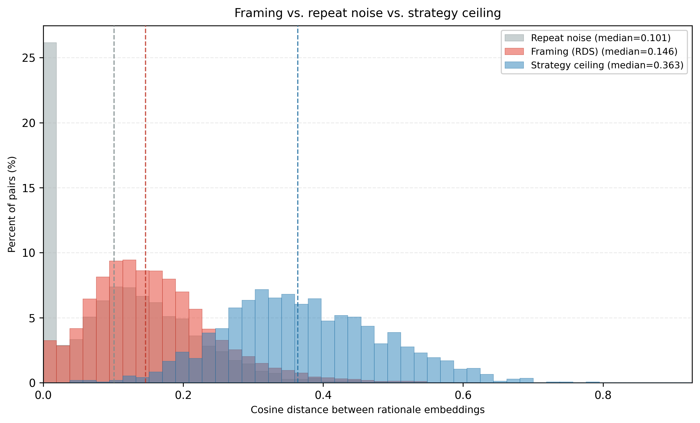
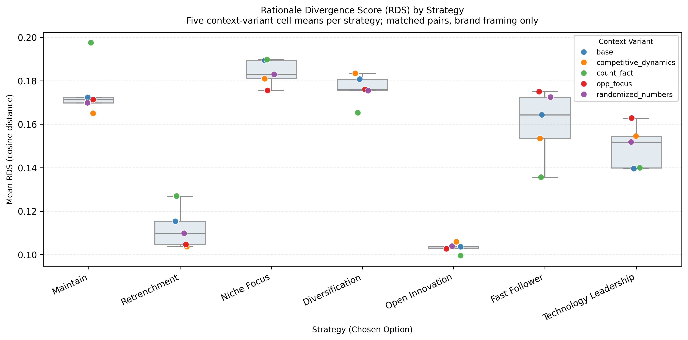

# §5.5 Archive — Legacy RDS Pairing (repeat × Chosen Option)

Archived snapshot of **Section 5.5** text and figures before RDS pairing was revised to:

- **Exclude** `repeat` from the matched-pair grouping key (repeats pooled within condition cells).
- **Match on** `Standard Mapping` (seven archetypes) instead of `Chosen Option` letter codes.
- **Restrict** analysis rows to `valid_strategies` only (same as §5.3–5.4 `load_profile_data`).

**Legacy pairing key:** `scenario`, `repeat`, `Model`, `Temperature`, `Num Context`, `context_variant`, `Chosen Option`.

**Archived figures (pre-revision):**

- Fig. 6 (legacy): `final_results/plots/eval_rationale_rds_calibration_histogram__legacy_repeat_chosenoption.png`
- Fig. 7 (legacy): `final_results/plots/eval_rationale_rds_strategy_boxplot__legacy_repeat_chosenoption.png`

---

## Archived §5.5 body (2026-07-15)

**5.5 Rationale Framing Shift Under Brand Exposure**

This section examines whether explanatory rationales shift under brand exposure even when the strategic choice remains identical. We constructed matched pairs holding all experimental conditions constant—model, temperature, scenario, context variant, number of context blocks, and chosen strategy—while varying only firm identification (Specific vs. Generic). Firm-referential tokens (e.g., Tesla, company) and numeric terms were masked to minimize superficial lexical artifacts. Lexical divergence was quantified using log-odds ratios, with statistical significance assessed via paired permutation tests(146,429 samples; 59,819 terms) and Benjamini–Hochberg false discovery rate correction. Both global separation (mean absolute log-odds difference) and keyword-level effects were evaluated.

The analysis confirms significant lexical divergence between conditions. The observed global separation (mean |Δlog-odds| = 0.323) exceeded the permutation baseline (0.223, p = 0.003), indicating systematic differences beyond random variation.

(Table 3 keyword summary omitted here — unchanged in main paper.)

These findings indicate that LLM-generated strategic rationales are not neutral analytical outputs but reflect framing-consistent narrative patterns. Notably, the effect persists after masking brand-referential terms, suggesting that firm identity cues trigger distinct explanatory styles rather than mere lexical priming.

To quantify the degree of narrative divergence beyond keyword inspection, we introduce the Rationale Divergence Score (RDS)—the cosine distance between SentenceTransformer embeddings of matched Generic and Specific rationale pairs. RDS ∈ [0, 1], where 0 indicates semantically identical justifications and 1 indicates maximal divergence. Because pairs are matched on all experimental conditions (model, temperature, scenario, context variant, context load, and chosen strategy), any RDS above zero reflects the effect of framing alone on the explanatory narrative.

Across **141,209** matched pairs, the overall mean RDS is **0.157** (median = **0.146**, SD = 0.090); macro-averaged over **2,343** condition×strategy cells, mean RDS = **0.156** (95% CI [0.154, 0.159]). The repeat-noise lower bound (n = **5,790**; median = **0.101**). The strategy-ceiling upper bound (n = **1,702**; median = **0.364**). RDS held repeat and strategy fixed and varied Generic vs. Specific framing alone.

**Fig. 6 (legacy).** Rationale embedding distance: framing (RDS) vs. repeat noise vs. cross-strategy ceiling.

**Fig. 7 (legacy).** Mean RDS by strategy (context-variant cell means).

**Strategy-level macro means (legacy):** Maintain 0.183 [0.176, 0.190]; Diversification 0.175 [0.168, 0.182]; Open Innovation 0.121 [0.115, 0.127]; Retrenchment 0.130 [0.123, 0.138]. Fig. 7 count_fact peak: Maintain = **0.197**; Fast Follower = 0.136; Open Innovation = 0.100.

**Known issue:** Legacy `Chosen Option` grouping mislabeled some cross-strategy pairs (e.g., DeepSeek `2_roadster_launch` Maintain × `count_fact` reported as n = 1, RDS = 0.337 when Generic and Specific selected different Standard Mappings under the same letter code).
