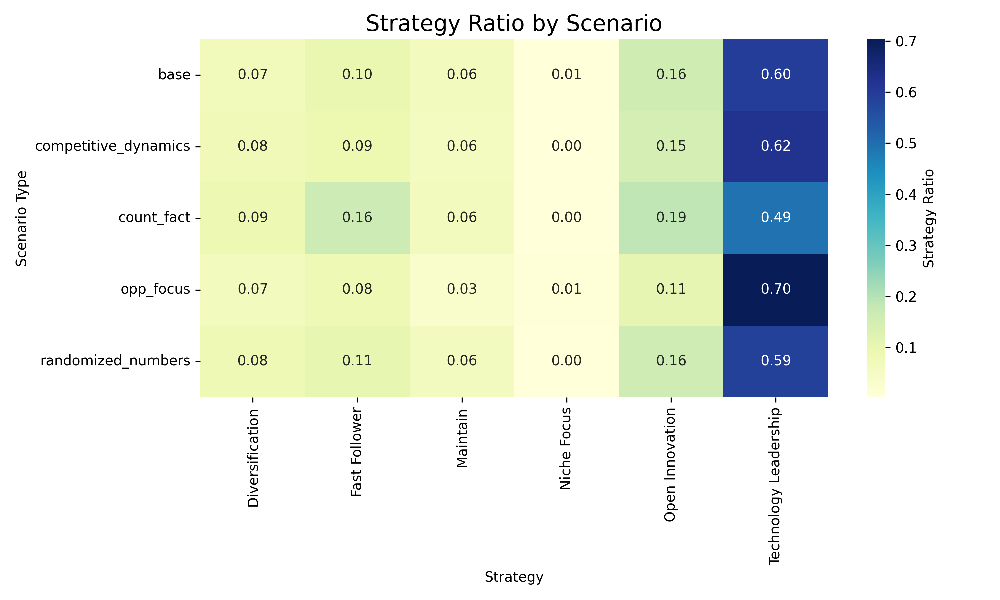
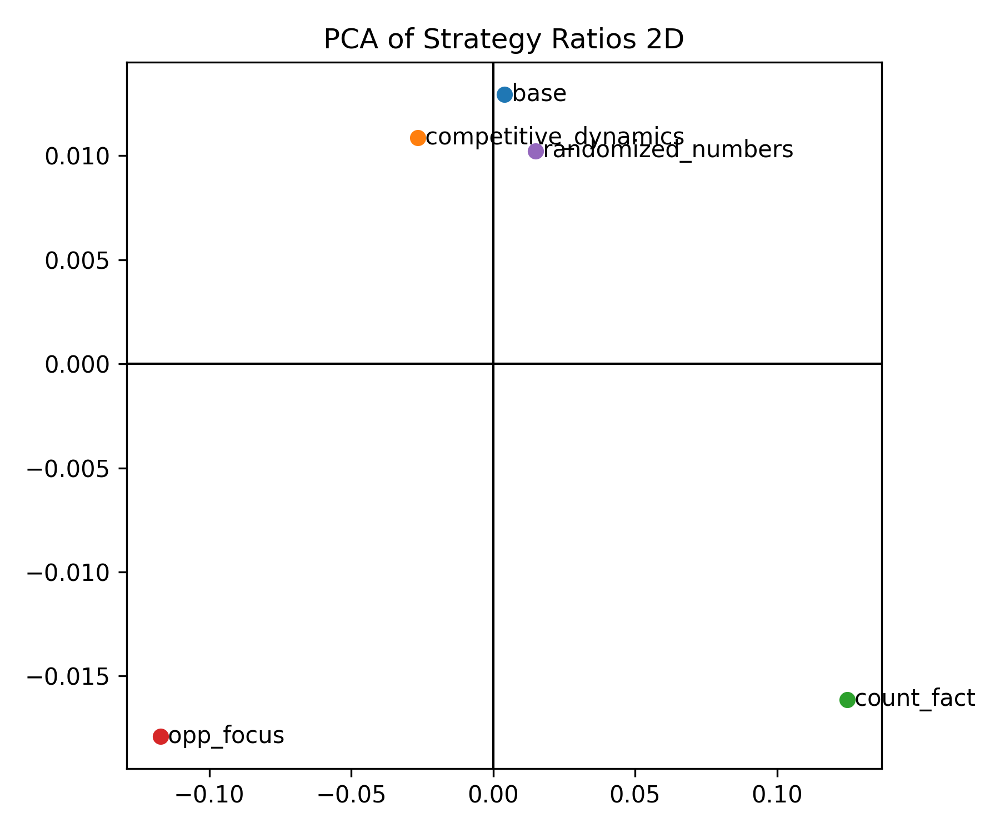

# llm-strategy-benchmark

### Project Overview

This project is a comprehensive benchmark designed to systematically evaluate how **Large Language Models (LLMs) make strategic decisions** in complex, real-world business scenarios. Our goal is to move beyond simple question-and-answer tests to understand the nuances of an LLM's analytical and reasoning capabilities, with a specific focus on diagnosing their cognitive biases and flexibility.

---

### Motivation and Core Hypothesis

Our primary motivation is to answer a fundamental question: "How do LLMs reason when given a strategic problem, and what cognitive biases do they exhibit?"

We aim to verify two main hypotheses:

1. **Context Dependency and Flexibility**: An LLM's strategic recommendations will change based on the specific contextual information it receives (e.g., market conditions, financial data), and the degree of this change will vary across models.
2. **Framing and Brand Bias**: An LLM's strategic choices might differ when a problem is presented as a specific company case (e.g., **Tesla**) versus an anonymous, generic case, indicating a potential brand or role bias.

---

### Key Diagnostic Metrics

This benchmark uses five key metrics to quantitatively diagnose the strategic decision-making profile of LLMs:

* **Technology Leadership Preference Index**: Measures a model's tendency to favor specific strategic options.
* **Brand Bias Index**: Quantifies the influence of a brand name (e.g., Tesla) on a model's decision-making.
* **Context Dependency Index**: Measures the degree to which a decision changes when additional contextual information is added or removed.
* **Numerical Insensitivity Index**: Evaluates a model's insensitivity to changes in numerical data within the problem statement.
* **Rationale-Choice Alignment Score**: Assesses the logical consistency between a model's chosen strategy and its provided reasoning.

---

### The Six Business Scenarios

The experiment is built around **six historical business scenarios based on Tesla's development**, each with a fixed core problem and various strategic options.

1. **Founder Period**: A new company with limited resources must choose a market entry strategy to secure funding and establish a brand.
2. **Roadster Launch**: The company faces a difficult balancing act between product quality and timely delivery during its first major product launch.
3. **Model S Launch**: The challenge is to transition from a niche, high-end automaker to a mass-market manufacturer by scaling production infrastructure.
4. **Model X Launch**: The company seeks to enter the growing SUV market, but a highly complex product design creates significant manufacturing risks.
5. **Model 3 Mass Market**: With an overwhelming number of pre-orders, the company must rapidly scale production while navigating financial and reputational risks.
6. **Energy Infrastructure**: The company must strategically diversify its business by addressing key bottlenecks in EV adoption, such as battery costs and charging infrastructure.

---

### Experimental Setup and Methodology

To rigorously test our hypotheses and evaluate our diagnostic metrics, we designed the experiment with the following key variables and parameters:

* **Problem Framing**: Each scenario is tested with two distinct problem types:
  * **Generic**: The problem is framed as a challenge for an "anonymous company," which helps to identify a model's pure, unbiased reasoning.
  * **Specific**: The problem explicitly names **Tesla**, allowing us to test for any brand or name-based biases.

* **Dynamic Context**: The core problem statement remains fixed, but additional data—such as market conditions, technology limitations, or financial details—is **dynamically added or removed**. This allows us to measure how an LLM's decision changes as the amount of available information varies.

* **Models**: The benchmark now supports **six distinct LLMs** to compare performance across different architectures:
  * `mistralai/Mistral-7B-Instruct-v0.3`
  * `Qwen/Qwen2.5-14B-Instruct`
  * `meta-llama/Meta-Llama-3.1-8B-Instruct`
  * `google/gemma-2-9b-it`
  * `deepseek-ai/deepseek-7b-instruct`
  * `01-ai/Yi-9B-Chat`

* **Temperature Settings**: Each experiment is conducted with **two decoding strategies**:
  * `temperature=0.0` (deterministic reasoning)
  * `temperature=0.7` (creative reasoning)

* **Repeats**: Each unique combination of the above variables is repeated **30 times** to ensure statistical robustness.

* **Scenario Variants**: Multiple `.json` files (e.g., `scenarios.json`, `scenarios_randomized_numbers.json`, etc.) are used. Results are automatically saved under:
  * `scenario_infer_results/base` (for `scenarios.json`)
  * `scenario_infer_results/<filename>` (for other scenario files)

---

## Strategy Distribution Analysis

### Figure 1. Strategy Ratio by Scenario

Across all scenarios, **Technology Leadership (TL)** consistently shows the highest share, while **Niche Focus** and **Maintain** remain persistently low. However, case-specific differences are clear:
- **competitive_dynamics**: TL slightly strengthens (0.60 → 0.62) compared to base, with minimal overall change. When framed with Tesla, TL becomes anchored and stable.  
- **count_fact**: TL decreases significantly (0.60 → 0.49), while **Fast Follower (0.16)** and **Open Innovation (0.19)** increase. Under unfavorable facts, strategies shift from aggressive to more conservative and cooperative.  
- **opp_focus**: TL surges strongly (0.70). When opportunities are highlighted, the model strongly gravitates toward TL.  
- **randomized_numbers**: Nearly identical to the base scenario. Numerical perturbations have negligible effect.  

In summary, TL acts as the default strategy across all conditions. Yet, under **negative context it weakens** and disperses to alternatives, while under **opportunity-focused context it intensifies**.

---

### Figure 2. Generic vs. Specific (Tesla) by Case
.png)

Comparing **Generic (anonymous company)** vs. **Specific (Tesla)** framings reveals:
- **Common pattern**: TL shows the largest differences. Explicit Tesla framing often **weakens TL** or reduces its growth.  
- **competitive_dynamics**: Generic TL rises (+0.043), but under Tesla framing converges to near zero → stabilization effect.  
- **count_fact**: Generic TL drops (−0.018), but with Tesla it drops further (−0.064). Tesla framing amplifies negative reactions, suppressing TL while boosting Fast Follower and Open Innovation.  
- **opp_focus**: Generic TL rises sharply (+0.140), but with Tesla the increase is muted (+0.043). Tesla framing induces conservatism.  
- **randomized_numbers**: Generic shows a slight positive (+0.011), but Tesla framing flips it negative (−0.019), overemphasizing risk narratives.  

Overall, **brand framing is not just stabilizing**; under unfavorable or uncertain contexts, it actively **suppresses aggressive TL choices** and shifts decisions toward alternative strategies.

---

### Figure 3. PCA of Strategy Ratios (2D Projection)

We applied Singular Value Decomposition (SVD) to the scenario–strategy ratio matrix (after mean-centering) and projected it into two dimensions. This visualization highlights the relative similarity of strategic distributions across scenarios.

Results show:
- **base, competitive_dynamics, randomized_numbers** cluster closely together.  
- **opp_focus** and **count_fact** diverge strongly, indicating that **positive opportunity framing** and **negative fact framing** distinctly reshape strategic choices.  

This demonstrates that **LLM strategy distributions are conditionally separable**, and PCA effectively captures these structural shifts.

