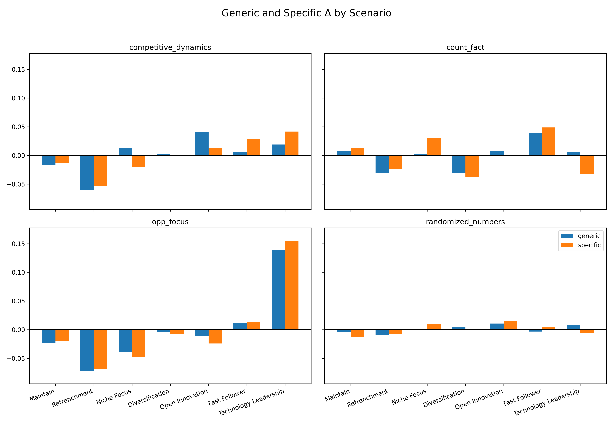

# Full Paper (R&D Management Workshop 2026)

**Title:** Context and Framing Sensitivity in LLM-Based Strategic Decision-Making  
**Authors:** Deokjin Choi (Sungkyunkwan University / Samsung Electronics)  
**Contact:** deokjin.choi@gmail.com  

---

## Abstract

Large language models (LLMs) are increasingly used in R&D-related workflows that inform strategy and portfolio decisions, yet their behavior as strategic decision agents remains poorly characterized. We introduce a scenario-based benchmark that measures *decision sensitivity*—how categorical strategy choices shift when contextual cues, numerical signals, and firm-identity framing change while the underlying dilemma is held fixed. Using six historically grounded innovation scenarios and a closed set of seven strategic archetypes, we run repeated inference across five open-weight instruction-tuned models under two decoding temperatures. Results show pronounced semantic context dependence: opportunity-focused cues concentrate choices toward technology leadership, while constraint cues push models toward defensive postures. In contrast, moderate numerical perturbations produce minimal redistribution, indicating limited magnitude sensitivity in narrative prompts. Firm naming does not impose a fixed bias; instead, it amplifies the direction suggested by context and also changes explanation style even when the chosen strategy is unchanged. We discuss governance implications for R&D management, including anonymized prompting, framing audits, and temperature documentation.

**Keywords:** large language models; strategic decision-making; framing effects; context sensitivity; R&D management; benchmarking; human-in-the-loop

---

## 1. Introduction

LLMs are rapidly being embedded in corporate R&D and innovation management activities, from technology scanning and competitive intelligence to scenario planning and portfolio narratives. In these contexts, models are increasingly expected to do more than summarize information: they are asked to recommend actions, justify trade-offs, and support strategic choices under uncertainty. However, the evaluation culture around LLMs is still dominated by task-centric metrics—accuracy, coherence, factuality, and helpfulness—rather than by the stability and sensitivity of *strategic judgments* (Chang et al., 2024).

For R&D management, this distinction is not academic. Strategy formulation is inherently sensitive to how problems are framed and which contextual signals are emphasized. If LLM recommendations shift disproportionately due to narrative emphasis or brand identity cues, organizations may inadvertently encode uncontrolled biases into strategic decision pipelines. Conversely, if models under-react to quantitative changes that should alter strategic posture (e.g., costs, demand, resource constraints), decision support may appear stable while silently missing magnitude-sensitive triggers.

This paper reconceptualizes LLMs as **conditional strategic decision agents**: their strategic stance is a function of the environment implied by the prompt, not a stable “default” preference. We propose a benchmark that measures decision sensitivity by mapping model outputs onto a fixed, theory-grounded set of strategy archetypes and analyzing how the *distribution* of choices changes under controlled perturbations.

Our central research question is:

> **How stable are LLM strategic judgments—over established strategy archetypes—under different contextual and framing conditions?**

---

## 2. Background and Research Gap

### 2.1 LLM-enabled decision support: what is well-studied

Prior work on **LLM use in decision-related settings** can be summarized into four practical streams. First, **decision support and operations** research embeds LLM agents into planning and coordination pipelines and evaluates system efficiency and plan quality (Wang et al., 2025; Du et al., 2025). Second, **reliability and safety** work develops hallucination detection, evidence checks, and governance layers to reduce factual and compliance risks (Kong et al., 2026; Heo et al., 2025; Antuley et al., 2026). Third, **knowledge-grounded infrastructures** connect LLMs to databases and domain knowledge via retrieval and agentic query translation (Ojuri et al., 2025; Xiong et al., 2025). Fourth, **decision-centric evaluation and profiling** extends beyond accuracy-only metrics toward multi-dimensional comparisons and stability/bias analyses (Liu et al., 2026; Gjorgjevikj et al., 2025; Memduhoğlu et al., 2026).

These streams demonstrate feasibility and improve deployability. Yet they rarely measure how an LLM reallocates its choices across a **held-fixed menu of strategic options** when only **contextual emphasis**, **numeric signals**, or **firm identity** are perturbed—exactly the robustness question that matters when LLMs are used for R&D strategy support.

### 2.2 Behavioral theory lens: anchoring and halo effects

Behavioral shifts under framing resemble well-established cognitive mechanisms such as anchoring (Tversky & Kahneman, 1974) and halo effects (Thorndike, 1920). In strategic contexts, firm identity can function as an associative anchor, activating narratives that influence reasoning style and risk posture. For R&D management, this provides a theory-aligned motivation to test whether naming a firm (versus anonymizing it) induces systematic changes in strategic choices and rationales, even when embedded facts are held fixed.

### 2.3 Research gaps addressed in this paper

Synthesizing these strands, three gaps remain salient for R&D management applications:

1. **Framing robustness:** Under identical economic facts, do brand identity and narrative cues reshape categorical strategy choice?
2. **Narrative vs. magnitude:** Do moderate quantitative changes trigger strategic reorientation, or does semantic emphasis dominate?
3. **Operational reliability:** How do decoding settings (e.g., temperature) interact with decision sensitivity and stability?

---

## 3. Methodology: Scenario-Based Benchmark for Strategic Choice Sensitivity

Before detailing each design choice, Figure 1 situates the workflow: how scenarios, framing, and context variants feed repeated closed-choice inference and yield distributions for sensitivity analysis. The figure is a roadmap for the empirical section—it explains the experimental pipeline rather than presenting a substantive empirical finding.

**Figure 1. Scenario-based benchmarking framework for LLM strategic decision-making.**  

### 3.1 Base scenarios and framing manipulation

We construct **six historically grounded base scenarios** anchored in key phases of Tesla’s development (Founder phase, Roadster launch, Model S, Model X, Model 3, and Energy infrastructure). Each scenario represents a fixed strategic dilemma. We then apply a cross-cutting framing manipulation:

- **Generic framing:** the firm is anonymous.
- **Specific framing:** the firm is explicitly identified as *Tesla*.

This isolates firm-identity effects while holding the core dilemma constant.

### 3.2 Contextual variants

Each base scenario is paired with four contextual variants that modify emphasis without changing the underlying problem:

- `competitive_dynamics`: adds intensified competition signals.
- `count_fact`: emphasizes unfavorable factual constraints.
- `opp_focus`: highlights positive opportunity signals.
- `randomized_numbers`: perturbs quantitative inputs by ±20% without changing semantic meaning.

The randomized numeric condition functions as a control to distinguish semantic sensitivity from magnitude sensitivity.

### 3.3 Closed-choice strategy selection task

To ensure comparability, we formulate each prompt as a closed-choice task. Models must select **exactly one** strategy from **seven archetypes** grounded in innovation strategy and competitive strategy literatures (Schilling, 2019; Porter, 1980; Barney, 1991; Chesbrough, 2003; Miles & Snow, 1978):

1. Technology Leadership  
2. Fast Follower  
3. Open Innovation  
4. Niche Focus  
5. Diversification  
6. Retrenchment  
7. Maintain

Models also provide a brief rationale for the choice. The closed set forces commitment to a single strategic direction, enabling distributional analysis across repeated runs.

### 3.4 Repeated inference and distributional evaluation

Strategic recommendation is non-deterministic under sampling, and single responses are not representative of model preference structure. We therefore perform repeated inference and aggregate outputs into **empirical strategy distributions**. We evaluate decision sensitivity using:

- **Entropy** of the strategy distribution (decision uncertainty).
- **Jensen–Shannon divergence (JSD)** between distributions (distributional shift).
- **Spearman rank correlation** vs. base (stability of ranking across strategies).

To assess operational sensitivity to decoding, we run experiments under two temperatures: **T = 0.0** and **T = 0.7**.

### 3.5 Model panel

We evaluate five open-weight, instruction-tuned models—**Llama 3.1 8B Instruct**, **Mistral 7B Instruct v0.3**, **Qwen 2.5 14B Instruct**, **DeepSeek LLM 7B Chat**, and **Yi 1.5 9B Chat**—selected to support **reproducible** repeated sampling under fixed prompts and decoding settings on **local inference stacks** (avoiding shifting proprietary endpoints). The panel also spans **developer ecosystems and pretraining traditions** (U.S., European, and Asia-based open models) to reduce the risk that observed framing effects reflect idiosyncrasies of a single model family or training corpus. Finally, models are kept in a compact capacity band (roughly **7B–14B**) that is realistic for on-premise or dedicated-GPU deployment while still offering meaningful variation in scale.

---

## 4. Results

### 4.1 Context drives systematic strategy redistribution (semantics > numbers)

To summarize the overall tendency of strategy choice under **context** changes versus **numeric** perturbations, we first visualize pooled strategy proportions across variants.

**Figure 2. Strategy distribution across contextual variants.**  
Overall, models do not converge on a single default strategy. Strategy distributions shift systematically with contextual emphasis. In base scenarios, conservative postures such as **Niche Focus** tend to be frequent, while **Technology Leadership** is secondary. Under opportunity emphasis (`opp_focus`), leadership-oriented strategies become dominant. Under unfavorable constraints (`count_fact`), models reposition defensively toward **Niche Focus** and **Fast Follower**.

In contrast, `randomized_numbers` produces minimal redistribution relative to base. This indicates that, in narrative prompts, moderate quantitative perturbations do not reliably trigger categorical strategic reorientation, compared to semantic reframing.

### 4.2 Structural separation and quantitative dynamics

Cell-wise proportions do not show whether **entire strategy profiles**—the full vector of seven archetype shares—separate or clump together across variants. **Figure 3** projects pooled profile vectors in two PCA dimensions. **Table 1** adds entropy, Jensen–Shannon divergence from baseline, and Spearman rank agreement—compact summaries of uncertainty and shift tied to the same profiles.

**Figure 3. PCA of strategy ratio vectors across scenario variants.**  
Opportunity-focused and constraint-focused contexts separate, while base and numeric-perturbation conditions cluster closely.

**Table 1. Decision uncertainty and distributional shift vs. base.**

| Scenario | Entropy | JSD from base | Spearman vs. base |
|----------|---------|---------------|-------------------|
| base | 1.8422 | 0 | 1 |
| competitive_dynamics | 1.8211 | 0.0107 | 0.8214 |
| count_fact | 1.7818 | 0.0081 | 0.6429 |
| opp_focus | 1.7030 | 0.0471 | 0.6786 |
| randomized_numbers | 1.8328 | 0.0002 | 1 |

Principal component analysis of strategy ratio vectors reveals clear separation between opportunity-focused and constraint-focused contexts, while base and numeric-perturbation conditions cluster closely. Quantitative metrics (Table 1) confirm this structure.

Three patterns matter for R&D management usage:

1. **Context-driven certainty:** `opp_focus` has the lowest entropy (1.7030), suggesting more concentrated choices when growth opportunities are emphasized.
2. **Asymmetric sensitivity:** JSD under `opp_focus` (0.0471) is far larger than under `count_fact` (0.0081), implying disproportionate responsiveness to optimistic framing in this experimental setup.
3. **Numerical insensitivity:** `randomized_numbers` yields near-zero JSD (0.0002) and perfect rank correlation (Spearman = 1), indicating that strategy ranking remains effectively unchanged under moderate numeric perturbation.

### 4.3 Brand framing amplifies contextual sensitivity (without a fixed directional bias)

**Firm-identity framing** (anonymous vs. naming Tesla) may push models toward a stable bias or mainly **intensify** whatever strategic cue the prompt already emphasizes. **Figure 4** compares Generic and Specific runs as **deltas from each variant’s own baseline**, so we can see whether naming steers choices uniformly or tracks the surrounding context.

**Figure 4. Effect of firm-identity framing on strategy shifts (delta from base).**  
Firm naming amplifies context-driven shifts rather than imposing a single fixed directional bias.

Firm identity does not impose a uniform bias toward a single strategy. Instead, naming Tesla acts as an amplifier: under opportunity framing, it strengthens the shift toward **Technology Leadership**; under constraint framing, it strengthens defensive repositioning toward **Fast Follower** and **Niche Focus**. Under numeric perturbation, delta remains minimal regardless of naming.

This pattern is consistent with **associative anchoring**: brand identity activates pretrained narratives that are then selected depending on which contextual cues are salient. For governance, this implies that strategy outputs are not purely data-driven; they may encode narrative-consistency pressures triggered by identity cues.

### 4.4 Rationales shift even when the strategy choice is held constant

Choice-level metrics can miss a second layer of framing risk: the **recommended label** might match while the **narrative justification** still drifts when the firm is named. For governance and human–AI delegation, that matters because stakeholders often react to explanation tone, not only to the discrete strategy tag. We therefore examine matched pairs that hold scenario, model, temperature, context amount, and chosen strategy fixed while varying only Generic vs. Specific framing, and we quantify lexical divergence after masking brand-referential and numeric tokens.

Using that setup, a paired permutation test indicates significant separation: mean |Δlog-odds| = **0.323** vs. baseline **0.223**, **p = 0.003**.

**Table 2. Representative rationale framing differences under firm identity (Specific vs. Generic).**

| Dimension | Specific (Tesla) | Generic |
|---|---|---|
| Leadership & identity | mission lead; identity leader | trust balanced; goals standards |
| Technological positioning | goal technological; position platform | enables integration; optimization scale |
| Market dynamics | world transition; leader capturing | rushed quality; delaying significant |
| Execution & feasibility | prestige demonstrate; mission showcase | funding invest; make feasible |

Substantively, Tesla-framed rationales use higher-agency, vision-oriented language (e.g., mission, leadership, transition), whereas generic rationales emphasize operational feasibility and constraints (e.g., quality, delays, funding). Thus, even when “what to do” is unchanged, “why” is framed differently. For human–AI delegation, this matters because justification style can influence managerial trust and perceived urgency.

### 4.5 Model profiling and temperature trade-offs

Scenario-level results show that LLMs are sensitive to context and framing, but practitioners also need a compact way to compare **models** and **decoding settings** on comparable dimensions. We therefore define five profiling axes. Each axis answers a distinct governance question: Is the model **distracted by firm naming** (FR)? Does it **update** when semantic context changes (CR)? Does it **react to numeric perturbation** (NS)? Is it **repeatable** across reruns (DS)? When the label is fixed, is the **explanation** stable across frames (EFI)? Together they summarize trade-offs between framing stability, contextual agility, numeric responsiveness, operational repeatability, and rationale consistency.

Let $P(m, \tau, s, v, \phi)$ denote the empirical strategy distribution for model $m$, temperature $\tau$, scenario $s$, context variant $v$, and framing type $\phi \in \{\text{Generic, Specific}\}$. For decision-level axes (1–4), distributional distance is measured with the Jensen–Shannon Divergence ($JSD$). By construction, **FR, CR, NS, DS** lie in $[0,1]$; **EFI** maps $EFD_{\mathrm{raw}} \ge 0$ to $(0,1]$.

**(1) Framing robustness (FR).** *Meaning:* How invariant the strategy mix is when only firm identity (Generic vs. Specific) changes—higher FR means the model is less “pulled” by brand cues.  

$$FR(m, \tau) = 1 - \mathbb{E}_{s,v} \left[ JSD\left( P(m, \tau, s, v, \text{Generic}), P(m, \tau, s, v, \text{Specific}) \right) \right]$$

**(2) Context responsiveness (CR).** *Meaning:* How much the distribution moves when **semantic** context variants replace the base—higher CR means stronger reaction to competitive, constraint, or opportunity emphasis.  

$$CR(m,\tau)=E_{s,\phi,\,v\in V_{sem}}\Big[JSD\big(P(m,\tau,s,\mathrm{Base},\phi),P(m,\tau,s,v,\phi)\big)\Big]$$
where $V_{sem}$ is the semantic-variant set `{competitive_dynamics, count_fact, opp_focus}`.

$$CR(m, \\tau) \= \\mathbb{E}\_{s,\\phi,v \\in \\mathcal{V}\_{sem}} \\left\[ JSD\\left( P(m, \\tau, s, \\text{Base}, \\phi), P(m, \\tau, s, v, \\phi) \\right) \\right\]$$  
where $\\mathcal{V}\_{sem} \= \\{\\text{competitive\\\_dynamics, count\\\_fact, opp\\\_focus}\\}$.

**(3) Numerical sensitivity (NS).** *Meaning:* How much the distribution moves when numeric inputs are perturbed (**Randomized** vs. **Base**)—higher NS means numeric shifts more often change the strategy mix (in this benchmark, absolute NS values remain modest relative to semantic effects).  

$$NS(m, \tau) = \mathbb{E}_{s,\phi} \left[ JSD\left( P(m, \tau, s, \text{Base}, \phi), P(m, \tau, s, \text{Randomized}, \phi) \right) \right]$$

**(4) Decision stability (DS).** *Meaning:* How **concentrated** choices are across repeated runs under the same condition—higher DS means more predictable outputs for audit and workflow locking. Let $\mathcal{A}$ be the seven strategy labels. For condition $c = (s,n,v,\phi)$ (scenario, context load, variant, framing), the empirical mass on strategy $a$ is  
$$p_{c}^{m,\tau}(a)=\frac{1}{R}\sum_{r=1}^{R} I(\mathrm{strategy}_{r}=a),\quad a\in\mathcal{A}.$$
With Shannon entropy $H(p) = -\sum_{a \in \mathcal{A}} p(a)\log_2 p(a)$,  
$$DS(m,\tau)=E_{c}\left[1-\frac{H\!\left(p_{c}^{m,\tau}\right)}{\log_{2}|\mathcal{A}|}\right].$$
$\mathrm{DS} \to 1$ when the model almost always picks the same strategy; $\mathrm{DS} \to 0$ when the empirical distribution is nearly uniform.

**(5) Explanatory framing invariance (EFI).** *Meaning:* When the **chosen strategy is identical** across Generic and Specific, how similar the **rationales** are lexically—higher EFI means less “post-hoc” re-storying under branding.

Implementation-wise, we align rationale pairs on $(s,r,m,\tau,n,a)$: scenario $s$, repeat $r$, model $m$, temperature $\tau$, context load $n$, and strategy label $a$ (**Standard Mapping** in the logs). Generic- and Specific-side texts are optionally **brand-masked**, then tokenized into an $n$-gram vocabulary $\mathcal{V}$ (bigrams in the reported runs). Let $c_w^{\phi}$ be the **pooled** count of term $w$ across all aligned pairs in frame $\phi \in \{\mathrm{Generic},\mathrm{Specific}\}$. Using the same smoothed log-odds construction as the rationale permutation analysis (pooled counts with a term-wise backing-off denominator shared across $w$), define a vocabulary-level contrast $\Delta_w$ between the two frames. Then  
$$EFD_{raw}(m, \tau) = \frac{1}{|\mathcal{V}|}\sum_{w\in\mathcal{V}} \left|\Delta_{w}\right|, \qquad EFI(m, \tau) = \frac{1}{1 + EFD_{raw}(m, \tau)}$$

Figure 5 applies these scores in a compact panel view so temperature and model can be compared on the same five spokes.

**Figure 5. Five-axis profiling radar (one panel per model).**  
Spokes use **display-only per-axis min–max scaling** over the ten evaluated $(m,\tau)$ configurations (five models × $T \in \{0.0, 0.7\}$) so that compressed axes (notably CR and NS) remain visually comparable; **solid** = $T=0.0$, **dashed** = $T=0.7$. The figure is for pattern comparison; **absolute axis values** are provided in Table 3 (Appendix).

Across the panel, raising temperature from **$T=0.0$** to **$T=0.7$** often increases **FR** and **EFI** while lowering **DS**—a trade-off between **precision-oriented repeatability** and **objectivity-oriented flexibility** in framing and rationale style. Temperature should therefore be documented like any other inference parameter in R&D governance.

**Illustrative personas**

- **Stable functional (Qwen2.5-14B-Instruct).** Keeps a **high DS** spoke at both temperatures (**≈0.91 → 0.79**), reflecting strong run-to-run concentration *within this panel’s relative scale*. **FR** and **EFI** stay **inward** on the radar—e.g. **FR** near the **hub** at **$T=0.0$** and **EFI** only **moderate** at **$T=0.7$**—so the footprint matches a model that privileges **operational steadiness** over maximal framing or rationale invariance.
- **Precision-sensitive / sampling-brittle (DeepSeek-LLM-7B-Chat).** At **$T=0.0$**, the trace sits **outward** on **FR**, **NS**, and **DS** (**FR ≈0.95**, **NS = 1.00**, **DS ≈0.94** on the scaled spokes). At **$T=0.7$**, **DS** and **CR** **collapse toward 0**, while **EFI** moves **outward (≈0.99)**—the dashed curve **deflates** on repeatability and context-response axes. The persona is a **deterministic** specialist more than a stable stochastic partner.
- **Adaptive resilient (Llama-3.1-8B-Instruct).** **CR** hits the **spoke maximum at $T=0.0$ (1.00)** under this normalization—the strongest semantic redistribution in the panel when sampling is greedy. **EFI** is **highest at $T=0.7$ (1.00)**, with **FR** also **high (≈0.92)**, consistent with **situational responsiveness** paired with **stronger cross-frame rationale consistency** when temperature is raised—in this **relative** display only.

### 4.6 Scenario-level heterogeneity: local failures hidden by global averages

Model-level aggregates (§4.5) ease comparison but can **average away** cells where framing collapses, context suddenly reallocates mass, or repeatability breaks down. We therefore map the same choice-level constructs (**FR**, **CR**, **DS**) onto the full **scenario × model** grid at each temperature, so readers can see *where* behavior concentrates rather than only *how high* a global score is.

**Figure 6. Scenario × model heatmaps of framing robustness, context responsiveness, and decision stability (T = 0.0).**

**Figure 7. Scenario × model heatmaps of framing robustness, context responsiveness, and decision stability (T = 0.7).**

For example, in the mass-market production scenario (`5_model_3_mass_market`) for Qwen 2.5 14B, naming the firm drives a major reallocation (open innovation vs. maintain), while in the Roadster launch scenario (`2_roadster_launch`) for DeepSeek, context load strongly reshapes stability and entropy. These cells motivate “audit-by-representative-scenarios” rather than relying only on global averages.

---

## 5. Discussion and Implications for R&D Management

### 5.1 Treat LLM strategy outputs as context-conditional

The evidence supports a practical stance: LLM strategy recommendations should be treated as **context-conditional**. Models parse semantic cues and adopt different strategic archetypes depending on narrative emphasis. This is beneficial for exploratory scenario work but risky when recommendations are interpreted as stable prescriptions.

### 5.2 Governance: anonymization, framing audits, and temperature documentation

Three governance practices follow directly from our results:

1. **Anonymize firm identity for objectivity checks.** Run Generic and Specific prompts side-by-side when brand identity is present, to detect narrative anchoring effects.
2. **Audit both optimistic and constraint framings.** Given asymmetric sensitivity to opportunity cues, teams should stress-test recommendations under both “upside” and “downside” context blocks.
3. **Treat temperature as a documented decision parameter.** Because temperature trades off stability (DS) with robustness/invariance (FR, EFI), organizations should document decoding settings in AI-assisted strategic decisions and align them with the decision purpose (e.g., repeatability vs. exploratory breadth).

### 5.3 Numerical perturbations and magnitude-sensitive decision contexts

The near-invariance under moderate numeric perturbation suggests that narrative prompts can downweight magnitude information. In magnitude-sensitive R&D decisions—budget thresholds, capacity constraints, timing windows—organizations should not assume that small-to-moderate numeric edits will alter strategy class. Instead, numeric thresholds should be made decision-relevant (e.g., explicitly linking magnitude to feasibility constraints or triggers) and outputs should be validated under multiple numeric regimes.

### 5.4 Implications for human–AI delegation

Because rationales shift with framing even when choices match, managers may be influenced by explanation style rather than by underlying choice stability. Human-in-the-loop review should therefore include:

- reviewing strategy labels *and* rationales;
- comparing alternative framings;
- requiring justification that references decision-critical constraints, not only brand-consistent narratives.

---

## 6. Limitations and Future Work

This paper is intentionally benchmark-oriented and therefore has limitations:

1. **Scenario scope:** We focus on six Tesla-anchored scenarios. Future work should expand to additional industries and R&D contexts (e.g., pharmaceuticals, semiconductors, platform ecosystems).
2. **Option set:** While the seven archetypes are theory-grounded, alternative taxonomies may capture different strategic nuance.
3. **Human baselines:** We do not yet compare distributions to human managers under matched prompts. Human panel baselines could clarify whether LLM sensitivity patterns mirror or diverge from managerial framing effects.
4. **Grounded tool use:** Our prompts are narrative-based; integrating retrieval or structured financial models may change numeric sensitivity. Studying how grounding changes decision sensitivity is an important next step.

---

## 7. Conclusion

LLMs are increasingly deployed in R&D-related workflows that inform strategic decisions, yet their behavior as strategic decision agents is not well captured by conventional evaluation metrics. Using a scenario-based benchmark with a fixed menu of strategic archetypes, we show that LLM strategy selection is strongly context-dependent and sensitive to narrative framing. Opportunity emphasis concentrates recommendations toward leadership strategies; constraints induce defensive shifts; moderate numeric perturbations cause minimal redistribution. Firm naming amplifies contextual sensitivity and alters explanation style even when the chosen strategy is unchanged. These findings position LLMs as **conditional strategic agents** and motivate governance practices for R&D management: anonymized prompting for bias checks, framing audits, and explicit documentation of decoding settings.  

---

## Appendix: Model-level profiling scores (raw)

To support reproducibility and allow readers to interpret the min–max scaled radar (Figure 5) in absolute terms, Table 3 reports the unscaled model-level scores for each $(m,\tau)$. Values correspond to the five axes defined in §4.5 (FR, CR, NS, DS, EFI) and are computed over the full experimental grid under the repeated-inference protocol.

**Table 3. Model-level profiling scores (raw axis values).**

| Model | $T$ | FR | CR | NS | DS | EFI |
|:------|-----:|---:|---:|---:|---:|---:|
| Yi-1.5-9B-Chat | 0.0 | 0.8137 | 0.0796 | 0.0803 | 0.8552 | 0.6366 |
| Yi-1.5-9B-Chat | 0.7 | 0.8298 | 0.0691 | 0.0430 | 0.6943 | 0.7633 |
| Qwen2.5-14B-Instruct | 0.0 | 0.6749 | 0.1485 | 0.0278 | 0.8932 | 0.6385 |
| Qwen2.5-14B-Instruct | 0.7 | 0.7066 | 0.1340 | 0.0151 | 0.8600 | 0.7070 |
| DeepSeek-LLM-7B-Chat | 0.0 | 0.9405 | 0.1138 | 0.1249 | 0.9015 | 0.6462 |
| DeepSeek-LLM-7B-Chat | 0.7 | 0.9560 | 0.0582 | 0.0435 | 0.6423 | 0.7705 |
| Llama-3.1-8B-Instruct | 0.0 | 0.8515 | 0.1750 | 0.0263 | 0.8759 | 0.6514 |
| Llama-3.1-8B-Instruct | 0.7 | 0.9334 | 0.1206 | 0.0232 | 0.7273 | 0.7722 |
| Mistral-7B-Instruct-v0.3 | 0.0 | 0.7594 | 0.1325 | 0.0336 | 0.9178 | 0.6417 |
| Mistral-7B-Instruct-v0.3 | 0.7 | 0.8195 | 0.1078 | 0.0250 | 0.8336 | 0.7630 |

## References

Antuley, U., Siddiqui, S., Hameed, S., Arif, W., & Shah, S. A. (2026). SORA-ATMAS: Adaptive trust management and multi-LLM aligned governance for future smart cities. *Knowledge-Based Systems*, 337, 115403.

Barney, J. (1991). Firm resources and sustained competitive advantage. *Journal of Management*, 17(1), 99–120.

Chang, Y., Wang, X., Wang, J., Wu, Y., Yang, L., Zhu, K., Chen, H., Yi, X., Wang, C., & Wang, Y. (2024). A survey on evaluation of large language models. *ACM Transactions on Intelligent Systems and Technology*, 15(3), Article 39, 1–45.

Chesbrough, H. W. (2003). *Open Innovation: The New Imperative for Creating and Profiting from Technology*. Harvard Business School Press.

Du, K., Yang, B., Xie, K., Dong, N., Zhang, Z., Wang, S., & Mo, F. (2025). LLM-MANUF: An integrated framework of fine-tuning large language models for intelligent decision-making in manufacturing. *Advanced Engineering Informatics*, 65, 103263.

Gjorgjevikj, A., Nikolikj, A., Koroušić Seljak, B., & Eftimov, T. (2025). User-defined trade-offs in LLM benchmarking: balancing accuracy, scale, and sustainability. *Knowledge-Based Systems*, 330, 114405.

Heo, S., Son, S., & Park, H. (2025). HaluCheck: Explainable and verifiable automation for detecting hallucinations in LLM responses. *Expert Systems with Applications*, 272, 126712.

Kong, L., Zhang, Y., Zhong, X., Fu, H., Wang, Y., & Liu, H. (2026). HaluGNN: Hallucination detection in large language models using graph neural network. *Expert Systems with Applications*, 306, 130857.

Lieberman, M. B., & Montgomery, D. B. (1988). First-mover advantages. *Strategic Management Journal*, 9(S1), 41–58.

Liu, J., Hao, W., Cheng, K., Chen, G., & Xie, X. (2026). CART: A traceable zero-shot planning framework for large language models with adaptive replanning. *Knowledge-Based Systems*, 336, 115189.

Memduhoğlu, A., Fulman, N., Polat, N., & Ataş, T. (2026). Large language models as virtual experts? Evaluating AHP-based criteria weighting performance for solar power plant site selection. *Expert Systems with Applications*, 299, 130171.

Miles, R. E., & Snow, C. C. (1978). *Organizational Strategy, Structure, and Process*. McGraw-Hill.

Ojuri, S., Han, T. A., Chiong, R., & Di Stefano, A. (2025). Optimizing text-to-SQL conversion techniques through the integration of intelligent agents and large language models. *Information Processing & Management*, 62(5), 104136.

Porter, M. E. (1980). *Competitive Strategy: Techniques for Analyzing Industries and Competitors*. Free Press.

Schilling, M. A. (2019). *Strategic Management of Technological Innovation* (6th ed.). McGraw-Hill Education.

Thorndike, E. L. (1920). A constant error in psychological ratings. *Journal of Applied Psychology*, 4(1), 25–29.

Tversky, A., & Kahneman, D. (1974). Judgment under uncertainty: Heuristics and biases. *Science*, 185(4157), 1124–1131.

Wang, Z., Wan, C., Liu, J., Zhang, X., Wang, H., Hu, Y., & Hu, Z. (2025). MASC: Large language model-based multi-agent scheduling chain for flexible job shop scheduling problem. *Advanced Engineering Informatics*, 67, 103527.

Xiong, X., Cai, H., Yu, H., Shen, B., & Hu, P. (2025). DR-RAG: Domain-rule-based retrieval-augmented generation for aviation digital model design. *Advanced Engineering Informatics*, 68, 103688.

