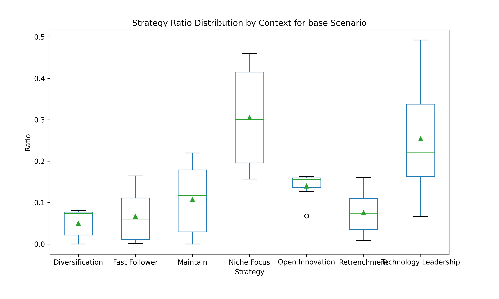
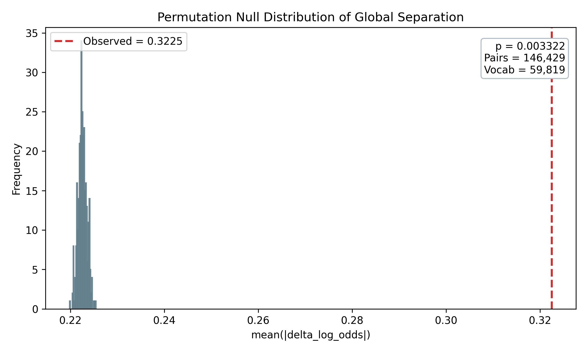
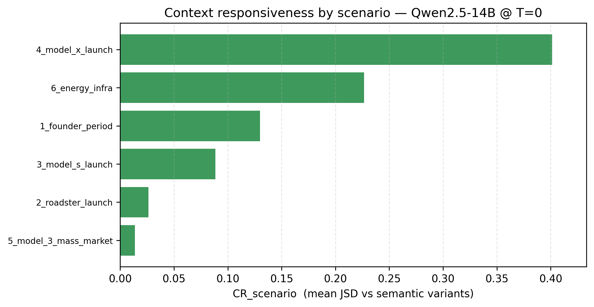
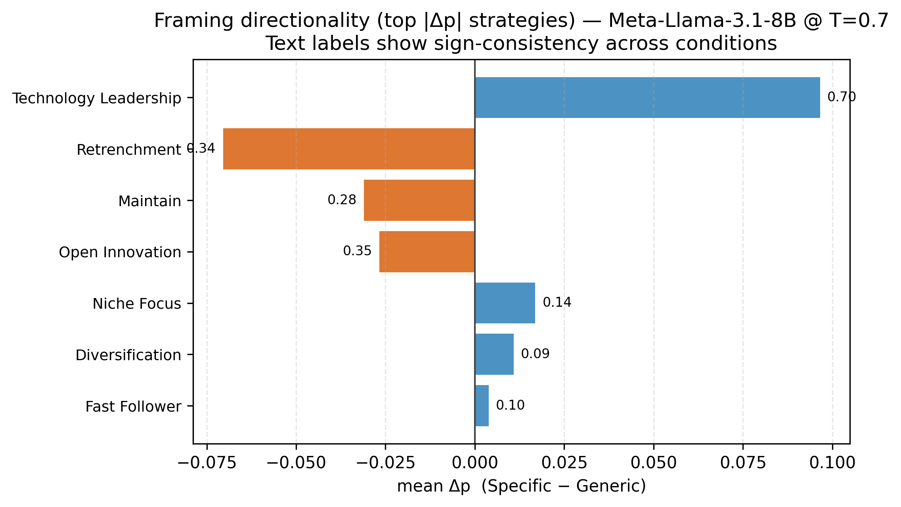
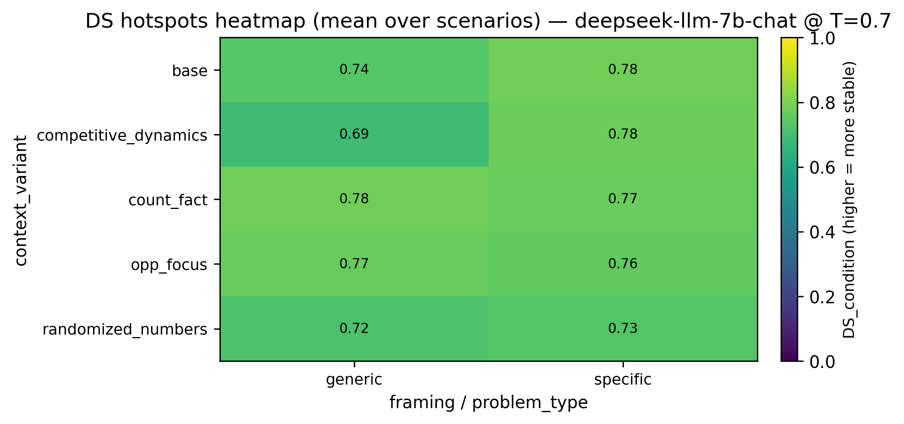
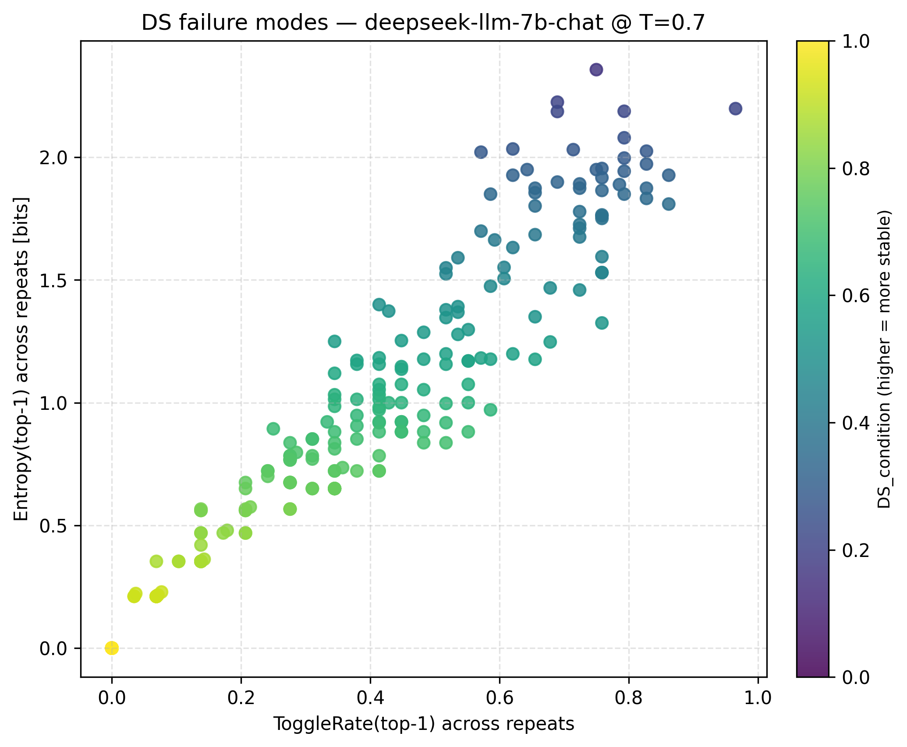

**Context and Framing Sensitivity in LLM-Based Strategic Decision-Making**

**Abstract**  
Large Language Models (LLMs) have shown strong performance in traditional language tasks, yet their behavior in strategic decision-making remains insufficiently understood. This study introduces a scenario-based benchmark to examine how LLMs’ strategic judgments vary under different contextual and framing conditions in R\&D and innovation management.

Using historically grounded business scenarios, we systematically vary contextual cues and problem framing to analyze changes in strategy selection. The results show that LLMs exhibit pronounced context-dependent behavior rather than stable default strategies, and that framing significantly affects decision sensitivity. These findings characterize LLMs as conditional decision agents and highlight the need for governance and human-in-the-loop oversight in strategic applications.

**1\. Introduction**  
Large Language Models (LLMs) are increasingly integrated into high-stakes strategic tasks within R&D and innovation management, ranging from technology assessment to competitive analysis and long-term planning. In these settings, LLMs are expected not only to synthesize information but also to provide evaluative support for strategic decision-making under uncertainty. Despite this rapid adoption, empirical understanding of how LLMs behave as strategic decision agents remains limited.

Current evaluative frameworks primarily focus on accuracy, coherence, or performance in isolated tasks (Chang et al., 2024). While informative, such metrics offer little insight into the stability of strategic judgments or how decisions shift in response to variations in contextual information and problem framing—factors that are central to R&D strategy, where outcomes are highly sensitive to market, technological, and institutional conditions.

To address this gap, this study shifts the focus from "correctness" to "decision sensitivity." We introduce a benchmarking framework grounded in the strategic management of technological innovation, mapping LLM choices onto seven established strategic archetypes, such as Technology Leadership, Fast Follower, and Open Innovation. By systematically varying contextual cues and framing conditions, we examine how these "conditional decision agents" adjust their strategic stances. Our findings clarify the boundaries of LLM-based reasoning, highlighting where these models can augment executive foresight and where their susceptibility to narrative framing necessitates rigorous human-in-the-loop oversight.

**2\. Background and related work**

**2.1 LLMs as decision support systems**  
Recent research has increasingly embedded LLMs into real-world decision pipelines, particularly in operations and engineering management. Wang et al. propose a multi-agent scheduling chain that leverages LLM-based agents to handle flexible job shop scheduling and real-time rescheduling, demonstrating substantial gains in scheduling efficiency under disruptions \cite{WANG2025103527}. Du et al. introduce LLM-MANUF, an integrated framework in which multiple fine-tuned LLMs generate alternative decision plans that are subsequently ranked and fused, highlighting that manufacturing decision quality depends as much on comparing and aggregating candidate strategies as on generating a single “best” answer \cite{DU2025103263}. Beyond manufacturing, Wang et al., Xiong et al., and Gindullina et al. combine spatiotemporal knowledge graphs, digital twins, and physics-informed neural networks with LLM agents to support berth allocation, aviation design, and epidemic forecasting, respectively \cite{WANG2025103633,XIONG2025103688,GINDULLINA2026131730}. These studies illustrate how LLMs can act as planning and coordination engines for complex operational systems, yet they typically assess success in terms of task performance and system-level efficiency. They rarely examine how, within a fixed set of strategic options, LLMs distribute their choices or how sensitive those choices are to subtle changes in contextual description or framing.

**2.2 Reliability, hallucination, and safety in high-stakes decisions**  
Another line of work focuses on making LLM-supported decisions more reliable in high-stakes environments. Kong et al. present HaluGNN, which models question–answer pairs as token graphs and uses graph neural networks to detect hallucinated content, thereby improving decision security in domains where factual errors are costly \cite{KONG2026130857}. Heo et al. develop HaluCheck, a visualization and automation framework that decomposes model responses into sentence-level claims, retrieves external evidence, and highlights likely hallucinations through an interactive interface for expert systems \cite{HEO2025126712}. Przystalski et al. use stylometric features to distinguish human- from LLM-generated texts, informing governance around authorship, attribution, and authenticity \cite{PRZYSTALSKI2026129001}. In the context of smart-city management, Antuley et al. propose SORA-ATMAS, an adaptive trust and governance framework that aligns multiple LLM agents with cross-domain policies and regulatory constraints \cite{ANTULEY2026115403}. Collectively, these studies treat reliability and safety primarily at the level of factual correctness, anomaly detection, and policy compliance. By contrast, the present work is concerned with how reliable LLMs are as strategic decision agents—namely, how their strategic choices and rationales shift under different contextual and framing manipulations even when the underlying problem remains fixed.

**2.3 Knowledge-grounded decision infrastructures**  
A third strand of literature builds knowledge-grounded infrastructures that connect LLMs to structured data and domain ontologies. Ojuri et al. propose a text-to-SQL framework in which LLMs and intelligent agents translate natural language queries into executable SQL, lowering the access barrier for non-technical users and reducing dependence on data specialists in organizational decision-making \cite{OJURI2025104136}. Xiong et al. introduce DR-RAG, a domain-rule-based retrieval-augmented generation framework that ties aviation digital models to knowledge graphs, rule bases, and digital twins, turning complex product design into a loop of retrieval, generation, and simulation feedback \cite{XIONG2025103688}. In financial decision-making, Sinha et al. present FinBloom, a knowledge-grounded financial agent that combines a domain-specialized LLM with real-time news and regulatory filings to answer dynamic financial queries \cite{SINHA2026115559}. Alarcón Serrano et al. evaluate how well general-purpose LLMs can recognize taxonomic relationships in SNOMED CT, clarifying their role in biomedical knowledge-graph workflows that support clinical reasoning \cite{ALARCONSERRANO2026115882}. These works substantially improve what LLMs know and how they access relevant information. Yet, even with stronger grounding, they do not systematically analyze how a model’s strategic choices over a fixed option set change when only the narrative emphasis, identity cues, or quantitative inputs are perturbed.

**2.4 Evaluation, slow thinking, and behavioral profiling of LLMs**  
Evaluation- and reasoning-centric research has sought to understand how LLMs plan, reason, and exhibit preferences across tasks. Liu et al. propose CART, a traceable planning framework that decomposes goals into subtasks, tracks planning trajectories, and triggers replanning when conditions change, thereby improving the robustness of LLM-based agents in incomplete-information environments \cite{LIU2026115189}. Gjorgjevikj et al. introduce xLLMBench, a decision-centric benchmarking framework that uses multi-criteria decision-making to rank models along accuracy, scale, energy consumption, and other non-performance factors \cite{GJORGJEVIKJ2025114405}. Memduhoğlu et al. treat LLMs as “virtual experts” for multi-criteria spatial planning, comparing their analytic hierarchy process (AHP) weightings with those of human panels and documenting systematic biases in how models prioritize criteria for solar power plant site selection \cite{MEMDUHOGLU2026130171}. Torres-Moreno and Hermosillo-Valadez propose a semantic knowledge abstraction framework that restructures premise–hypothesis relations in natural language inference to improve consistency and reveal latent semantic gaps in LLMs’ reasoning \cite{TORRESMORENO2026114825}. These contributions collectively move beyond simple accuracy metrics toward richer assessments of reasoning, robustness, and multi-dimensional trade-offs. 

However, such behavioral shifts often mirror human cognitive shortcuts, such as the 'Halo Effect' \cite{THORNDIKE1920} or 'Associative Anchoring' \cite{TVERSKY1974}. In strategic contexts, the presence of a high-status brand identity can trigger general biases—similar to how social stereotypes or availability heuristics bypass deep reasoning \cite{KAHNEMAN2011}—leading LLMs to prioritize pre-trained narrative consistency over neutral, quantitative data. Nonetheless, existing benchmarks seldom treat LLMs explicitly as strategic decision-makers whose behavior can be characterized by how their choice distributions respond to controlled changes in context, framing, and numerical signals. This study complements those efforts by viewing models as conditional decision agents and by asking which aspects of the decision environment most strongly shape their strategic behavior. This study complements those efforts by viewing models as conditional decision agents and by asking which aspects of the decision environment most strongly shape their strategic behavior.

**2.5 Strategic Archetypes in R&D and Innovation Management**  
To rigorously characterize the strategic behavior of LLMs, it is necessary to map their decision outputs onto established theoretical frameworks. This study adopts seven strategic archetypes rooted in the classical literature of competitive strategy and technological innovation. These options—Technology Leadership, Fast Follower, Open Innovation, Niche Focus, Diversification, Retrenchment, and Maintain—represent the fundamental trajectories firms pursue to navigate market transitions and resource constraints.

Specifically, the distinction between 'Technology Leadership' and 'Fast Follower' is grounded in the pioneering work on timing of entry and R&D intensity \cite{SCHILLING2019}. The concepts of 'Niche Focus' and 'Diversification' align with Porter’s generic strategies and the resource-based view of the firm \cite{PORTER1980, BARNEY1991}. Furthermore, 'Open Innovation' reflects the modern shift toward collaborative R&D ecosystems \cite{CHESBROUGH2003}, while 'Retrenchment' and 'Maintain' represent critical defensive maneuvers under high environmental volatility \cite{MILES1978}. By constraining the LLM’s choice set to these validated archetypes, we transition from observing simple linguistic patterns to analyzing structural strategic reasoning. This methodological grounding ensures that the observed shifts in choice distributions are interpretable within the context of established management science.

**2.6 Research gap**  
Synthesizing these strands, prior work shows that LLMs can (i) drive automated planning in operational systems, (ii) support reliability through hallucination detection, (iii) operate within knowledge-grounded infrastructures, and (iv) be evaluated along general reasoning dimensions. Yet, taken together, this literature provides little systematic evidence on how LLMs behave as categorical strategic decision-makers when subjected to controlled perturbations of the same business dilemma.

In particular, three critical gaps remain. First, while existing studies focus on task performance, they rarely examine framing robustness—specifically, how arbitrary brand identities and narrative cues reshape strategy selection when the underlying economic facts are unchanged. Second, there is a lack of research on the interplay between qualitative context and quantitative data, leaving it unclear whether LLMs prioritize narrative consistency over numerical shifts in strategic settings. Finally, the operational reliability of these strategic choices across different decoding configurations (e.g., temperature) remains largely unexplored.

To address these limitations, this study reconceptualizes LLMs as conditional strategic agents whose decision-making logic is intrinsically linked to environmental framing. Rather than treating model outputs as static responses, we seek to characterize the dynamic boundaries of LLM-based reasoning by evaluating the stability and sensitivity of strategic choices under controlled perturbations. By bridging the gap between cognitive psychology and strategic management, this research provides a foundational framework for understanding how architectural biases in LLMs can be identified and managed in high-stakes corporate environments.

**3\. Methodology**  
This study adopts a scenario-based benchmarking framework to analyze LLMs make strategic decisions under varying contextual and framing conditions. As illustrated in Fig. 1, the methodology consists of five sequential stages. First, we define six historically grounded base strategic scenarios, each representing a fixed strategic dilemma. Across all scenarios, problem framing is systematically controlled through two conditions: a Generic framing (anonymous firm) and a Specific framing (explicitly identified as Tesla), which are applied consistently throughout the experiment. Second, each base scenario is expanded using four contextual variants that selectively modify competitive, factual, opportunity-related, or numerical information. Third, contextual information related to technology, market competition, policy, and financial conditions is automatically injected or removed while preserving the same core problem structure. Fourth, LLMs are required to select a single strategy from a predefined set of strategic options and to articulate a brief rationale for their choice. Finally, each scenario configuration is evaluated through repeated inference under different decoding settings, and the resulting outputs are aggregated and analyzed to assess decision sensitivity across conditions.

Fig 1\. Scenario-based benchmarking framework for LLM strategic decision-making  
**3.1 Base Strategic Scenarios and Problem Framing**  
To anchor the analysis in realistic and theoretically grounded decision contexts, we construct six base strategic scenarios based on key phases in Tesla’s historical development. These phases—Founder phase, Roadster launch, Model S, Model X, Model 3, and Energy Infrastructure—are derived from widely used case narratives and strategic patterns in the strategic management of technological innovation literature (Schilling, 2019). Each scenario represents a distinct but well-defined strategic dilemma commonly faced by technology-driven firms as they transition across stages of innovation, market expansion, and organizational scaling.

Importantly, each base scenario is designed to capture a fixed strategic dilemma. While contextual information may vary across experimental conditions, the core problem statement—namely, the fundamental strategic challenge faced by the firm at that stage—remains unchanged. This design ensures that observed differences in model behavior can be attributed to contextual and framing variations rather than to changes in the underlying decision problem itself.

Across all base scenarios and their contextual variants, problem framing is systematically controlled through two conditions. In the Generic framing, the firm is described as an anonymous company, allowing assessment of strategy selection without explicit brand cues. In the Specific framing, the firm is explicitly identified as Tesla, introducing firm identity and brand-related associations into the decision context. This framing distinction is applied consistently across all scenarios and variants, serving as a cross-cutting experimental dimension rather than a scenario-specific feature.

By grounding base scenarios in established innovation strategy frameworks while maintaining consistent problem structures and framing controls, this stage establishes a stable foundation for isolating how LLMs respond to contextual variation and firm identity cues in subsequent experimental steps.

**3.2 Contextual Scenario Variants**  
To examine how LLMs’ strategic judgments change under different informational emphases, we introduce controlled contextual variants to each base scenario. These variants do not alter the underlying strategic dilemma; instead, they selectively modify how the same problem is contextualized.

Four contextual variants are used. The competitive\_dynamics variant adds explicit signals of intensified competition to assess responses to competitive pressure. The count\_fact variant emphasizes unfavorable factual constraints, such as financial or operational limitations, to test defensive strategic adjustment. The opp\_focus variant highlights positive opportunity signals, probing whether opportunity framing amplifies proactive or leadership-oriented strategies. Finally, the randomized\_numbers variant applies numerical perturbations (±20%) to quantitative inputs without changing their semantic meaning, serving as a control to distinguish semantic sensitivity from numerical variation.

All variants are applied consistently across base scenarios and framing conditions, enabling direct comparison of how different types of contextual cues influence strategic decision sensitivity.

**3.3 Contextual Information Injection**  
To probe decision sensitivity, contextual information is injected into each scenario in a controlled and modular manner. Across all scenario instances, including the base case and its contextual variants, context blocks are defined to represent market conditions, technological constraints, financial status, policy support, competitive landscape, and customer response.

Each experimental run receives a subset of these context blocks, which are selectively added to or removed from the prompt while keeping the core problem statement unchanged. This design enables systematic combinations of contextual presence and absence, allowing us to observe how LLMs adjust strategic judgments when specific signals are emphasized, suppressed, or jointly presented.

Importantly, contextual injection operates independently of problem framing. Both Generic (anonymous firm) and Specific (Tesla-identified) problem formulations are paired with identical contextual information, ensuring that observed differences can be attributed to contextual cues and framing effects rather than changes in the underlying strategic dilemma.

This approach enables fine-grained analysis of how individual and combined contextual signals influence strategy selection, decision stability, and sensitivity to semantic framing.

**3.4 Strategy Selection Task Design *\[각 전략별, 참조 논문 달기\]***  
To ensure comparability across models and scenarios, the strategy selection task is formulated as a closed-choice decision problem. For each scenario instance, LLMs are instructed to select exactly one strategy from a predefined set of seven mutually exclusive strategic options. These options represent well-established strategic archetypes in the strategy and innovation literature and are held constant across all experimental conditions.

The seven strategy options are defined as follows:

Technology Leadership  
Pursue technological superiority by prioritizing performance, innovation, and differentiation, even at the cost of higher risk or delayed scalability.

Fast Follower  
Rapidly scale by adopting or refining proven technologies and practices, emphasizing speed and cost efficiency over originality.

Open Innovation  
Collaborate with external partners such as suppliers, incumbents, or institutions to share risks, resources, and capabilities.

Niche Focus  
Target a narrowly defined customer segment or market niche, emphasizing specialization and controlled growth.

Diversification  
Expand into adjacent or complementary businesses beyond the core product or market to spread risk and create synergies.

Retrenchment  
Reduce scope, delay expansion, or limit commitments to preserve financial stability under uncertainty.

Maintain  
Stabilize existing operations and consolidate current capabilities before pursuing further strategic moves.

For each decision task, LLMs are prompted to (1) select one of the seven strategies and (2) provide a brief rationale explaining the choice. No ranking or weighting of strategies is allowed, forcing the model to commit to a single strategic direction. This design enables direct comparison of strategy distributions across scenarios and facilitates quantitative analysis of decision sensitivity under different contextual and framing conditions.

**3.5 Repeated Inference and Aggregation**  
To examine the stability and variability of LLM-based strategic judgments, this study adopts a repeated inference approach rather than relying on single-shot model outputs. Strategic decision-making is inherently non-deterministic, and a single response may not adequately represent a model’s underlying preference structure.

Repeated inference enables observation of how consistently a model favors particular strategies under identical conditions and how its choices disperse when multiple plausible interpretations exist. By incorporating both deterministic and stochastic decoding regimes, the framework captures a spectrum of decision behaviors ranging from most-probable judgments to probabilistic exploration.

Instead of treating each output as an isolated recommendation, individual inferences are aggregated into empirical strategy distributions. These distributions reflect relative selection tendencies across the predefined strategic options, allowing analysis of dominant patterns as well as decision uncertainty.

This distributional perspective is essential for assessing context and framing sensitivity. It supports comparative analysis across scenarios, structural examination of strategic environments, and sensitivity measurement relative to baseline conditions, thereby providing a more robust characterization of LLMs as strategic decision agents than single-point evaluations.

4\. Experimental Setup

4.1 Model Selection

We evaluate five open-weight, instruction-tuned language models that span distinct developer ecosystems and pretraining traditions: **Meta Llama 3.1 8B Instruct**, **Mistral 7B Instruct v0.3**, **Qwen 2.5 14B Instruct**, **DeepSeek LLM 7B Chat**, and **Yi 1.5 9B Chat**. This selection is motivated by three considerations. First, **architectural and institutional diversity** reduces the risk that findings reflect idiosyncrasies of a single model family or geographic training corpus; the panel mixes U.S., European, and Asia-based open models whose alignment and data mixes differ in ways that may plausibly affect strategic framing and narrative priors. Second, all models are **openly available instruct variants** that can be hosted on local inference stacks, which supports **reproducible, high-volume repeated sampling** under fixed prompts and decoding regimes—conditions that are difficult to guarantee with proprietary API-only frontiers whose internals may change without notice. Third, parameter counts are confined to a **compact scale band (roughly 7B–14B parameters)**, which keeps compute and latency within a range typical of on-premise or dedicated-GPU deployments in corporate R\&D settings while still allowing **meaningful variation in model capacity** (e.g., 7B-class versus 14B-class) within a single experimental design. The goal is **comparable** results across models and evidence that speaks to **open weights firms can run on their own hardware**.

4.2 Prompt Design and Bias Control

4.3 Inference Settings and Repetition Protocol

***\[매트릭 알려주기\] \-\> 별도 섹션으로 빼고 여기서 메트릭 모두 정의할 수도 있음***  
To support the interpretation of the generated outputs, we employ a set of quantitative metrics capturing decision uncertainty, distributional shift, and ranking stability. These metrics are used in Section 5 for scenario-level analysis and are further extended into model-level behavioral profiling. Detailed formulations are introduced where analytically required.

**5\. Key Findings**  
This section analyzes how LLMs’ strategic decisions vary across scenarios. Before delving into the strategic shifts, we verified the data integrity by measuring the models' adherence to the prescribed strategic categories.

**5.1 Data Validation and Categorical Compliance**  
The models demonstrated stable instruction-following performance, with an overall compliance rate of approximately 89%. Table 1 summarizes the compliance and non-compliance (error) rates across the five experimental scenarios.

| Scenario | Compliance Rate (Valid) | Non-compliance Rate (Error) |
| :---- | :---- | :---- |
| **Competitive** | 91.49% | **8.51% (Lowest)** |
| **Count Fact** | 89.96% | 10.04% |
| **Randomized** | 89.47% | 10.53% |
| **Opportunity** | 87.23% | 12.77% |
| **Base** | 85.95% | **14.05% (Highest)** |

As indicated in Table 1, the non-compliance rate remained within a relatively narrow range, with a maximum deviation of only 5.54 percentage points between the Competitive (8.51%) and Base (14.05%) scenarios. The slightly higher error rate in the Base scenario suggests that in the absence of explicit contextual anchors, LLMs may exhibit a greater tendency for 'strategic drift'—providing descriptive justifications instead of selecting a single category.

However, the overall consistency across all scenarios confirms that the models are capable of operating within a constrained decision-making framework. To ensure a rigorous comparison of strategic patterns, subsequent analyses in this section are conducted using the normalized distribution of valid strategic choices, excluding the out-of-set responses.

**5.2 Strategy Distribution Across Contextual Variants**  
Fig. 2 shows that the distribution of selected strategies varies across repeated runs, indicating that LLMs do not rely on a single dominant default strategy but respond systematically to contextual framing. In the base scenario, conservative positioning such as Niche Focus is most frequent, while Technology Leadership remains secondary. When opportunity signals are emphasized (opp\_focus), leadership-oriented strategies surge and become dominant. In contrast, unfavorable factual constraints (count\_fact) lead to defensive repositioning toward niche or follower strategies. Notably, numerical perturbations alone (randomized\_numbers) produce minimal change, indicating that semantic context rather than numeric variation drives strategic reorientation. This pattern carries important implications for strategic decision-making. In many real-world R\&D and innovation contexts, proportional numerical changes—such as shifts in cost, market size, or resource availability—often serve as triggers for strategic adjustment. However, the observed stability under numerical perturbations suggests that LLMs may treat moderate quantitative variation as secondary when the overall semantic structure of the scenario remains unchanged. This does not imply an inability to process numbers, but it suggests that, within narrative-based prompts, quantitative signals may exert less influence on categorical strategic choice than semantic framing. For practitioners, this indicates that LLM-generated recommendations in magnitude-sensitive environments should be interpreted with attention to how numerical thresholds are presented and whether they meaningfully alter the underlying decision narrative.

  
Fig. 2\. Strategy distribution across contextual scenario variants.

**5.3 Structural Separation and Statistical Dynamics of Strategic Contexts**  
Fig 3\. examines whether these distributional shifts reflect meaningful structural differences. Principal component analysis reveals clear separation between opportunity-focused and unfavorable scenarios, while the base and randomized-number variants cluster closely together. This suggests that LLMs internally distinguish qualitatively different strategic environments rather than responding to random noise or minor input changes.  
  
Fig. 3\. PCA-based structural separation of strategy distributions across scenarios.

To establish a rigorous baseline for our analysis, we first examine the internal consistency of the models within the Base scenario (Fig. X). As the experimental control group, the Base scenario represents the strategic dilemma in its most neutral form, devoid of explicit contextual anchors. Analysis of this baseline is critical to understanding whether LLMs possess inherent strategic predispositions before external signals are introduced.  

The resulting box plot (Fig. X) reveals a high degree of strategic ambiguity among models in the absence of explicit contextual cues. Specifically, Niche Focus and Technology Leadership exhibit the largest interquartile ranges (IQR), indicating that strategic preference is highly dispersed across different LLM architectures and stochastic runs. This suggests that the Base scenario successfully captures a genuine strategic dilemma where no single "correct" answer dominates, thereby serving as a valid neutral starting point for observing external framing effects.

To further quantify these shifts and the underlying decision uncertainty, we calculated Shannon entropy, Jensen-Shannon Divergence (JSD), and Spearman rank correlation for each scenario relative to the base (Table 2).

| Scenario | entropy | jsd\_from\_base | spearman\_vs\_base |
| :---: | :---: | :---: | :---: |
| base | 1.8422 | 0 | 1 |
| competitive\_dynamics | 1.8211 | 0.0107 | 0.8214 |
| count\_fact | 1.7818 | 0.0081 | 0.6429 |
| opp\_focus | 1.7030 | 0.0471 | 0.6786 |
| randomized\_numbers | 1.8328 | 0.0002 | 1 |

Table 2\. Quantitative metrics for strategic decision consistency and shift.

The quantitative analysis provides several key insights into the models' decision-making logic:

* Context-Driven Certainty (Entropy): The opp\_focus scenario exhibited the lowest entropy (1.7030), compared to the base scenario (1.8422). This suggests that while LLMs are generally cautious (high entropy) in ambiguous settings, they become significantly more "confident" and decisive when presented with growth-oriented opportunities.

* Sensitivity to Narrative vs. Magnitude (JSD & Spearman): The jsd\_from\_base for opp\_focus (0.0471) was nearly six times higher than that of count\_fact (0.0081), indicating that LLMs are disproportionately sensitive to optimistic framing. Conversely, the randomized\_numbers scenario showed a perfect Spearman correlation (1.0000) and near-zero JSD (0.0002) relative to the base. This statistically confirms "numerical insensitivity," where the models' strategic ranking remains frozen despite quantitative fluctuations.

These metrics validate the PCA results: the structural separation observed in Fig. 3 is not merely visual but is rooted in distinct changes in decision certainty and rank stability across different semantic contexts.

**5.4 Decision Sensitivity to Brand Framing**  
Fig. 4 presents the change in strategy selection relative to the base scenario (Delta from Base), showing that brand framing influences the sensitivity of strategic decisions rather than their absolute ranking. Explicit firm identification functions as a context-dependent amplifier or stabilizer. When unfavorable facts are emphasized, it amplifies defensive reactions, increasing movement toward follower or conservative strategies. In contrast, opportunity-focused contexts trigger stronger leadership-oriented responses under brand-specific framing. Overall, these results indicate that brand framing modulates how strongly LLMs react to contextual cues, rather than determining which strategy is selected outright.

  
Fig. 4\. Effects of brand framing on strategy selection sensitivity (delta from base).

**Mechanism Analysis: Associative Anchoring and Identity Alignment**

This phenomenon can be attributed to the "Associative Anchoring" characteristic of LLMs. When a specific brand identity, such as 'Tesla', is introduced, the model does not merely process it as a neutral label; it activates a vast network of pre-trained associations related to the brand's perceived market persona.

* Aggressive Convergence in Opportunity: In the opp\_focus scenario, the introduction of a specific brand acts as a catalyst for polarization. As shown in Fig. 4, the preference for Technology Leadership increases significantly more under specific framing than generic framing. The LLM aligns the positive market signals with the brand's 'innovative pioneer' identity, leading to a "confident leap" toward aggressive strategies.  
* Defensive Amplification in Constraints: Conversely, in the count\_fact scenario, the brand framing reinforces plausible survival narratives. The shift toward Fast Follower or Niche Focus is more pronounced under specific framing, suggesting that the LLM retrieves "historical pivot" patterns associated with the brand to maintain strategic consistency.  
* Pre-trained Bias over Data Integrity: These results confirm that LLMs are "Narrative-Driven Reasoners" rather than objective data processors. They prioritize the internal consistency of a brand’s 'story'—which is part of their training data—over a neutral evaluation of the provided quantitative scenario.

These findings suggest that for objective strategic foresight, practitioners should anonymize firm identities to prevent LLMs from prioritizing pre-trained brand stereotypes over quantitative data. 

**5.5 Rationale Framing Shift Under Brand Exposure**

This section examines whether the explanatory rationales generated by the model shift under brand exposure, even when the final strategic choice remains identical. Rather than focusing on disagreements in strategic selection, the analysis isolates cases where both conditions select the same option and evaluates whether the accompanying explanations diverge.

The objective is therefore to test whether the presence of a named firm (Specific) versus an anonymized firm (Generic) alters the semantic framing of the model’s reasoning under otherwise identical decision outcomes.

5.5.1 Matched-Pair Design and Statistical Test

To isolate explanatory differences, we constructed matched pairs in which all experimental conditions were held constant—including scenario, repetition, model, temperature, context amount, and chosen strategy—while only the problem type differed (Specific vs. Generic).

To minimize superficial lexical artifacts, firm-referential tokens (e.g., Tesla, company, brand) were removed during keyword analysis, and numeric-heavy tokens were excluded to prevent context-driven metric terms from dominating the lexical comparison.

We then compared the lexical distributions of the two rationale sets by computing log-odds ratios for each vocabulary term, which quantify how strongly a token is associated with one condition relative to the other.

To assess statistical significance, we applied a paired permutation test by randomly swapping the Specific and Generic labels within each matched pair. Two statistics were evaluated:  
(1) a global separation statistic, defined as the mean absolute log-odds difference across vocabulary terms  
(2) keyword-level effects using two-sided permutation p-values with Benjamini–Hochberg false discovery rate (FDR) correction.

5.5.2 Results: Lexical Divergence in Explanatory Framing

Paired permutation testing (brand-masked) confirms a significant lexical divergence between Specific and Generic rationales under matched conditions. Using 146,429 paired samples and a 59,819-term vocabulary, the observed global separation (mean(|Δlog-odds|) \= 0.322525) exceeded the permutation baseline (0.222604) with p \= 0.003322, indicating that the observed difference is unlikely to be explained by random label assignment.  

Keyword-level tests also remained significant after multiple-testing correction (q \< 0.05).  Specific rationales (Tesla) over-indexed on leadership- and vision-oriented expressions. This group utilizes an "assertive persona," employing active verbs and high-status nouns—such as mission lead, leader capturing, and world transition—to emphasize a proactive stance toward global market transformation.

In contrast, Generic rationales (Anonymized) more frequently referenced operational and constraint-oriented expressions. Their discourse is characterized by a "managerial persona," focusing on risk mitigation and resource management through keywords such as rushed quality, delaying significant, and make feasible. This suggests that while the Specific condition frames the rationale around future-oriented strategic goals, the Generic condition prioritizes operational viability and regulatory/resource constraints.

To summarize the semantic structure of these lexical differences, the significant keywords were grouped into thematic clusters based on their dominant strategic framing (Table X).

| Analysis Dimension | Specific (Tesla Named)Visionary & Strategic Expansion | Generic (Firm Anonymized)Operational & Constraint Management |
| :---: | ----- | ----- |
| **Leadership & Identity** | mission lead, identity leader (Focus on mission-driven leadership and brand identity) | trust balanced, goals standards (Focus on maintaining trust and adhering to industry standards) |
| **Technological Positioning** | goal technological, position platform (Emphasis on technological objectives and platform dominance) | enables integration, optimization scale (Emphasis on systems integration and operational efficiency) |
| **Market Dynamics** | world transition, leader capturing (Highlighting global transformation and proactive market capture) | rushed quality, delaying significant (Highlighting quality risks and significant project delays) |
| **Execution & Feasibility** | prestige demonstrate, mission showcase (Demonstrating institutional prestige and showcasing core missions) | funding invest, make feasible (Addressing capital investment and practical feasibility) |

Table X. Semantic framing differences in rationale keywords

5.5.3 Interpretation

The results indicate a systematic shift in explanatory framing under brand exposure. When Tesla is explicitly named, the model’s rationales tend to emphasize leadership, mission, and technological vision narratives. When the firm identity is anonymized, the explanations shift toward operational considerations, including competitive pressures, cost dynamics, and execution risks.

Importantly, this divergence persists even after removing firm-referential tokens and filtering numeric artifacts, suggesting that the effect is not driven solely by superficial lexical cues. Instead, the presence of a named entity appears to activate different narrative templates in the model’s explanatory reasoning.

These findings imply that LLM-generated strategic rationales should be interpreted as context-conditioned narratives rather than purely neutral analytical explanations. In applied strategic analysis settings, this highlights the potential value of anonymized prompting or multi-framing comparisons to mitigate narrative bias in model-generated reasoning.

**5.6 Model-Level Behavioral Profiling and Temperature Robustness**  
This section extends the scenario-level findings by profiling model-specific behavioral signatures under the same strategic benchmark. Rather than relying on pooled trends, we compare models as distinct strategic reasoners and evaluate whether their behavioral profiles remain stable across decoding temperatures.

To support this comparative analysis, we now formalize the quantitative framework introduced in Section 4.3 into five specific profiling axes. These axes transition from general descriptive metrics to formal behavioral indicators, allowing for a multidimensional assessment of how each model navigates the trade-offs between contextual responsiveness and framing stability.

5.6.1 Profiling Axes  
To quantify model behavior, we define a strategy distribution $P(m, \\tau, s, v, \\phi)$ for a given model $m$, temperature $\\tau$, scenario $s$, context variant $v$, and framing type $\\phi \\in \\{\\text{Generic, Specific}\\}$. For decision-level metrics (1–4), we employ the Jensen-Shannon Divergence ($JSD$) to measure the statistical distance between distributions. For the explanation-level metric (5), we measure lexical divergence in the generated rationales.

1\. Framing Robustness (FR)  
FR measures the model's ability to maintain a consistent strategy regardless of arbitrary branding changes (Generic vs. Specific) under identical underlying conditions.

$$FR(m, \\tau) \= 1 \- \\mathbb{E}\_{s,v} \\left\[ JSD\\left( P(m, \\tau, s, v, \\text{Generic}), P(m, \\tau, s, v, \\text{Specific}) \\right) \\right\]$$

* Interpretation: A higher FR indicates that the model's strategic choice is invariant to framing manipulations, focusing on the core problem rather than brand-level biases.

2\. Context Responsiveness (CR)  
CR evaluates how effectively a model updates its strategic distribution when provided with high-value semantic context (e.g., competitive dynamics, factual constraints, or opportunity focus) compared to a baseline scenario.

$$CR(m, \\tau) \= \\mathbb{E}\_{s,\\phi,v \\in \\mathcal{V}\_{sem}} \\left\[ JSD\\left( P(m, \\tau, s, \\text{Base}, \\phi), P(m, \\tau, s, v, \\phi) \\right) \\right\]$$  
where $\\mathcal{V}\_{sem} \= \\{\\text{competitive\\\_dynamics, count\\\_fact, opp\\\_focus}\\}$.

* Interpretation: A higher CR reflects the model's "strategic intelligence"—its capacity to parse and integrate task-relevant nuances into its decision-making process.

3\. Numerical Sensitivity (NS)  
NS quantifies the degree to which a model's decisions are driven by quantitative data. It measures the distributional shift when numerical inputs are intentionally perturbed (Randomized condition) relative to the baseline.

$$NS(m, \\tau) \= \\mathbb{E}\_{s,\\phi} \\left\[ JSD\\left( P(m, \\tau, s, \\text{Base}, \\phi), P(m, \\tau, s, \\text{Randomized}, \\phi) \\right) \\right\]$$

* Interpretation: A higher NS indicates that the model is sensitive to quantitative shifts, suggesting a data-driven approach rather than relying solely on qualitative narratives.

4.Decision Stability (DS)  
DS measures how predictable a model’s strategic choices are across repeated runs under fixed conditions. In the current implementation, DS is defined using the concentration of the empirical choice distribution across repeats (normalized entropy).  
Let (\\mathcal{A}) be the set of strategies and let a fixed condition be (c=(s,n,v,\\phi)), where (s) is the scenario, (n) is Num Context, (v) is the context variant, and (\\phi\\in{\\text{Generic},\\text{Specific}}) is framing. For model (m) at temperature (\\tau), define the empirical distribution over repeats:

\[ p\_{c}^{m,\\tau}(a)=\\frac{1}{R}\\sum\_{r=1}^{R}\\mathbf{1}\\big\[\\text{strategy}\_{r}=a\\big\],\\quad a\\in\\mathcal{A}. \]

Then

\[ DS(m,\\tau)=\\mathbb{E}{c}\\left\[1-\\frac{H\!\\left(p{c}^{m,\\tau}\\right)}{\\log\_{2}|\\mathcal{A}|}\\right\], \\qquad H(p)=-\\sum\_{a\\in\\mathcal{A}}p(a)\\log\_{2}p(a). \]

* Interpretation: A higher DS indicates that repeated runs under the same condition concentrate on fewer strategies (higher predictability). DS approaches 1 when the model consistently selects the same strategy, and approaches 0 when choices are spread uniformly across strategies.

5\. Explanatory Framing Invariance (EFI)  
EFI measures the stylistic and lexical stability of the model's rationales. For cases where the strategic choice remains the same, we calculate the lexical divergence ($EFD\_{raw}$) between frames and map it to an invariance score.

$$EFI(m, \\tau) \= \\frac{1}{1 \+ EFD\_{raw}(m, \\tau)}$$  
where $EFD\_{raw}$ is the mean absolute log-odds ratio across the vocabulary $\\mathcal{V}$ for the generated rationales.

* Interpretation: A higher EFI signals that the model's underlying logic remains consistent across different frames, avoiding "post-hoc" justifications tailored to specific branding.

5.6.2 Cross-Model and Cross-Temperature Comparison  
We evaluate each model’s "strategic fingerprint" by calculating the five-axis scores at both $T=0.0$ and $T=0.7$. This comparison reveals whether a model’s behavior is rooted in its structural reasoning logic or merely a byproduct of stochastic decoding.

The comparative analysis seeks to answer the following three core questions regarding strategic reliability:

1. Framing & Logical Integrity (Robustness): Which models are "brand-blind" (High FR) and maintain a "consistent narrative" (High EFI)?  
   * *Objective:* To identify models that remain objective and do not change their decision or justification simply because the company name or branding context changes.  
2. Information Processing Intelligence (Agility): Which models are "context-smart" (High CR) while remaining "data-responsive" (High NS)?  
   * *Objective:* To find models that effectively pivot their strategy when new market intelligence is provided, while ensuring they are sensitive to changes in critical numerical data rather than just following a generic story.  
3. Operational Reliability (Consistency): Which models offer a "predictable output" (High DS) across different runs and randomness levels?  
   * *Objective:* To determine which models are reliable enough for production environments, where strategic advice must remain stable even when the decoding temperature increases.

Results are summarized in a model-by-temperature profile table (Table X) and visualized as a multi-axis profile plot (Figure X). This visualization allows for an immediate assessment of how architectural differences translate into distinct strategic behaviors.

### **5.6.3 Interpretation and Practical Implications**

The five-axis profiling reveals that LLM behavior in strategic R\&D settings is not monolithic but follows distinct patterns. By comparing individual footprints against the aggregate Average Profile, we identify three key dimensions of strategic behavior:

\<전체 패턴\>

#### **(1) The Observed Axial Shift: From Deterministic Precision to Logic Objectivity**

The radar charts suggest a fundamental topological shift in model behavior as decoding temperature increases from $T=0.0$ to $T=0.7$. This represents a significant migration of what we term the "intelligence axis":

* **$T=0.0$ (The Precision Axis):** At this state, **most models** operate on a High-Probability/High-Bias axis. They generally exhibit elevated DS, NS, and CR, ensuring sharp data alignment and predictive stability. For many, this "greedy" focus draws the model into the deep gravitational wells of training data—such as brand stereotypes—often resulting in lower FR and EFI. **However, DeepSeek-LLM-7B stands as a notable outlier, maintaining high FR (0.94) even in this deterministic state.**  
* **$T=0.7$ (The Objectivity Axis):** As stochastic variance is introduced, models tend to migrate toward a Lower-Precision/Higher-Objectivity axis. We interpret this "noise" as a form of kinetic energy that allows the model to bypass narrow brand-level framing. While this typically leads to a decline in DS and NS, it triggers a **widespread upward trajectory** in FR and EFI. By flattening the probability distribution, the model is encouraged to rely on broader logical structures rather than superficial labels.

**Mechanism & Meaning:** This shift **suggests** that while deterministic decoding ($T=0.0$) may inherit systemic biases in many architectures, stochastic sampling ($T=0.7$) can function as a natural filter for framing effects. For strategic decision-making, this implies that a model appearing "smartest" at $T=0.0$ may also be the most susceptible to hidden biases; thus, a degree of entropy is often required to achieve genuine logical invariance.

#### **(2) Strategic Personas: Stability vs. Agility**

Individual models deviate significantly from the mean, forming three distinct strategic personas:

1. **The Robust Functionalist (Strategic Persistence):** **Qwen2.5-14B** is characterized by its ability to maintain its core operational identity despite environmental shifts. While it shows susceptibility to certain framing biases (lower FR/EFI), it excels in preserving its primary decision-making pillars, maintaining high DS (0.91 → 0.79) with remarkable consistency. This suggests Qwen prioritizes functional persistence over stylistic invariance.  
2. **The Deterministic Analyst (Precision-driven Fragility):** **DeepSeek-LLM-7B-Chat** embodies a persona of extreme technical precision at $T=0.0$, acting as a cold, analytical observer with near-perfect NS (1.0) and an exceptionally high FR (0.94) for a deterministic setting. However, this intelligence is highly brittle; its DS and CR collapse to near-zero at $T=0.7$. This indicates the model functions most effectively as a deterministic engine rather than a flexible, stochastic partner.  
3. **The Contextual Resilient (Adaptive Logical Integrity):** **Meta-Llama-3.1-8B** functions as a sophisticated agent with high situational awareness. It leads the cohort in CR (1.0 at $T=0.0$), showing high sensitivity to strategic cues. Notably, Llama reaches peak EFI at $T=0.7$, indicating that its reasoning remains consistent across different frames, proving its resilience as a reliable partner for objective analysis.

#### **(3) Strategic Deployment: Matching Temperature to Decision Tasks**

The trade-off between the Precision Axis and the Objectivity Axis implies that deployment should be task-specific. Based on these observations, we propose the following framework:

* **Type 1: Deterministic Compliance (Use $T=0.0$):** For tasks requiring absolute numerical precision (e.g., verifying patent dates or financial audits), greedy decoding is mandatory. However, users should note that "Analytical" models like DeepSeek, while precise at this level, may face a total logical collapse if stochastic variance is introduced.  
* **Type 2: Semi-Automated Strategic Reasoning (Proposed $T=0.3$ to $0.5$):** **Extrapolating from our findings**, for roles requiring both reasoning and predictability, "Robust" models like Qwen2.5-14B are uniquely suited. These models are expected to maintain a stable functional area, offering a reliable bridge between precision and flexibility.  
* **Type 3: High-Stake Adversarial Analysis (Use $T=0.7$):** When the goal is to eliminate brand-level biases or framing manipulations, "Resilient" models like Llama-3.1-8B at higher temperatures are superior. By leveraging the peak EFI observed at $T=0.7$, organizations can extract rationales that are independent of superficial labels.

**Conclusion:** Effective LLM integration in corporate strategy requires dynamic temperature calibration. Organizations must transition from viewing LLMs as static calculators to treating them as adaptive strategic agents that require specific environmental tuning to filter out inherent systemic biases.

5.6.4 Scenario-Resolved Behavior: Localizing FR, CR, and DS Across the Experimental Grid

The model-level profiles in Section 5.6.2 ~ 5.6.3 summarize **how** each architecture behaves on average when the five axes are collapsed across scenarios, framing conditions, and context variants. That aggregation is appropriate for comparing models as strategic agents, but it leaves a **different** question open: **where** along the factorial structure of our benchmark—historical scenario, Generic versus Specific framing, and semantic context variants such as `opp_focus` or `count_fact`—those axis values are generated, and whether patterns are **uniform** or **heterogeneous** across cells. Answering that question **localizes** aggregate fingerprints in the experimental design and connects observed bias and responsiveness to the **manipulations readers already understand** from the methodology.

We therefore **disaggregate** three **choice-level** axes that co-vary with those manipulations in a transparent way. **Framing robustness (FR)** is examined in relation to **firm identity framing** (Generic vs. Specific) within each scenario and variant, so that brand-driven divergence is not confounded with scenario identity alone. **Context responsiveness (CR)** is traced across **semantic** variants relative to the neutral baseline within each scenario, aligning the metric with the intended role of competitive, constraint, and opportunity cues. **Decision stability (DS)** is evaluated at the level of **fixed experimental cells** (scenario, variant, framing, and context count), reflecting how concentrated strategy choices remain across repeated draws under identical prompts. Together, this decomposition turns the prior subsection’s comparative rankings into a **map** of **when and under which prompts** framing sensitivity, contextual adaptation, and run-to-run reliability rise or fall.

We **do not** repeat the same fine-grained exercise for **numerical sensitivity (NS)** or **explanatory framing invariance (EFI)** here. Section 5 already establishes that **moderate numeric perturbations** under an unchanged narrative produce **minimal** movement in strategy distributions, so additional NS breakdowns would largely **restate** that null pattern at finer resolution. **EFI** is inherently tied to **rationale text**; Section 5.5 documents systematic lexical shifts under brand exposure when the chosen strategy is held constant, so condition-wise EFI would **overlap** that message rather than add a distinct choice-level story. Restricting this subsection to **FR, CR, and DS** thus keeps the narrative **scoped**: we extend the analysis only where the experimental grid is still needed to **interpret** heterogeneity that the aggregate profiles alone cannot pin to specific scenario–framing–variant combinations.

**Illustrative localization results.** The following figures are **not** an exhaustive gallery of every model and temperature; they **exemplify** recurring patterns in the condition-level tables and plots produced by the localization routine. Together, they show that aggregate axis scores pool cells with very different behavior.

**Context responsiveness (CR) across historical scenarios.** Fig. 5 reports, for **Qwen2.5-14B** at **$T{=}0.0$**, the scenario-specific mean Jensen–Shannon distance between the **base** prompt and each **semantic** variant (`competitive_dynamics`, `count_fact`, `opp_focus`), averaged over framing and context-count conditions as defined for $CR_{\mathrm{scenario}}$. The bars are far from flat: some phases of the benchmark (e.g., Model X launch) exhibit **large** movement of the strategy distribution when semantic cues replace the neutral baseline, while others (e.g., mass-market Model 3) show **much smaller** responsiveness. This pattern supports interpreting $CR$ as **historically localized**—models are not uniformly “context-sensitive” agents; sensitivity is **concentrated** in particular narrative settings.

  
Fig. 5\. Context responsiveness by historical scenario (Qwen2.5-14B Instruct, $T{=}0.0$). Vertical axis: $CR_{\mathrm{scenario}}$ (mean divergence from base under semantic variants).

**Framing directionality (FR) with sign-consistency.** Fig. 6 summarizes, for **Meta–Llama-3.1-8B** at **$T{=}0.7$**, the **global** mean shift $\Delta p = p(\mathrm{Specific}) - p(\mathrm{Generic})$ for each strategy, aggregated over scenarios and variants, together with **consistency**: the fraction of experimental conditions in which the sign of $\Delta p$ matches the sign of the global mean. For many strategies in the full tables, that consistency remains modest, indicating that brand-driven shifts **flip direction** across cells even when a net average remains. **Technology Leadership** is a **notable exception** in this model–temperature pair: the mean shift is clearly positive and **consistency is comparatively high**, so the “lift” of leadership-oriented mass under Tesla-identified framing is **directionally stable** across much of the grid—an exception that would be invisible from a radar chart alone.

  
Fig. 6\. Framing directionality: mean $\Delta p$ (Specific $-$ Generic) for each strategy, with numeric **consistency** of the sign of $\Delta p$ across conditions (Meta–Llama-3.1-8B Instruct, $T{=}0.7$). Strategies are ordered by $|\Delta p|$ within the figure.

**Decision stability (DS): where repeat-level dispersion concentrates.** Fig. 7 displays, for **DeepSeek-LLM-7B-Chat** at **$T{=}0.7$**, the **mean** condition-level $DS$ across the six historical scenarios, as a function of **context variant** (rows) and **framing** (generic vs. specific). Darker cells indicate **lower** stability (higher entropy of the repeat-level strategy distribution). Even after averaging over scenarios, the heatmap shows **structured** weakness: stability is not uniform across the `context_variant` $\times$ framing surface, which motivates drilling into individual $(\mathrm{scenario}, \mathrm{variant}, \mathrm{framing}, \mathrm{Num\ Context})$ rows in the diagnostics table when a deployment cares about run-to-run reliability.

  
Fig. 7\. Mean decision stability ($DS_{\mathrm{condition}}$) by context variant and framing, averaged over historical scenarios (DeepSeek-LLM-7B-Chat, $T{=}0.7$). Higher values indicate more concentrated repeat-level choices.

**Failure modes for DS (toggle rate vs. entropy).** Fig. 8 plots, for the **same** model and temperature, every experimental cell with at least two repeats: horizontal axis—**toggle rate** of the modal strategy across adjacent repeats; vertical axis—**entropy** of the repeat-level choice distribution (bits); point color—$DS_{\mathrm{condition}}$. Points in the **upper-right** combine frequent switching with non-degenerate entropy, indicating **volatile** behavior; points with **low** $DS$ but **moderate** toggling suggest **concentrated but unstable** two-mode flipping. This scatter **complements** the heatmap: the latter shows **where** on the variant $\times$ framing grid mean stability drops; the former separates **qualitatively different** instability regimes at the cell level.

  
Fig. 8\. Repeat-level instability diagnostics for each experimental cell (DeepSeek-LLM-7B-Chat, $T{=}0.7$). Color encodes $DS_{\mathrm{condition}}$; axes separate high toggling and high entropy failure modes.

**6\. Discussion and Implications**  
The findings indicate that LLMs adjust strategic recommendations systematically in response to contextual cues, reflecting an ability to distinguish between qualitatively different strategic environments rather than producing rigid outputs.

However, these adjustments are highly sensitive to framing. Brand identification and selective emphasis on contextual information can amplify or dampen strategic shifts beyond what factual changes alone suggest, indicating potential overreaction to semantic framing.

For R\&D and innovation management, this suggests that LLM outputs should be treated as context-conditional. Effective use therefore requires human-in-the-loop processes that compare alternative framings, examine embedded assumptions, and interpret LLM-generated strategies as exploratory inputs rather than prescriptions.

**References**

Chang, Y., Wang, X., Wang, J., Wu, Y., Yang, L., Zhu, K., Chen, H., Yi, X., Wang, C. and Wang, Y. et al. (2024). A survey on evaluation of large language models. ACM Transactions on Intelligent Systems and Technology, 15(3), Article 39, pp. 1–45. 

Lieberman, M.B. and Montgomery, D.B. (1988). First-mover advantages. Strategic Management Journal, 9(S1), pp. 41–58.

Schilling, M.A. (2019). Strategic Management of Technological Innovation (6th ed.). New York: McGraw-Hill Education.

| Model | Temp | FS | CR | NI | DS | EFD | p-value |
| :---- | :---- | :---- | :---- | :---- | :---- | :---- | :---- |
| **Yi-1.5-9B** | 0.0 | 0.1712 | 0.0635 | 0.9608 | 0.9992 | 0.5708 | 0.005 |
|  | 0.7 | 0.1302 | 0.0399 | 0.9858 | 0.9727 | 0.3102 | 0.005 |
| **Qwen2.5-14B** | 0.0 | 0.2324 | 0.1028 | 0.9919 | 0.9996 | 0.5661 | 0.005 |
|  | 0.7 | 0.2035 | 0.0953 | 0.9941 | 0.9935 | 0.4144 | 0.005 |
| **DeepSeek-7B** | 0.0 | 0.0293 | 0.0657 | 0.9325 | 0.9987 | 0.5475 | 0.005 |
|  | 0.7 | 0.0199 | 0.0274 | 0.9808 | 0.9687 | 0.2984 | 0.005 |
| **Llama-3.1-8B** | 0.0 | 0.0637 | 0.1300 | 0.9946 | 0.9998 | 0.5351 | 0.005 |
|  | 0.7 | 0.0435 | 0.0896 | 0.9944 | 0.9840 | 0.2949 | 0.005 |
| **Mistral-7B** | 0.0 | 0.2086 | 0.0655 | 0.9951 | 0.9998 | 0.5583 | 0.005 |
|  | 0.7 | 0.1614 | 0.0673 | 0.9898 | 0.9883 | 0.3106 | 0.005 |

Table x (Raw metrics by model × temperature)

\~  